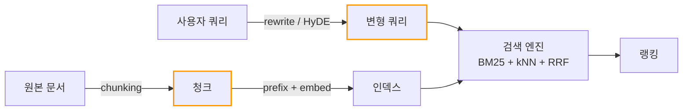
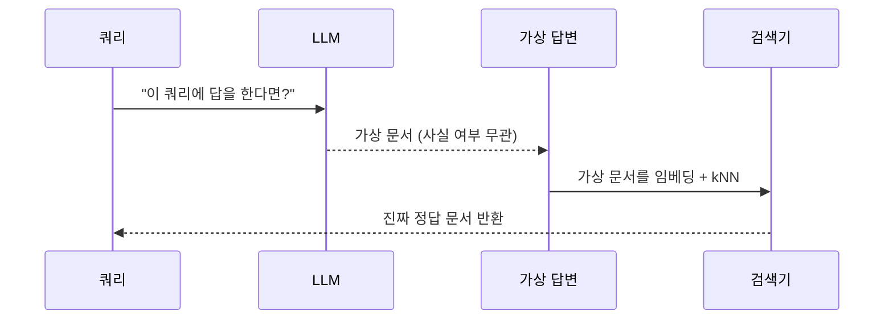
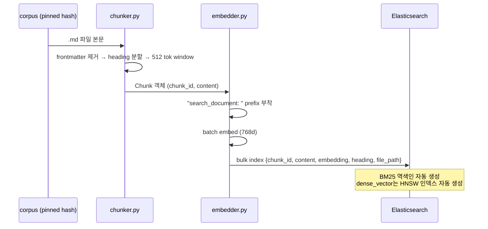

> [!summary] 핵심 한 줄
> RRF / 재정렬은 **이미 풀에 들어온 후보를 재배치**할 뿐이다. **진짜 개선은 풀 자체를 바꾸는 두 곳에서 일어난다** — (1) 쿼리 측(쿼리를 어떻게 변형해 검색기에 넣을지), (2) 문서 측(코퍼스를 어떻게 잘라 인덱싱할지). 이전 노트는 검색기 본체(BM25/kNN/RRF)와 재정렬(→ [[2.Reranker 크로스 인코더]])만 다뤘다.

> [!info] 시리즈 — AI 검색 파이프라인 깊게 파기
> 하이브리드 검색 기초 → 쿼리·문서 측 레버 → 재정렬.
>  [[0.임베딩에서 하이브리드 검색까지]] ·  [[1.검색 쿼리 변형과 청킹]] ·  [[2.Reranker 크로스 인코더]]



표시한 두 박스(`Q2`, `CH`)가 본 문서의 주제다.

---

## 1. Query-side: 쿼리는 그대로 검색기에 들어가지 않는다

사용자가 입력한 문장과 **검색에 잘 잡히는 문장**은 다르다. 사이에 변형 단계를 끼우는 것이 query-side 기법.

### 1.1 Query Rewriting (쿼리 재작성)

LLM으로 쿼리를 더 검색 친화적인 형태로 변형.

- 다국어 → 단일 언어 (본 프로젝트: 한국어 → 영어 강제 번역, 코퍼스가 영어)
- 자연어 → 검색어 키워드 + 개념
- 모호한 표현 → 구체적 용어

본 프로젝트의 실제(`src/kuberag/agent/rewrite.py`):

```
ko: "파드 재시도는 어떻게 설정하나요?"
  → "Kubernetes Pod retry configuration backoff"

en: "how retry works"
  → "Kubernetes Pod retry policy and backoff configuration"
```

> [!tip] 한 줄 직관
> **쿼리를 검색기의 입맛에 맞게 다시 쓴다.**

> [!warning] 무차별 확장은 RED
> 확정된 RED: "LLM으로 쿼리를 무차별 확장"하면 **잘 찾던 질의까지 회귀**한다. 추가된 단어가 BM25 점수 분포를 흔들거나 임베딩 평균을 이상한 방향으로 끌고 간다. 채택은 항상 per-query LOOCV로 검증.

### 1.2 HyDE (Hypothetical Document Embeddings)

쿼리가 아니라 **"가상의 답변"**을 만들어 그것을 검색에 쓴다.



핵심 통찰: **쿼리와 정답 문서는 보통 표현이 다르다**(쿼리는 짧고 추상적, 정답은 길고 구체적). 그 간극을 LLM이 만든 가상 답변이 메꿔, kNN 매칭 확률을 높인다.

> [!important] 가상 답변이 사실일 필요는 없다
> HyDE의 가상 답변은 **임베딩 공간에서 정답 문서와 가깝기만** 하면 된다. 검색에만 쓰고, 최종 답변에는 진짜 검색된 문서를 쓴다.

본 프로젝트의 결과:
- **사이드 narrow**: q015 hit @ rank 8 (GREEN 신호)
- **통합 setup**(titlechunk + reranker): **효과 0**
- 가설: reranker가 풀 정답을 이미 끌어올려 HyDE가 추가 가치를 못 만듦. (deferred)

> [!tip] 한 줄 직관
> **쿼리는 짧고 정답은 길다 — LLM으로 가상의 긴 답을 만들어 좌표를 정답 쪽으로 옮긴다.**

### 1.3 Expansion vs Rewriting vs HyDE — 비교

| 기법 | 무엇을 늘리나 | 위험 | 본 프로젝트 |
|---|---|---|---|
| Expansion | 쿼리에 관련 단어 추가 (동의어, BM25 OR 절) | 무차별이면 회귀 | RED (무차별) |
| Rewriting | 쿼리를 더 좋은 한 문장으로 교체 | 의미 왜곡 가능 | 채택 (ko→en) |
| HyDE | 쿼리를 **가상 답변**으로 교체 (kNN 측) | LLM 1회 추가 호출 비용 | 사이드 GREEN, 통합 효과 0 |

> [!warning] 셋은 같이 쓰면 효과가 중복될 수 있다
> HyDE 통합 효과 0 사례 — reranker가 이미 풀 안 정답을 위로 올려서 HyDE의 가치가 사라졌다. **레버는 따로 검증하고 통합 시 효과를 재측정**해야 한다.

---

## 2. Document-side: 문서를 어떻게 잘라야 잘 찾히나

### 2.1 Chunking — 왜 자르는가

- 인덱스에 들어갈 단위는 **모델의 컨텍스트 안에 들어와야** 한다 (임베딩 모델 max 토큰, 보통 512~8K).
- 너무 크면 한 청크 안에 여러 주제가 섞여 임베딩이 평균화돼 의미가 흐려진다.
- 너무 작으면 문맥이 잘려 의미 자체가 사라진다.

| 방식 | 장점 | 단점 |
|---|---|---|
| 고정 토큰 (e.g. 512 토큰) | 단순, 균일 | 문장·문단·헤딩 무시 |
| 문장 단위 | 의미 단위 보존 | 너무 짧을 수 있음 |
| 헤딩 인식 (heading-aware) | 문서 구조 활용 | 헤딩 길이 편차 큼 |
| 슬라이딩 윈도우 (overlap) | 경계 정답 누락 방지 | 인덱스 크기↑ |

### 2.2 본 프로젝트의 chunker

핵심 선택(`src/kuberag/indexing/chunker.py`):

| 결정 | 값 | 이유 |
|---|---|---|
| 단위 | H2 / H3 헤딩 기준 + Overview 블록 | 마크다운 문서 구조 활용 |
| 토큰 예산 | 512 토큰 | 임베딩 모델 안전 범위 |
| 오버랩 | 50 토큰 (~10%) | 헤딩 경계 정답 보호 |
| 토크나이저 | tiktoken cl100k_base (heuristic) | 실제 모델 토크나이저 근사 |
| `chunk_id` | `{file_path}#{heading_slug}[_idx]` | 안정적 식별자 |

전처리: YAML frontmatter 제거, Hugo `<!-- overview -->` / `<!-- body -->` 마커 제거.

### 2.3 Title-prepend Chunking — Reachability enabler

문제: 청크 본문에 정답 정보가 있어도 **헤딩/문서 제목이 본문에서 잘려나가 있으면** 임베딩이 추상적 주제를 못 잡는다.

해법: 청크 본문 앞에 **문서 제목 + 헤딩 경로를 명시적으로 붙임**.

```
원본 청크:
    Pods that fail can be restarted by the kubelet according to the
    restartPolicy. The default is Always.

title-prepend 청크:
    # Pod Lifecycle > Restart policy
    Pods that fail can be restarted by the kubelet according to the
    restartPolicy. The default is Always.
```

> [!tip] 한 줄 직관
> **본문이 답을 알고 있어도 "무엇에 관한 답인지"가 좌표에 없으면 못 찾힌다 — 제목을 붙여 좌표를 의미 영역으로 옮긴다.**

본 프로젝트의 측정:

| 단독 적용 | 효과 |
|---|---|
| Title 만 | R@10 변동 **0**, DEF R@1 **+0.051**, MRR +0.025, nDCG +0.020 |
| Reranker 만 | R@10 **+0.051** |
| **Title + Reranker (통합)** | **R@10 +0.102** (LOOCV 16.67×), q038/q051 새로 hit |

> [!important] 단독 RED가 RED가 아닐 수 있다
> Title 단독은 R@10 0 — 보통이면 기각이지만, **reranker와 합쳤을 때 풀 안에 정답을 넣어주는 역할**을 한다 (reachability). 단독 측정만 보고 기각하면 통합 효과를 놓친다. (→ reachability vs promotion은 [[2.Reranker 크로스 인코더]] 참고)

---

## 3. Embedding 측 — Prefix

### 3.1 왜 prefix가 필요한가

Nomic embed text v1.5 같은 일부 임베딩 모델은 **쿼리와 문서가 같은 공간에 들어가도록 학습되지 않았다**. 대신 두 모드로 학습한다.

- 문서 모드: 긴 글, 사실 진술 형태
- 쿼리 모드: 짧고 질문 형태

→ 모델이 입력의 모드를 알 수 있도록 **prefix 토큰**을 붙여 학습한다.

본 프로젝트(`src/kuberag/indexing/embedder.py`):

```python
DOC_PREFIX = "search_document: "    # 인덱싱 시
QUERY_PREFIX = "search_query: "     # 검색 시
```

> [!warning] prefix 미적용이 RED의 원흉이었다
> 임베딩을 EmbeddingGemma → Nomic으로 교체하면서 prefix도 함께 채택. **임베딩 family 교체 자체가 OVERALL +0.033 (LOOCV 6.16×)** 채택. prefix 없이 같은 모델을 썼다면 효과가 미미했을 가능성. 모델별 사용법은 항상 카드 참조.

### 3.2 768d 벡터, dense_vector 매핑, 코사인 유사도

Nomic 출력은 768d float. ES의 `dense_vector` 필드에 저장, similarity는 코사인(정규화된 벡터면 dot product와 동치).

> [!tip] 한 줄 직관
> **임베딩 모델은 "쿼리 모드 / 문서 모드"가 따로 학습됐을 수 있다 — prefix로 모드를 알려야 정답 좌표에 도달한다.**

---

## 4. 인덱싱 파이프라인 — 언제 임베딩을 만드는가



핵심: **임베딩은 인덱싱 시점에 1회**. 검색 시에는 쿼리만 새로 임베딩(kNN 측). 문서가 바뀌지 않는 한 재계산 없음.

> [!important] Corpus drift가 측정을 흔든다
> upstream 코퍼스가 PR 머지로 본문이 바뀌면 청크 ID가 바뀌어 골든셋 라벨과 어긋난다 — 모든 측정이 다른 코퍼스 위에서 일어나 비교 불가. **corpus pin 규약**(특정 git hash 고정) 도입이 측정 인프라의 토대.

---

## 5. 비교 표 — query-side / doc-side 레버 전체

| 위치 | 레버 | 정의 | 본 프로젝트 결과 |
|---|---|---|---|
| Query | rewriting (ko→en) | 다국어 정렬 | 채택 |
| Query | expansion (무차별) | OR 절로 단어 추가 | RED |
| Query | HyDE | LLM 가상 답변으로 kNN | 통합 효과 0 |
| Doc | heading-aware chunking | H2/H3 + 512 tok | 기본 |
| Doc | title-prepend | 청크 앞에 헤딩 경로 부착 | 채택 (reranker 동반 시 +0.102) |
| Doc | overlap (50 tok) | 경계 정답 보호 | 기본 |
| Embed | prefix (search_document / search_query) | 모드 신호 | 채택 |

---

## 한계 / 확인 필요

- HyDE의 효과는 모델·코퍼스·도메인에 매우 의존적. "사이드 narrow GREEN → 통합 효과 0" 패턴은 본 프로젝트의 특성일 수 있다.
- title-prepend도 도메인이 다르면 다를 수 있다 (이미 문서가 단일 주제로 깨끗이 분할돼 있다면 효과↓).
- prefix는 모델별로 다르다 (Nomic은 `search_document:` / `search_query:`, e5는 `passage:` / `query:`, BGE는 또 다름). 모델 카드 확인 필수.

## 더 볼 것

- 청크 사이즈 sweep — 256 / 512 / 1024 tok 비교
- semantic chunking — LLM으로 의미 단위 분할
- multi-vector representation — 한 문서 = 여러 임베딩 (ColBERT 류)
- 관련 노트: [[2.Reranker 크로스 인코더]] · [[0.임베딩에서 하이브리드 검색까지]]
