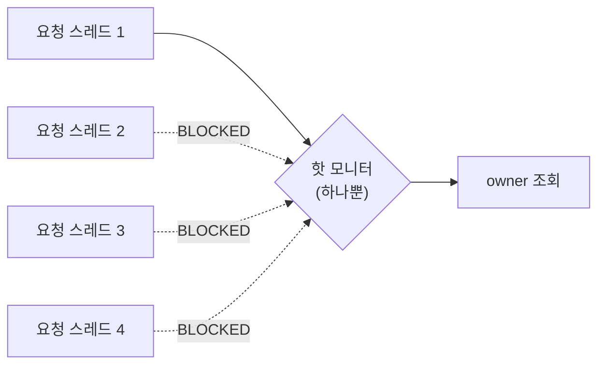

> [!summary] 핵심 한 줄
> owner 검색이 한 핫 모니터에서 직렬화되면 요청 스레드가 떼로 **BLOCKED**로 쌓인다. 겉보기엔 데드락 같지만 — `petclinic_blocked_threads`는 치솟는데 `petclinic_deadlocked_threads = 0`. **사이클이 없으니 데드락이 아니라 락 경합**이다. 이 한 줄의 신호 차이가 오진을 막는다.

> [!info] 시리즈 — 장애를 '구별 가능'하게 만든 카오스 벤치
> [[0.서문]] · [[1.스택트레이스가 곧 원인인 유일한 순간]] · [[2.p99가 튀는데 아무도 안 던졌다]] · [[3.200 OK인데 답이 틀렸다]] · [[4.top frame은 표면이지 원인이 아니다]] · [[5.느린 쿼리의 진짜 범인은 인덱스]] · [[6.커넥션을 안 돌려줬다]] · [[7.CPU가 남는데 스로틀당했다]] · [[8.컨슈머가 못 따라잡았다]] · [[9.멈춘 건 GC였다]] · [[10.다 멈췄는데 데드락은 아니다]] · [[11.요청 하나에 쿼리 1+N]] · [[12.캐시 만료에 떼로 몰렸다]]

---

## 1. 배경 — 지연의 수많은 얼굴

운영에서 `p99 latency↑` 알림이 뜨면, 원인 후보가 십수 가지다. 락 경합·GC 폭주·N+1·커넥션풀 고갈·CPU 스로틀… 전부 **같은 증상**으로 도착한다. 이 시리즈의 목표는 각 원인을 *다른 원인은 못 내는* 단 하나의 신호로 가르는 것이다([[0.서문]]).

W10의 주인공은 **락 경합(lock contention)** 이다. 그리고 락 경합에는 특별히 까다로운 형제가 있다 — **데드락**. 둘은 증상이 너무 닮아서, 신호를 제대로 설계하지 않으면 반드시 오진한다.

---

## 2. 무엇을 망가뜨렸나 — 핫 모니터 직렬화

chaos 프로파일에서 `lockContention`을 arm하면, owner 검색(`GET /owners`)이 **하나의 공유 모니터에서 `synchronized`로 직렬화**된다. 모든 검색 요청이 그 단 하나의 락을 통과해야 한다.

```java
// OwnerController.java (chaos seam — profile-gated)
this.lockContender.ifAvailable(LockContender::contendIfArmed);
```

seam은 `ObjectProvider<LockContender>`로 주입되어 **chaos 프로파일에서만** 살아난다. 평소 빌드에는 이 코드가 없는 것과 같다(`.ifAvailable(...)`가 no-op).

여기에 동시 부하를 주면 — 요청 스레드들이 그 핫 모니터를 기다리며 `BLOCKED` 상태로 쌓인다. throughput은 떨어지고 p99는 폭등한다.



---

## 3. 증상 — 데드락처럼 보인다

부하를 주고 스레드 덤프를 뜨면 `BLOCKED` 스레드가 한가득이다. 첫 직관은 자연스럽게 **"데드락인가?"** 로 향한다. 둘 다 "스레드가 막혀서 안 흐른다"처럼 보이기 때문이다.

하지만 결정적 차이가 있다 — **데드락이면 시스템이 영구 정지**해야 한다(서로가 서로의 락을 기다리는 사이클). 그런데 이 경우 throughput은 *떨어질 뿐 흐른다*. 락을 잡은 스레드는 일을 끝내고 락을 놓는다. 단지 그 앞에 줄이 길 뿐이다.

문제는, **증상(BLOCKED 다수)만으로는 이 둘을 못 가른다**는 것이다. 스레드 덤프의 BLOCKED 개수는 둘 다 높다.

---

## 4. 판별 신호 — BLOCKED 인구조사 + 데드락 탐지기

그래서 두 게이지를 **함께** 본다. `ContentionProbe`가 `ThreadMXBean`으로 주기적으로 census한다.

```java
// ContentionProbe — BLOCKED 인구조사 + 데드락 사이클 탐지
ThreadMXBean tmx = ManagementFactory.getThreadMXBean();
long blocked = Arrays.stream(tmx.dumpAllThreads(false, false))
    .filter(t -> t.getThreadState() == Thread.State.BLOCKED).count();
long[] deadlocked = tmx.findDeadlockedThreads();   // 사이클이 있을 때만 non-null
int cycle = (deadlocked == null) ? 0 : deadlocked.length;
// → petclinic_blocked_threads = blocked,  petclinic_deadlocked_threads = cycle
```

두 신호를 표로 놓으면 락 경합과 데드락이 갈린다.

| 신호 | 데드락 | 락 경합 |
|---|---|---|
| `petclinic_blocked_threads` | 높음 | 높음 |
| `petclinic_deadlocked_threads` | **> 0** (사이클 있음) | **0** (사이클 없음) |

알림은 `petclinic_blocked_threads`가 임계(> 5)를 넘으면 발화한다. 하지만 **진단**은 거기서 멈추지 않는다 — `deadlocked_threads = 0`을 확인하고 "데드락 아님 → 락 경합"으로 확정한다.

> [!important] 같은 증상, 다른 축
> BLOCKED가 높다고 데드락이 아니다. **사이클의 유무**(`deadlocked > 0`)가 가른다. 락 경합의 판별 신호는 크기가 아니라 조합이다 — `blocked↑ AND deadlocked=0`, 즉 "막혔지만 사이클은 없다."

---

## 5. 함정 — 라이브 게이지는 버스트에 출렁인다

신호를 설계해도 *측정*에서 한 번 더 미끄러진다. 부하를 버스트로 주면(예: 15 동시 요청 × 반복) 게이지가 순간순간 출렁인다 — 버스트 중엔 BLOCKED가 높고, 버스트 사이 틈엔 거의 0으로 떨어진다.

스크레이프 타이밍이 하필 그 *틈*에 걸리면 `petclinic_blocked_threads = 0`을 본다. "알림이 떴다는데 값은 0?" 하는 혼란이 여기서 나온다.

> [!warning] 순간값이 아니라 피크를 봐라
> 알림이 실제로 발화한 값을 확인하려면 순간 게이지가 아니라 `max_over_time(petclinic_blocked_threads[2m])` 처럼 **창(window) 안의 피크**를 봐야 한다. 버스트성 부하에서 instantaneous gauge는 거짓 0을 보여준다.

---

## 6. 자동 진단으로 잇기

이 판별 신호는 사람이 외우라고 만든 게 아니다. [[2.장애 도구가 장애에 죽지 않게|장애대응 오케스트레이터]]가 그대로 소비한다:

`latency-saturation` 알림 도착 → differential 후보 나열(락 경합·GC·N+1·풀 고갈…) → 각 후보의 판별 신호 조회 → **`blocked↑ AND deadlocked=0` 매치 → "락 경합" 확정** → Class C(원인은 named, 고치는 건 사람의 설계 판단) → 과거 유사 사례 첨부.

벤치가 신호를 *공급*하고 오케스트레이터가 *소비*하는 — 이 연결이 시리즈 전체의 목적이다.

---

## 7. 교훈

> [!important] 증상이 아니라 '구별 신호'를 설계하라
> "느리다"와 "BLOCKED가 많다"는 십수 원인의 공통 증상이다. 벤치의 일은 각 원인마다 *다른 원인은 못 내는* 단 하나의 신호를 만드는 것. 락 경합의 그 신호는 **`blocked↑ AND deadlocked=0`** — "막혔지만 사이클은 없다." 이 한 줄이 데드락과의 오진을 구조적으로 막는다.

---

## 관련 글

- [[0.서문]] — 이 '판별 신호' 논제의 전체 그림
- [[9.멈춘 건 GC였다]] — 같은 지연 패밀리, 다른 신호(GC pause rate)
- [[11.요청 하나에 쿼리 1+N]] — 또 다른 지연 구별(요청당 쿼리 수)
- [[2.장애 도구가 장애에 죽지 않게]] — 이 신호를 소비하는 자동 진단
- 근거: spring-petclinic `ContentionProbe`, `OwnerController` lock-contention seam, `scripts/smoke/lock-contention-to-slack.sh`
