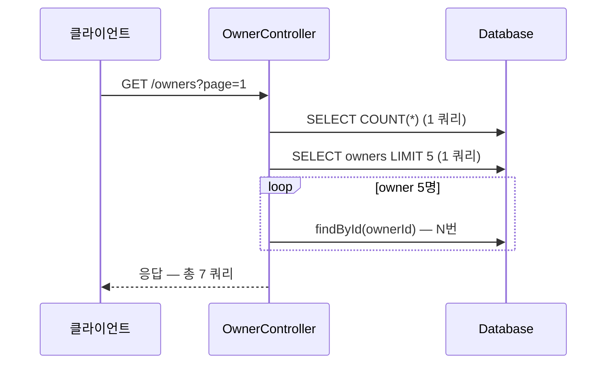

> [!summary] 핵심 한 줄
> owner 검색 한 번이 owner마다 `findById`를 추가로 날려 **요청당 쿼리 수 = 1+N**이 된다. p99 얼굴은 W10·W9와 판박이지만 — `petclinic_owner_search_queries` 평균이 임계(> 3)를 넘는 순간 이 지연은 query-plan 문제(쿼리 수 = 1, 그 1개가 느림)와 갈린다. **같은 지연, 반대 쿼리 수**.

> [!info] 시리즈 — 장애를 '구별 가능'하게 만든 카오스 벤치
> [[0.서문]] · [[1.스택트레이스가 곧 원인인 유일한 순간]] · [[2.p99가 튀는데 아무도 안 던졌다]] · [[3.200 OK인데 답이 틀렸다]] · [[4.top frame은 표면이지 원인이 아니다]] · [[5.느린 쿼리의 진짜 범인은 인덱스]] · [[6.커넥션을 안 돌려줬다]] · [[7.CPU가 남는데 스로틀당했다]] · [[8.컨슈머가 못 따라잡았다]] · [[9.멈춘 건 GC였다]] · [[10.다 멈췄는데 데드락은 아니다]] · [[11.요청 하나에 쿼리 1+N]] · [[12.캐시 만료에 떼로 몰렸다]]

---

## 1. 배경 — 지연의 또 다른 얼굴

W9(GC 폭주), W10(락 경합)에 이어 W11도 같은 알림으로 시작한다 — `p99 latency↑`. 이제 눈에 익은 얼굴이다. 문제는 이 얼굴이 **너무 많은 원인을 감춘다**는 것이다([[0.서문]]).

이번 편의 주인공은 **N+1 쿼리**다. 논리적으로는 owner 목록 조회 "하나"인데, 물리적으로는 owner마다 추가 쿼리가 한 번씩 더 나간다. owner가 N명이면 쿼리는 1+N개. 결과? 요청이 느려진다. p99가 오른다. W9·W10과 같은 얼굴.

판별이 필요하다. 같은 p99↑도 **'요청당 쿼리 수'라는 축**을 추가하면 원인이 갈린다.

---

## 2. 무엇을 망가뜨렸나 — owner 목록이 N번 추가 조회

chaos 프로파일에서 `ownerListLatency`를 arm하면 `amplifyOwnerReads()`가 활성화된다. owner 검색 결과 페이지에 포함된 owner마다 `findById`를 한 번씩 추가로 호출한다. 페이지 크기가 5라면 — pagination count 쿼리 1 + content select 1 + `findById` × 5 = **총 7 쿼리**가 요청 하나에서 나간다.



이 패턴 자체는 새로울 게 없다. 문제는 **지연만 봐서는 N+1인지 query-plan 문제인지 모른다**는 것이다. 둘 다 p99가 오른다. 그래서 계측 층이 하나 더 필요하다.

`QueryCountingDataSource`가 이를 맡는다. `DelegatingDataSource`를 상속해 JDBC Connection을 JDK 동적 프록시로 감싸고, `prepareStatement` / `prepareCall` / `createStatement` 호출마다 `ThreadLocal` 카운터를 증가시킨다. chaos 프로파일 전용 `QueryCountChaosConfig`가 `BeanPostProcessor`로 HikariCP 풀을 이 데코레이터로 교체한다 — **기본 빌드는 byte-for-byte 동일**하다.

`QueryCountInterceptor`(`HandlerInterceptor`)가 요청 입구(`preHandle`)에서 카운터를 리셋하고, 출구(`afterCompletion`)에서 값을 읽어 Micrometer `DistributionSummary`에 기록한다.

```java
// QueryCountInterceptor — 요청당 쿼리 수를 DistributionSummary에 기록
@Override
public boolean preHandle(HttpServletRequest request, HttpServletResponse response, Object handler) {
    QueryCountingDataSource.reset();   // 요청 시작: ThreadLocal 카운터 초기화
    return true;
}

@Override
public void afterCompletion(HttpServletRequest request, HttpServletResponse response,
        Object handler, Exception ex) {
    summaryFor(uriOf(request)).record(QueryCountingDataSource.count());  // 요청 종료: 기록
}
```

메트릭 이름은 `petclinic.owner.search.queries`(태그: `uri`). Prometheus에서는 `petclinic_owner_search_queries_sum` / `_count`로 노출된다.

---

## 3. 증상 — p99↑

부하를 주면 응답 지연이 오른다. Grafana p99가 치솟는다. 이 지점에서는 W9·W10, 그리고 W5(느린 쿼리)와 구별이 안 된다. 전부 `p99 latency↑`다.

스레드 BLOCKED 없다(W10 아님). GC pause 없다(W9 아님). 커넥션 고갈 없다(W6 아님). 그러나 원인은 여전히 불명확하다 — **지연이 "쿼리 1개가 느린 것"인지 "쿼리가 너무 많은 것"인지, p99만으로는 알 수 없다**.

---

## 4. 판별 신호 — 요청당 쿼리 수 = 1+N

여기서 W11의 판별 축이 등장한다. PromQL:

```
rate(petclinic_owner_search_queries_sum{uri="/owners"}[1m])
/ rate(petclinic_owner_search_queries_count{uri="/owners"}[1m])
```

즉 **요청당 평균 쿼리 수**다. Grafana 알림 `NPlusOneQueries`(`chaos-n-plus-one` 그룹)가 이 값이 3을 초과하면 발화한다(`for: 0s`).

- 비무장 baseline: pagination count + content select = **~2 쿼리/요청**
- `ownerListLatency` arm 시: 2 + 5 × `findById` = **~7 쿼리/요청**

같은 지연이지만, 이 축에서 원인이 갈린다.

| 신호 | W5 — query-plan 문제 | W11 — N+1 |
|---|---|---|
| `p99 latency` | 높음 | 높음 |
| `petclinic_owner_search_queries` 평균 | **~1** (느린 쿼리 1개) | **1+N** (N개 추가) |
| `NPlusOneQueries` 알림 | 미발화 | **발화** |

W5는 쿼리 수가 1인데 그 1개가 느리다. W11은 쿼리 하나하나는 빠른데 수가 너무 많다. **정반대**다. 이 한 줄의 수치 차이가 오진을 구조적으로 막는다.

---

## 5. 베이스라인과 임계 — 요청당 쿼리 수 게이트

임계값 3은 baseline ~2와 armed ~7 사이에 설계적으로 놓인 게이트다. 이 게이트 덕분에 "느리다"는 알림이 왔을 때 두 번째 질문을 자동화할 수 있다 — **"요청당 쿼리 수가 3을 넘는가? 넘으면 N+1, 아니면 다른 후보."**

> [!warning] 비율 지표는 cold-start에 출렁인다
> `rate(...[1m])`는 관측 창이 짧을수록 분모(count)가 작아 값이 불안정해진다. 부하를 막 시작했거나 트래픽이 매우 낮을 때 비율이 튈 수 있다. `NPlusOneQueries` 알림이 `noDataState: OK`로 설정된 이유다 — 데이터가 없으면 발화하지 않는다. 알림이 발화하지 않아도 "N+1이 없다"가 아니라 "아직 관측이 부족하다"일 수 있다.

---

## 6. 교훈

> [!important] 같은 지연도 '요청당 쿼리 수' 축으로 갈린다
> `p99↑`는 십수 원인의 공통 증상이다. N+1의 판별 신호는 **쿼리 수**다 — 요청당 쿼리 수가 1+N이면 N+1이고, 1이면 query-plan 문제다. `QueryCountingDataSource`(DataSource 데코레이터)와 `QueryCountInterceptor`(HandlerInterceptor)가 이 축을 만들고, `petclinic.owner.search.queries` 메트릭이 값을 공급한다. 벤치가 이 신호를 *공급*하고 오케스트레이터([[2.장애 도구가 장애에 죽지 않게]])가 *소비*한다.

---

## 관련 글

- [[0.서문]] — 이 '판별 신호' 논제의 전체 그림
- [[10.다 멈췄는데 데드락은 아니다]] — 같은 지연 패밀리, 다른 신호(BLOCKED 인구조사)
- [[5.느린 쿼리의 진짜 범인은 인덱스]] — 쿼리 수=1 vs. 1+N의 정반대 대조
- [[12.캐시 만료에 떼로 몰렸다]] — 요청 내 쿼리 수 vs. 요청 간 쏠림
- [[2.장애 도구가 장애에 죽지 않게]] — 이 신호를 소비하는 자동 진단
- 근거: spring-petclinic `QueryCountingDataSource`, `QueryCountInterceptor`, `QueryCountChaosConfig`, `scripts/smoke/n-plus-one-to-slack.sh`
