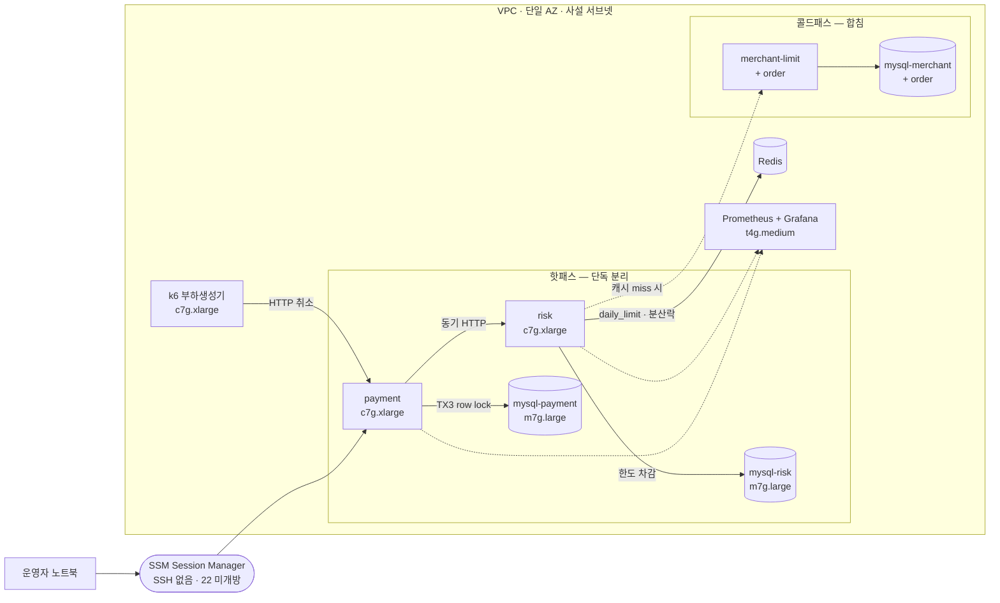

> [!summary] 핵심 한 줄
> "느려요"를 진단으로 바꾸려면, **느린 게 로직인지 lock인지 DB I/O인지**가 갈려야 한다. 그러려면 부하생성기·앱·DB를 **물리적으로 분리**해야 한다. 핫패스(payment·risk·각 DB)는 단독, 콜드패스(merchant-limit·order)는 합침 — 9대를 사설 IP로 고정하고 SSH 없이 SSM으로만 접속하는 판을 Terraform으로 깐다.

> [!info] 시리즈 — 부하가 드러낸 설계
> **1막 · 실측으로 잡고 증명하다** [[00.실측 서문|00]] · [[01.사설 IP 9대에 실측 판을 깔다|01]] · [[02.DB를 키웠더니 병목이 숨었다|02]] · [[03.서버는 필요할 때만, 이미지는 바뀔 때만|03]] · [[04.배포가 세 번 터졌다|04]] · [[05.190은 용량이 아니었다|05]] · [[06.10명인데 7.63%가 실패했다|06]] · [[07.한 가맹점에 몰았더니 99.9%가 튕겼다|07]] · [[08.데드락인 줄 알았다|08]] · [[09.거절을 대기로 바꿨다|09]] · [[10.SSM 고고학을 그만두다|10]] · [[11.캐시를 껐는데 아무 일도 안 났다|11]]
> **2막 · 관측을 코드로, 코드를 재측정으로** [[12.요청당 쿼리 수와 APM|12]] · [[13.동기 홉인 줄 알았다|13]] · [[14.이력 3커밋을 1로|14]] · [[15.147을 220으로|15]]

---

## 1. 한 머신에선 아무것도 안 보인다

부하 테스트를 로컬 docker-compose로 먼저 돌려봤다. 앱 4개, DB 5개, Kafka, Redis, 그리고 k6까지 **한 노트북**에 떠 있다. 숫자는 나온다 — TPS, p99, 에러율. 그런데 그 숫자가 **무엇의 한계인지**를 말해주지 않는다.

k6가 CPU를 먹으면 앱이 느려진다. 앱과 DB가 같은 코어를 다투면 "쿼리가 느린 건지 앱이 밀린 건지"가 뭉갠다. 측정값은 **모든 컴포넌트의 간섭이 합쳐진 흐릿한 평균**이 된다.

> [!danger] 실측의 0번 원칙
> 부하생성기가 SUT(측정 대상)의 CPU를 침범하면, 그 측정은 오염된 것이다. **부하는 부하대로, 앱은 앱대로, DB는 DB대로** 다른 인스턴스에 있어야 각 계층의 한계가 서로를 가리지 않는다.

그래서 로컬은 파이프라인이 도는지 확인하는 용도로만 쓰고(E2E smoke), 진짜 실측은 분리된 인프라에서 하기로 했다.

## 2. 무엇을 나누고 무엇을 합치나 — 핫/콜드

전부 단독 인스턴스로 띄우면 정확하지만 비싸다. 기준이 필요하다. **취소의 동기 경로에 있는가**로 갈랐다.

- **핫패스(단독 분리)** — `payment`, `risk`, 그리고 `payment_db`·`risk_db`. 취소 요청이 지나가며 CPU·lock을 다투는 곳. 여기가 병목 후보라 서로 섞이면 안 된다.
- **콜드패스(합침)** — `merchant-limit`, `order`. 취소 동기 경로에서 살짝 비켜서 있거나(merchant-limit은 캐시/스냅샷 뒤에 있고) 다운스트림이라, 한 인스턴스에 합쳐도 측정을 흐리지 않는다.

이 구분이 나중에 결정적이었다. [[07.한 가맹점에 몰았더니 99.9%가 튕겼다|7편]]에서 병목이 `risk`와 `risk_db`에 있다는 걸, 다른 컴포넌트의 노이즈 없이 깨끗하게 볼 수 있었던 건 이렇게 나눠뒀기 때문이다.

## 3. 9대의 지도

| role | 역할 | 사설 IP |
|---|---|---|
| k6 | 부하생성기 (분리 필수) | 10.0.1.10 |
| payment | 핫패스 주인공 | 10.0.1.20 |
| risk | 한도 차감 동시성 | 10.0.1.21 |
| cold-svc | merchant-limit + order (합침) | 10.0.1.22 |
| mysql-payment / mysql-risk | 핫 DB 단독 | 10.0.1.30 / .31 |
| cold-db | merchant + order DB | 10.0.1.32 |
| infra | Redis + Kafka | 10.0.1.40 |
| obs | Prometheus + Grafana | 10.0.1.50 |



사설 IP를 **고정**한 게 포인트다. compose·config의 배선(앱이 어느 DB를 바라보는지)이 IP로 하드코딩되니, 배포가 단순해진다.

**single-AZ로 간다.** 서버간 통신인데 같은 AZ여도 되나? — baseline의 목적이 "compute/lock 병목 탐색"이라면 **그렇다**. cross-AZ RTT는 네트워크 노이즈를 더할 뿐이다. 네트워크 민감도(서킷브레이커·타임아웃)는 나중에 `tc netem`으로 payment→risk 링크에만 인위적 지연을 주입해 *따로* 잰다. 한 번에 한 변수만.

## 4. SSH 없이 — SSM

9대에 퍼블릭 IP를 안 붙였다. 22번 포트도 안 열었다. 접속은 전부 **SSM Session Manager**로 한다.

```bash
aws ssm start-session --target i-0abc...
```

키페어도, 바스티온도, 보안그룹 인바운드도 필요 없다. 인스턴스는 IAM role로 SSM에 등록되고, 아웃바운드는 NAT Gateway로만 나간다(이미지 pull·패키지). 공격면이 0에 가깝고, 무엇보다 **명령을 스크립트로 9대에 일괄 발사**할 수 있다 — 이게 나중에 배포와 진단의 축이 된다([[04.배포가 세 번 터졌다|4편]], [[10.SSM 고고학을 그만두다|10편]]).

전부 Terraform으로 코드화했다. `terraform apply`로 VPC·서브넷·NAT·9대·IAM이 뜨고, `terraform destroy`로 흔적 없이 사라진다. 실측은 필요할 때만 — 이 온디맨드 성질은 [[03.서버는 필요할 때만, 이미지는 바뀔 때만|3편]]에서 배포와 엮인다.

---

판을 이렇게 깔아두니, "느려요" 대신 "risk의 이 한 줄"까지 좁혀갈 여지가 생겼다. 분리는 비용이지만, **분리하지 않으면 원인을 못 가른다.** 다음은 그 인스턴스들을 *얼마나 크게* 잡아야 하는가 — 크게 잡으면 오히려 병목이 숨는다는 이야기다.
