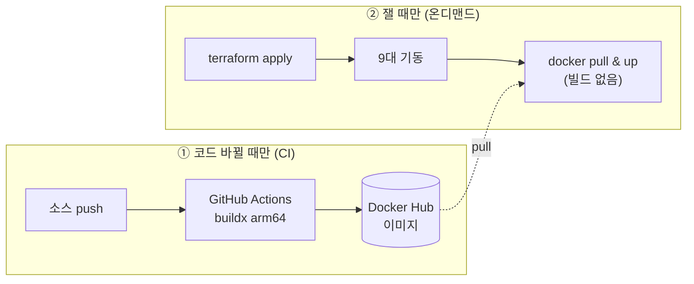

> [!summary] 핵심 한 줄
> 부하 실측은 *간헐적*이다 — 필요할 때만 서버를 띄우고 싶다. 그러려면 빌드와 실행을 시간축으로 분리해야 한다. **이미지는 코드가 바뀔 때만 CI가 굽고**(Docker Hub), **서버는 잴 때만 떠서 pull만** 한다. `apply → 측정 → destroy`, 안 쓸 땐 $0.

> [!info] 시리즈 — 부하가 드러낸 설계
> **1막 · 실측으로 잡고 증명하다** [[00.실측 서문|00]] · [[01.사설 IP 9대에 실측 판을 깔다|01]] · [[02.DB를 키웠더니 병목이 숨었다|02]] · [[03.서버는 필요할 때만, 이미지는 바뀔 때만|03]] · [[04.배포가 세 번 터졌다|04]] · [[05.190은 용량이 아니었다|05]] · [[06.10명인데 7.63%가 실패했다|06]] · [[07.한 가맹점에 몰았더니 99.9%가 튕겼다|07]] · [[08.데드락인 줄 알았다|08]] · [[09.거절을 대기로 바꿨다|09]] · [[10.SSM 고고학을 그만두다|10]] · [[11.캐시를 껐는데 아무 일도 안 났다|11]]
> **2막 · 관측을 코드로, 코드를 재측정으로** [[12.요청당 쿼리 수와 APM|12]] · [[13.동기 홉인 줄 알았다|13]] · [[14.이력 3커밋을 1로|14]] · [[15.147을 220으로|15]]

---

## 1. 호스트에서 빌드하지 마라

처음 배포 스크립트는 이랬다 — 앱 호스트에 SSM으로 접속해서 레포를 `git clone`하고, 그 위에서 `./gradlew bootJar`로 빌드한 뒤 컨테이너를 올린다.

동작은 한다. 그런데 이건 **서버를 띄울 때마다 빌드가 도는** 구조다. 실측을 반복하려면 매번 clone + 컴파일을 기다려야 하고, 호스트에는 소스·JDK·Gradle이 얹혀 있어야 한다. 12-factor가 말하는 build/release/run 분리에 어긋난다.

## 2. 빌드는 한 번, 실행은 pull만

발상을 뒤집는다. **빌드와 실행을 시간축에서 떼어낸다.**

- **코드가 바뀔 때만(CI)** — GitHub Actions가 4개 서비스 이미지를 굽고 Docker Hub에 push한다.
- **서버를 띄울 때(terraform apply)** — 호스트는 Docker Hub에서 **pull만** 한다. 소스도, 빌드 툴체인도 없다.

이미지는 arm64(Graviton) 타깃인데, GitHub 러너는 x86이다. 순진하게 `buildx --platform linux/arm64`로 빌드하면 arm64 에뮬레이션(QEMU) 위에서 Gradle이 돌아 몇 배로 느리다. 여기서 트릭 하나 —

```dockerfile
# build 스테이지는 러너 네이티브(x86)에서. JAR은 아키텍처 독립이므로.
FROM --platform=$BUILDPLATFORM eclipse-temurin:21-jdk AS build
RUN ./gradlew :${MODULE}:bootJar
# 최종 런타임 스테이지만 arm64
FROM eclipse-temurin:21-jre
COPY --from=build .../*.jar /app/app.jar
```

`bootJar` 산출물은 바이트코드라 아키텍처와 무관하다. 그러니 빌드는 러너 네이티브에서 빠르게 하고, **arm64는 최종 JRE 레이어만** 결정하면 된다. 에뮬레이션 없이 빠르게 굽는다.



## 3. 온디맨드 — 안 쓸 땐 $0

이제 실측 한 사이클이 이렇게 된다.

```
(코드 바뀐 경우만) gh workflow run   → Docker Hub 이미지 갱신
terraform apply                      → 9대 기동
ssm-deploy.sh                        → role별로 pull & up (호스트는 빌드 X)
k6 실측 → terraform destroy          → 과금 종료
```

이미지는 Docker Hub에 남아 있으니 **서버를 다시 띄워도 재빌드가 없다.** 코드가 바뀐 날만 CI를 돌리면 된다. 실측이 필요 없는 대부분의 시간에는 인스턴스가 하나도 안 떠 있다 — 비용이 0이다.

## 4. 왜 ECS가 아니라 EC2 + destroy인가

"컨테이너면 ECS 아냐?" — 이 용도엔 아니다.

> [!note] 간헐적 워크로드엔 관리형이 비싸다
> ECS/Fargate는 컨트롤플레인과 태스크가 상시 과금 구조다. 하루에 한두 번, 몇 시간씩 재는 부하테스트엔 오버킬이다. **EC2 Spot + `terraform destroy`**가 "안 쓸 땐 완전히 사라진다"라 훨씬 싸다. Docker Hub는 이미지 저장이 무료라 여기 얹기 딱 좋다.

레지스트리도 ECR 대신 Docker Hub를 썼다. in-region 속도는 ECR이 낫지만, 이미지 3개를 NAT 경유로 pull해봐야 처리비 몇 센트다. 간헐적·독립 실행엔 단순한 Docker Hub가 실용적으로 우위였다.

---

이렇게 "필요할 때만 뜨는" 파이프라인을 만들었다. 그런데 그 파이프라인을 **처음 실제로 돌리자 세 군데가 터졌다** — 그게 다음 편이다.
