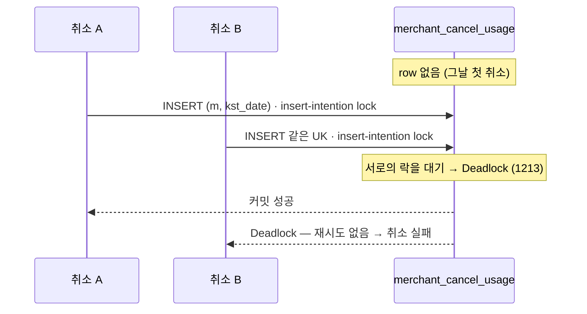

> [!summary] 핵심 한 줄
> 지연은 완벽했다 — med 53ms, p99 65ms. 그런데 **10 VU 저부하에서 7.63%가 실패**했다. 풀 소진도 아니고, 서버 예외도 아니었다. risk 로그를 파보니 `merchant_cancel_usage` **INSERT 데드락**. 코드 리뷰가 통과시킨 로직이, 부하에서 처음으로 균열을 보였다.

> [!info] 시리즈 — 부하가 드러낸 설계
> **1막 · 실측으로 잡고 증명하다** [[00.실측 서문|00]] · [[01.사설 IP 9대에 실측 판을 깔다|01]] · [[02.DB를 키웠더니 병목이 숨었다|02]] · [[03.서버는 필요할 때만, 이미지는 바뀔 때만|03]] · [[04.배포가 세 번 터졌다|04]] · [[05.190은 용량이 아니었다|05]] · [[06.10명인데 7.63%가 실패했다|06]] · [[07.한 가맹점에 몰았더니 99.9%가 튕겼다|07]] · [[08.데드락인 줄 알았다|08]] · [[09.거절을 대기로 바꿨다|09]] · [[10.SSM 고고학을 그만두다|10]] · [[11.캐시를 껐는데 아무 일도 안 났다|11]]
> **2막 · 관측을 코드로, 코드를 재측정으로** [[12.요청당 쿼리 수와 APM|12]] · [[13.동기 홉인 줄 알았다|13]] · [[14.이력 3커밋을 1로|14]] · [[15.147을 220으로|15]]

---

## 1. 지연은 완벽한데 실패한다

10 VU, 3분, 분산 부하. baseline 결과다.

```
http_req_duration : med=53ms  p95=60ms  p99=65ms   ← 훌륭하다
http_req_failed   : 7.63%  (2610 / 34194)          ← ??
cancel_success    : 92.36%
```

지연은 나무랄 데가 없다. 워밍업된 시스템이 53ms 중앙값으로 응답한다. 그런데 **7.63%가 실패했다.** 그것도 겨우 10명이 붙은 저부하에서. 부하가 세서 무너진 게 아니다.

## 2. 서버 예외가 아니다

먼저 [[05.190은 용량이 아니었다|풀 소진]]을 의심했지만 아니었다. 3분을 완주했고 34,194 < 10만 풀이다.

payment 로그를 grep했다. 예외가 없다. `PG 취소 성공 처리...`만 잔뜩. 스케줄러도 `pending-recovery 대상=0건`, 멈춘 트랜잭션이 없다. payment 쪽은 멀쩡하다.

> [!note] 실패가 500이 아니면 4xx다
> 서버 예외(500)가 안 뜨는데 요청이 실패했다면, 그건 **비즈니스 에러 응답**(4xx/5xx로 의도적으로 던진 것)이다. k6의 체크가 "HTTP 200 아님 / status COMPLETED 아님"으로 잡은 것. 원인은 payment가 아니라 **그 아래 risk**에 있다.

## 3. risk 로그의 데드락

risk-management-service 로그를 팠다. 초반 타임스탬프에 스택트레이스가 몰려 있었다.

```
HHH000247: ErrorCode: 1213, SQLState: 40001
Deadlock found when trying to get lock; try restarting transaction
CannotAcquireLockException: could not execute statement
  [insert into merchant_cancel_usage (..., merchant_id, kst_date, ...) values (?, ...)]
```

`merchant_cancel_usage`에 **INSERT하다 데드락**(MySQL 1213 / SQLState 40001)이다. 이 테이블은 `(merchant_id, kst_date)`가 UK다. 그날 그 가맹점의 첫 취소 때 row가 아직 없는데, **동일 merchant의 첫 취소 여러 개가 같은 UK로 동시에 INSERT**하면서 insert-intention 락이 데드락을 일으켰다. 에러가 실행 초반에 몰린 것도 이걸 뒷받침한다 — row가 생기고 나면 UPDATE로 전환되며 잦아든다.



그리고 이 데드락에는 **재시도가 없었다.** `CannotAcquireLockException`이 그대로 위로 흘러 사용자 취소가 실패했다.

## 4. 첫 신호, 그러나 표면일 수도

이건 코드 리뷰로는 절대 안 보이는 결함이다. 소스엔 "동시 취소를 락으로 직렬화한다"고 써 있었고, 논리적으로 옳았다. **10명이 동시에 눌렀을 때 7.63%가 데드락으로 실패한다는 사실은, 실제로 부하를 걸어야만 나온다.**

하드 게이트는 지켰다 — 실패한 취소는 차감 전에 롤백됐으니 이중차감·이중취소는 없다. 문제는 정확성이 아니라 **가용성**이다.

다만 한 가지가 걸렸다. "데드락"이 정말 근본 원인일까, 아니면 더 깊은 무언가의 *증상*일까. 이걸 확인하려면 경합을 극단으로 밀어봐야 했다 — **한 가맹점에 부하를 몰면** 어떻게 되는가. 그게 다음 편이다.

---

baseline은 지연을 재는 자리인 줄 알았는데, **결함을 잡는 자리**가 됐다. 7.63%는 작아 보이지만, 이 숫자를 한 가맹점에 집중시키자 99.9%가 됐다.
