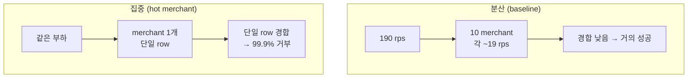

> [!summary] 핵심 한 줄
> VU만 올리는 게 아니라 **데이터 분포**를 바꾼다. 같은 부하를 한 가맹점에 몰자, [[06.10명인데 7.63%가 실패했다|분산에선 7.63%]]였던 실패가 **99.9%**로 폭발했다. 지연은 낮은 채로 에러만 치솟는 시그니처 — 데드락이 아니라 뭔가가 요청을 *즉시* 튕기고 있었다. (그리고 첫 측정은 교란됐다. 그 교란을 걷어내는 것도 실측의 일부다.)

> [!info] 시리즈 — 부하가 드러낸 설계
> **1막 · 실측으로 잡고 증명하다** [[00.실측 서문|00]] · [[01.사설 IP 9대에 실측 판을 깔다|01]] · [[02.DB를 키웠더니 병목이 숨었다|02]] · [[03.서버는 필요할 때만, 이미지는 바뀔 때만|03]] · [[04.배포가 세 번 터졌다|04]] · [[05.190은 용량이 아니었다|05]] · [[06.10명인데 7.63%가 실패했다|06]] · [[07.한 가맹점에 몰았더니 99.9%가 튕겼다|07]] · [[08.데드락인 줄 알았다|08]] · [[09.거절을 대기로 바꿨다|09]] · [[10.SSM 고고학을 그만두다|10]] · [[11.캐시를 껐는데 아무 일도 안 났다|11]]
> **2막 · 관측을 코드로, 코드를 재측정으로** [[12.요청당 쿼리 수와 APM|12]] · [[13.동기 홉인 줄 알았다|13]] · [[14.이력 3커밋을 1로|14]] · [[15.147을 220으로|15]]

---

## 1. VU가 아니라 분포를 바꾼다

[[05.190은 용량이 아니었다|5편]]에서 의심한 게 이거였다 — 190 rps는 10개 가맹점에 나뉜 집계고, 그 평균이 편중을 숨긴다. 그래서 축을 바꿨다. **VU를 올리는 게 아니라, 부하를 한 가맹점에 몰았다.**

부하 스크립트가 시딩 풀을 단일 `merchantId`로 필터한다. 이제 모든 취소가 그 가맹점의 `merchant_cancel_usage` **단일 row**를 두고 다툰다. VU를 1, 5, 20, 50으로 올리며 거부율을 잰다.

## 2. 첫 측정은 거짓말을 했다

첫 스윕 결과에 이상한 게 있었다.

| VU | 거부율 |
|---|---|
| **1** | **6.62%** |
| 10 | 68% |
| 30 | 68% |

VU=1인데 6.62%가 실패했다. **단일 VU는 자기 자신과 경합할 수 없다** — 데드락이든 락 충돌이든 동시성이 있어야 난다. 뭔가 잘못됐다.

> [!warning] 교란 요인 — 오염된 풀
> 직전 [[06.10명인데 7.63%가 실패했다|baseline]]이 10만 풀의 34%를 이미 취소해버렸다. hot-merchant가 그 가맹점의 풀을 필터하면, 그 안에 **이미 취소된 결제**가 섞여 있다. 그건 경합이 아니라 "이미 취소됨" 에러다. VU=1의 6.62%는 그거였다.

측정이 원인을 못 가리키면, 측정 설계부터 고쳐야 한다. **신선한 풀**(가맹점 5개 × 각 2만 건, 미취소)로 다시 시딩하고, VU=1을 **대조군**으로 삼아 재측정했다.

## 3. 깨끗한 곡선

| 동시 VU | 거부율 | p95 | risk 데드락 |
|---|---|---|---|
| 1 (대조) | **0.00%** | 48ms | 0 |
| 5 | 32.7% | 54ms | 0 |
| 20 | **99.93%** | 76ms | 0 |
| 50 | **99.95%** | 176ms | 0 |

이번엔 VU=1이 0%다 — 교란이 걷혔다. 그리고 동시성이 오를수록 거부율이 **가파르게** 치솟는다. VU 20에서 이미 99.93%. 한 가맹점에 20명만 붙어도 취소가 거의 다 튕긴다.

## 4. 두 가지가 이상하다

이 표에 진단의 단서가 다 들어 있었다.

1. **데드락 카운트가 0이다.** [[06.10명인데 7.63%가 실패했다|6편]]에선 데드락 스택트레이스가 났는데, 단일 가맹점 고VU에선 데드락이 0건이다. 그럼 이 99.9%는 데드락이 아니다.
2. **지연이 낮은데 에러만 폭증한다.** p95가 76~176ms로 낮다. 블로킹 대기(락 앞에서 몇 초씩 기다리다 실패)라면 지연이 치솟아야 한다. 낮은 지연 + 높은 에러 = **fail-fast** 시그니처. 뭔가가 요청을 *즉시* 거부하고 있다.

그리고 집계가 숨긴 진실이 드러났다. 분산 190 rps에서 안 보이던 것이, 한 가맹점에선 **per-merchant 처리량이 약 20 rps에서 막히고 나머지는 전량 거부**로 나타났다.

> [!danger] 평균은 최악을 숨긴다
> "10 VU에서 7.63% 실패, 지연 53ms"는 운영 대시보드에서 별로 안 무섭다. 하지만 그 부하가 대형 셀러 한 곳(플래시 세일·정산일)에 쏠리는 순간 99.9%가 된다. **분산을 가정한 평균 지표로는 이 붕괴를 절대 예측할 수 없다.**

---

데드락이 아니다. fail-fast다. 그럼 무엇이 요청을 즉시 튕기는가 — 이제 로그와 코드를 파고들 차례다. "데드락인 줄 알았다"에서 진짜 범인을 만난다.
