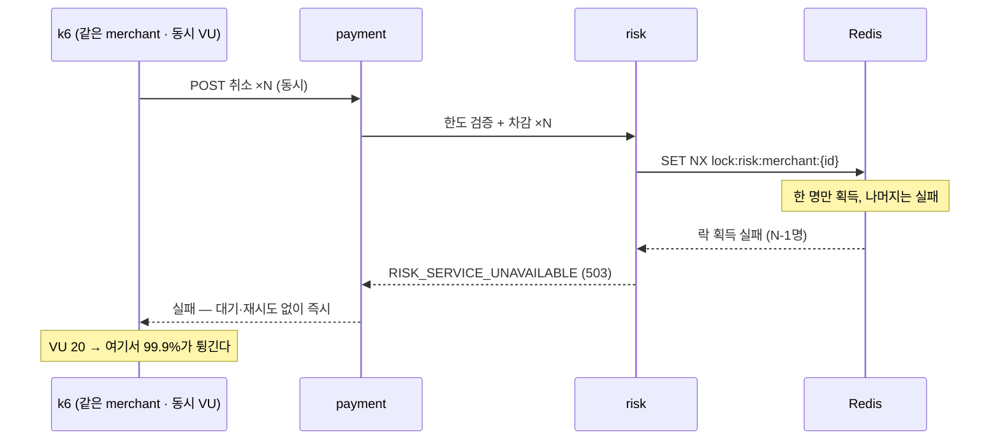

> [!summary] 핵심 한 줄
> baseline엔 데드락 스택트레이스가 났으니 원인은 데드락인 줄 알았다. 그런데 [[07.한 가맹점에 몰았더니 99.9%가 튕겼다|단일 가맹점 스윕]]은 데드락 0에 99.9% 거부. 로그를 파니 진짜 에러는 `RISK_SERVICE_UNAVAILABLE`. 코드를 파니 **merchant별 Redis 분산락이 락을 못 잡은 요청을 대기 없이 즉시 거부**하고 있었다. 데드락은 그 락의 TTL이 만료된 2차 효과였다.

> [!info] 시리즈 — 부하가 드러낸 설계
> **1막 · 실측으로 잡고 증명하다** [[00.실측 서문|00]] · [[01.사설 IP 9대에 실측 판을 깔다|01]] · [[02.DB를 키웠더니 병목이 숨었다|02]] · [[03.서버는 필요할 때만, 이미지는 바뀔 때만|03]] · [[04.배포가 세 번 터졌다|04]] · [[05.190은 용량이 아니었다|05]] · [[06.10명인데 7.63%가 실패했다|06]] · [[07.한 가맹점에 몰았더니 99.9%가 튕겼다|07]] · [[08.데드락인 줄 알았다|08]] · [[09.거절을 대기로 바꿨다|09]] · [[10.SSM 고고학을 그만두다|10]] · [[11.캐시를 껐는데 아무 일도 안 났다|11]]
> **2막 · 관측을 코드로, 코드를 재측정으로** [[12.요청당 쿼리 수와 APM|12]] · [[13.동기 홉인 줄 알았다|13]] · [[14.이력 3커밋을 1로|14]] · [[15.147을 220으로|15]]

---

## 1. 오진의 위험

[[06.10명인데 7.63%가 실패했다|6편]]에서 데드락 스택트레이스를 봤다. 그래서 "원인은 `merchant_cancel_usage` INSERT 데드락"이라고 §8 로그에 적을 뻔했다. 개선안까지 떠올렸다 — 데드락 재시도, upsert.

그런데 [[07.한 가맹점에 몰았더니 99.9%가 튕겼다|7편]]의 표가 그걸 막았다. **단일 가맹점 고VU에서 데드락은 0건**인데 99.9%가 튕긴다. 데드락이 원인이면 데드락 카운트가 수천이어야 한다. 뭔가를 잘못 짚고 있었다.

> [!note] 증상과 원인을 헷갈리지 마라
> [[10.다 멈췄는데 데드락은 아니다|카오스 벤치]]에서 배운 것과 같다. "BLOCKED가 많다 = 데드락"이 아니듯, "데드락 스택트레이스를 봤다 = 원인은 데드락"이 아니다. 다른 축의 신호(데드락 카운트, 지연 모양)가 원인을 가른다.

## 2. 진짜 에러는 무엇인가

risk 로그에서 예외를 종류별로 셌다.

```
781  BusinessException
781  c.e.r.p.GlobalExceptionHandler
```

데드락도, OptimisticLock도, 락 대기 타임아웃도 아니다. **`BusinessException` 781건.** 메시지를 봤다.

```
BusinessException: code=RISK_SERVICE_UNAVAILABLE,
message=위험관리 서비스가 일시적으로 이용 불가합니다.
```

`RISK_SERVICE_UNAVAILABLE`(503). "일시적으로 이용 불가" — 전형적인 **폴백/거부 문구**다. 낮은 지연 + 이 코드 = 실제 작업을 하다 실패한 게 아니라, **뭔가에 막혀 즉시 거부**된 것. [[07.한 가맹점에 몰았더니 99.9%가 튕겼다|7편]]의 fail-fast 시그니처와 정확히 맞는다.

## 3. 코드가 다 말해줬다

`RISK_SERVICE_UNAVAILABLE`을 던지는 곳을 grep했다. `ValidateAndReserveService`의 첫머리였다.

```java
String lockKey = "lock:risk:merchant:" + cmd.merchantId();
Boolean acquired = redis.opsForValue()
    .setIfAbsent(lockKey, "locked", Duration.ofSeconds(5));  // SET NX, TTL 5s
if (!Boolean.TRUE.equals(acquired)) {
    throw ServiceUnavailableException.riskServiceUnavailable();  // ← 즉시 거부
}
try {
    return transactionTemplate.execute(status -> { /* 조회·검증·차감·저장 */ });
} finally {
    redis.delete(lockKey);
}
```

merchant별 **Redis 분산락**이다. `SET NX`로 한 번 시도하고, 락을 못 잡으면 **대기도 큐도 재시도도 없이** 곧바로 `RISK_SERVICE_UNAVAILABLE`을 던진다.

이걸로 [[07.한 가맹점에 몰았더니 99.9%가 튕겼다|7편]]의 곡선이 전부 설명된다.

- VU=1: 경합 없음 → 100% 성공
- VU=5: 다섯이 한 락을 다툼 → 락 못 잡은 넷은 거부 → 33% 실패
- VU=20/50: 사실상 1명만 통과, 나머지 전량 거부 → **99.9%**



데드락이 0인 이유도 나온다 — 락이 DB 접근을 직렬화하니, 단일 가맹점엔 애초에 DB 데드락이 안 생긴다.

## 4. 그럼 baseline의 데드락은 뭐였나

두 실측의 데드락이 서로 모순돼 보였는데, 하나의 설계로 통합됐다.

> [!warning] 데드락은 2차 효과였다
> 락의 TTL은 5초다. 부하 중 트랜잭션(+그 안의 HTTP)이 5초를 넘으면, 락이 **자동 만료**되어 두 번째 요청이 락을 획득한다 → **동시에 두 명이 진입** → 같은 UK로 INSERT → 데드락. [[06.10명인데 7.63%가 실패했다|baseline]]의 데드락은 이 TTL 만료의 부산물이었다. 락이 있어서 데드락이 안 나는 게 정상이고, 데드락은 락이 *뚫렸을 때*만 난다.

즉 99.9% 거부(락이 작동)와 데드락(락이 뚫림)은 **같은 fail-fast 분산락의 두 얼굴**이었다.

## 5. 나쁜 코드가 아니었다

이 락은 실수로 들어간 게 아니다. **선의의 설계**였다.

한도 차감은 `merchant_cancel_usage`를 `SELECT ... FOR UPDATE`로 잡는다. 그런데 대기자가 그 행락 앞에서 기다리면 **DB 커넥션을 쥔 채 줄 서게** 되고, 그러면 [[06.기다리게 하지 말고 거절하라|커넥션풀이 마른다]] — 이건 Kata에서 배운 교훈이다. 그걸 피하려고, DB에 닿기 *전에* Redis 게이트에서 fail-fast로 거절한 것이다.

> [!quote] 미덕이 청구서를 보낸다
> "기다리게 하지 말고 거절하라"는 좋은 원칙이다. 그런데 이 원칙을 한도 카운터에 적용하면, 핫 가맹점에서 **"전부 거절"**이 된다. 코드 리뷰는 이 설계를 "정확하고, 풀도 보호한다"고 통과시켰다. 실제로 정확했고 풀도 보호했다. 대가는 오직 **한 가맹점에 부하를 몰았을 때만** 청구됐다.

---

원인을 한 줄까지 좁혔다: `ValidateAndReserveService` L37, 대기 없는 분산락. 이제 고칠 차례다 — 거절을 대기로 바꾸고, 다시 부하를 걸어 증명한다.
