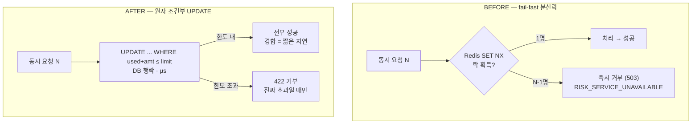

> [!summary] 핵심 한 줄
> 8편에서 핫 merchant의 취소가 **99.9% 거부**됨을 봤다. 범인은 merchant별 Redis 분산락이 락을 못 잡은 요청을 *대기 없이 거부*하는 것 — 경합을 **가용성**으로 청구했다. 고침은 락을 걷고 **DB 원자 조건부 UPDATE**로 바꾸는 것. 임계구역이 트랜잭션 통째에서 단일 문장(µs)으로 줄고, 경합의 대가가 *거부 → 지연*으로 옮겨간다. 그리고 진짜 고쳐졌는지는 **다시 부하를 걸어** 확인한다: 99.9% → **0%**.

> [!info] 시리즈 — 부하가 드러낸 설계
> **1막 · 실측으로 잡고 증명하다** [[00.실측 서문|00]] · [[01.사설 IP 9대에 실측 판을 깔다|01]] · [[02.DB를 키웠더니 병목이 숨었다|02]] · [[03.서버는 필요할 때만, 이미지는 바뀔 때만|03]] · [[04.배포가 세 번 터졌다|04]] · [[05.190은 용량이 아니었다|05]] · [[06.10명인데 7.63%가 실패했다|06]] · [[07.한 가맹점에 몰았더니 99.9%가 튕겼다|07]] · [[08.데드락인 줄 알았다|08]] · [[09.거절을 대기로 바꿨다|09]] · [[10.SSM 고고학을 그만두다|10]] · [[11.캐시를 껐는데 아무 일도 안 났다|11]]
> **2막 · 관측을 코드로, 코드를 재측정으로** [[12.요청당 쿼리 수와 APM|12]] · [[13.동기 홉인 줄 알았다|13]] · [[14.이력 3커밋을 1로|14]] · [[15.147을 220으로|15]]

---

## 1. 정확한데, 전부 튕긴다

[[08.데드락인 줄 알았다|8편]]에서 찾은 원인은 이거였다.

```java
String lockKey = "lock:risk:merchant:" + merchantId;
boolean acquired = redis.opsForValue()
    .setIfAbsent(lockKey, "locked", Duration.ofSeconds(5));  // SET NX
if (!acquired) throw riskServiceUnavailable();               // 즉시 거부
try {
    // 트랜잭션 전체: 조회 → 검증 → 차감 → 저장
} finally { redis.delete(lockKey); }
```

merchant별로 취소를 **직렬화**하는 분산락이다. 정확성은 지킨다 — 동시에 두 요청이 같은 가맹점 한도를 깎는 일이 없으니 이중차감이 안 난다. 하드 게이트는 통과다.

문제는 **락을 못 잡은 쪽**이다. `SET NX`는 한 번 시도하고 실패하면 끝이다. 대기도, 큐도, 재시도도 없이 곧바로 `RISK_SERVICE_UNAVAILABLE`(503)로 거부한다. 그리고 락을 **트랜잭션 통째로** 쥐고 있으니(그 안에 `SELECT FOR UPDATE`도, [[07.트랜잭션 안에서 HTTP를 부르지 마라|HTTP 호출]]까지 들어있다) 승자가 락을 쥐는 시간이 길다. 창이 넓으니 그 안에 도착한 요청은 거의 다 부딪힌다.

실측이 이걸 냉정하게 보여줬다. 단일 merchant에 동시 요청을 올리자:

| 동시 VU | 거부율 |
|---|---|
| 1 | 0% |
| 5 | 33% |
| 20 | **99.93%** |
| 50 | **99.95%** |

> [!warning] 경합을 무엇으로 청구하는가
> 경합은 원래 "잠깐 줄 서세요(지연)"로 처리할 수 있는 것이다. 그런데 이 설계는 "당신 차례 아니니 실패(가용성)"로 바꿔버린다. 핫 가맹점(대형 셀러·플래시 세일)은 취소가 사실상 1건씩만 통과하고 나머지는 전부 튕긴다.

## 2. 세 가지 선택지 — 낙관·비관·원자

차감은 본질이 **"카운터를 상한까지 증가"**다. `used_amount + amount <= daily_limit`이면 더한다. [[03.동시에 사면 초과판매된다|재고 차감]]과 똑같은 모양이다. 이 모양의 동시성 처리는 세 갈래다.

- **낙관(@Version)** — 읽을 땐 안 잡고, 쓸 때 버전이 안 바뀌었는지 확인 후 충돌이면 재시도. 그런데 **단일 핫 행**에선 최악이다. 다들 같은 버전을 읽고 한 명만 이기니, 나머지는 충돌·재시도를 반복하며 스래싱한다.
- **비관(SELECT FOR UPDATE)** — 읽을 때 행락을 잡고 쓸 때까지 쥔다. 정확하지만 **락을 앱까지 다녀오는 동안 쥔다**. 대기자가 DB 커넥션을 쥔 채 줄 서면 [[06.기다리게 하지 말고 거절하라|풀이 마른다]]. 지금 락이 바로 이걸 피하려고 Redis 게이트에서 fail-fast로 거절한 거였다.
- **원자 조건부 UPDATE** — 읽기·검사·쓰기를 **한 문장**으로 DB 엔진 안에서. 카운터+상한엔 이게 교과서 정답이다.

원자 UPDATE가 "락 없음"은 아니다. 같은 InnoDB 행락을 쓴다. 차이는 **얼마나 오래 쥐나**다.

```
[비관] 락 획득 → 앱으로 값 이동 → 검증·계산(+HTTP) → UPDATE → 커밋   ← 트랜잭션 통째
[원자] UPDATE ... SET used=used+? WHERE used+? <= limit               ← 이 한 문장 실행 동안만(µs)
```

읽기와 쓰기 사이에 **앱 왕복이라는 갭이 없으니** lost update가 원천적으로 안 난다. `WHERE`가 락 잡은 시점의 현재값으로 상한을 검사하니 초과차감도 못 샌다. 비관락과 **똑같은 정합성**을, **락을 최소 시간만** 쥐고 얻는다.

## 3. 임계구역을 한 문장으로

락과 `FOR UPDATE`를 걷고, 두 문장으로 쪼갰다. 한 문장에 `IF()`로 다 넣으면 affected-rows가 insert=1/update=2/무변경=0으로 섞여 판정이 모호해지기 때문이다.

```sql
-- ① 행 존재 보장 (한도 로직 없음, 없으면 만들기). 멱등·즉시.
INSERT INTO merchant_cancel_usage (merchant_id, kst_date, daily_limit, used_amount, ...)
VALUES (:m, :d, :limit, 0, ...)
ON DUPLICATE KEY UPDATE merchant_id = merchant_id;   -- 충돌 시 no-op

-- ② 조건부 원자 차감. rows_affected 로 명확히 판정.
UPDATE merchant_cancel_usage
   SET used_amount = used_amount + :amt
 WHERE merchant_id = :m AND kst_date = :d
   AND used_amount + :amt <= daily_limit;
-- rows = 1 → 예약 성공 / rows = 0 → 한도 초과(거부)
```

동시 첫 취소가 몰려도 ①에서 하나가 INSERT하고 나머진 no-op이라 행이 즉시 생긴다(read-then-write 갭이 없어 **데드락도 없다**). 이후 차감은 ②만 실행하고, `daily_limit`은 **행에 박힌 컬럼**을 WHERE가 직접 본다.

여기서 [[15.순수하게 만들었더니 저장이 사라졌다|도메인 순수성]] 문제가 걸린다. 한도 규칙이 SQL WHERE로 새어나간 것 아닌가? 그래서 규칙의 **원본은 도메인에 남겼다**.

```java
// 규칙 원본
public boolean canDeduct(BigDecimal limit, BigDecimal used, BigDecimal amt) {
    return used.add(amt).compareTo(limit) <= 0;
}
```

그리고 SQL의 `WHERE used + :amt <= daily_limit`가 이 규칙을 **그대로 옮긴 것**임을 테스트로 못박았다 — 경계값들에서 `canDeduct`의 예/아니오와 SQL `tryDeduct`의 1/0이 항상 같은지 파라미터라이즈로 검증한다. 순수성을 지키면서 원자성을 얻는다.



## 4. 리뷰가 잡은 두 함정

코드 리뷰에서 두 개가 걸렸다. 둘 다 "TX에 뭐가 있나" 렌즈인데 결론이 반대라 재밌다.

**① native `@Modifying`은 1차 캐시를 우회한다.** 원자 UPDATE는 영속성 컨텍스트를 건너뛰고 DB에 직접 쏜다. 그래서 차감 뒤 같은 트랜잭션에서 결과를 다시 조회하면, PC에 남은 **옛 엔티티(used=0)**를 돌려받는다([[05.save가 INSERT가 아니었다|save가 INSERT가 아니었던]] 그 영속성 컨텍스트다).

```java
@Modifying(flushAutomatically = true, clearAutomatically = true)
```

`clearAutomatically`로 쿼리 후 PC를 비워, 재조회가 DB값을 보게 한다. *clear가 없으면 실패하는 테스트*로 이 결정을 고정했다.

**② history는 TX 안에 남긴다.** limit 해석의 HTTP는 [[07.트랜잭션 안에서 HTTP를 부르지 마라|밖으로 빼야]] 맞지만(느리고 외부·best-effort), 멱등 원장(`cancelRequestId` UK)은 **밖으로 빼면 안 된다**. 차감과 원자적으로 커밋돼야 UK가 이중차감을 막는다. 밖으로 빼면 두 요청이 둘 다 차감하고 나서 UK가 하나만 막아 — 정확히 우리가 방어하려던 이중차감이 난다. **감사 로그는 밖으로, 멱등 원장은 안으로.** 같은 렌즈, 반대 결론.

## 5. 증명 — 단위와 실측

두 종류로 증명한다.

**단위(correctness)** — 단일 merchant 한 행에 50스레드를 동시에 던진다. 한도 300,000, 차감 10,000이면 용량은 정확히 30건.

```
50스레드 동시 tryDeduct →  성공 30건, used_amount = 300,000
초과차감 0, spurious 거부 0, 데드락 0
```

**실측(증상 소멸)** — 8편과 *똑같은 부하*를 AWS 분리 인프라에 다시 걸었다.

| 동시 VU | BEFORE 거부% | **AFTER 거부%** | AFTER p95 |
|---|---|---|---|
| 1 | 0% | 0.00% | 70ms |
| 5 | 33% | **0.00%** | 65ms |
| 20 | 99.93% | **0.00%** | 130ms |
| 50 | 99.95% | **0.00%** | 300ms |

거부가 사라졌다. 그리고 **p95가 70→300ms로 오르는 게 핵심**이다 — 요청이 튕기는 대신 DB 행락에서 잠깐 줄 서서 전부 성공한다. **경합의 대가가 가용성에서 지연으로 옮겨간 것.** 건강한 백프레셔다. ([[06.10명인데 7.63%가 실패했다|축A baseline]]의 7.63%도 같은 뿌리였고, 같이 0%로 내려갔다.)

## 6. 거절의 반대편

[[06.기다리게 하지 말고 거절하라]]에서는 거절이 미덕이었다. 뒤늦은 멱등 중복을 락 앞에 줄 세우는 대신 상태를 보고 즉시 409로 갈라쳤다 — 어차피 버릴 요청을, 버리려고 커넥션을 쥐고 기다리게 하지 말라는 것.

이 편은 그 반대편이다. **똑같이 "거절 vs 대기"인데 결론이 뒤집힌다.** 멱등 따닥은 버릴 요청이라 거절이 옳지만, 한도 카운터는 **버리면 안 되는 진짜 취소**라 대기가 옳다. 같은 원리를 문제의 모양에 따라 반대로 적용하는 것 — 그게 판단이다.

부하가 없었다면 이 차이는 안 보였을 것이다. 코드 리뷰엔 "락으로 직렬화, 정확함"이라고 써 있었고, 실제로 정확했다. **99.9%가 튕긴다는 사실은 오직 한 가맹점에 부하를 몰았을 때만 드러났다.** 그리고 고쳤다는 사실은, 다시 몰아봐야 증명된다.
