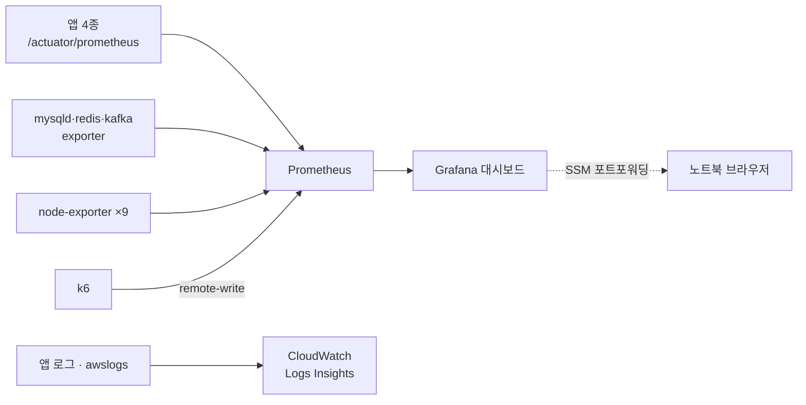

> [!summary] 핵심 한 줄
> [[08.데드락인 줄 알았다|진단]]을 전부 `aws ssm send-command`로 `docker logs`를 grep해서 했다. 왜? **관측 스택이 안 떠 있었기 때문**이다. 사설 IP라 브라우저 접근도 없었다. 고침은 obs를 반드시 띄우고(온디맨드), SSM 포트포워딩으로 노트북에서 Grafana를 열고, 로그를 CloudWatch로 보내는 것. 다음 진단은 CLI 고고학이 아니라 point-and-click이다.

> [!info] 시리즈 — 부하가 드러낸 설계
> **1막 · 실측으로 잡고 증명하다** [[00.실측 서문|00]] · [[01.사설 IP 9대에 실측 판을 깔다|01]] · [[02.DB를 키웠더니 병목이 숨었다|02]] · [[03.서버는 필요할 때만, 이미지는 바뀔 때만|03]] · [[04.배포가 세 번 터졌다|04]] · [[05.190은 용량이 아니었다|05]] · [[06.10명인데 7.63%가 실패했다|06]] · [[07.한 가맹점에 몰았더니 99.9%가 튕겼다|07]] · [[08.데드락인 줄 알았다|08]] · [[09.거절을 대기로 바꿨다|09]] · [[10.SSM 고고학을 그만두다|10]] · [[11.캐시를 껐는데 아무 일도 안 났다|11]]
> **2막 · 관측을 코드로, 코드를 재측정으로** [[12.요청당 쿼리 수와 APM|12]] · [[13.동기 홉인 줄 알았다|13]] · [[14.이력 3커밋을 1로|14]] · [[15.147을 220으로|15]]

---

## 1. 진단이 고고학이 된 이유

[[08.데드락인 줄 알았다|8편]]에서 원인을 한 줄까지 좁혔다. 그런데 그 과정을 다시 보면 — 전부 이런 식이었다.

```bash
aws ssm send-command --targets Key=tag:Role,Values=risk \
  --parameters commands='docker logs risk-management-service --since 5m | grep -iE "exception|deadlock"'
# → command-id 받아서 → get-command-invocation 폴링 → 출력 파싱 → 다시 grep ...
```

9대에 흩어진 컨테이너 로그를, SSM으로 명령을 쏘고 결과를 폴링해서, 파싱하고 grep했다. 예외를 종류별로 세는 것도, 데드락 타임라인을 보는 것도 전부 이 CLI 고고학이었다. **원인은 정확히 찾았지만, 찾는 방법이 원시적이었다.**

## 2. 정작 관측 스택은 안 떠 있었다

아이러니는, [[00.실측 서문|서문]]에서 "서버만 분리하고 지표를 안 보면 실측이 아니다"라고 했으면서, **관측 스택(Prometheus+Grafana)을 만들어놓고도 안 띄웠다**는 것이다.

이유가 두 개였다.

- **obs가 Spot 용량 부족으로 안 떴다.** [[02.DB를 키웠더니 병목이 숨었다|2편]]의 그 `t4g.medium` Spot 문제. 관측 인스턴스가 통째로 없었다.
- **로그가 호스트에 흩어져 있었다.** 중앙 로그가 없으니 `docker logs`를 호스트마다 캐야 했다.

관측을 안 갖춘 대가를, 진단 내내 CLI로 치른 셈이다.

## 3. 관측을 GUI로

그래서 "관측 이지 세팅"을 묶어 만들었다.

**① obs는 반드시 뜨게 (온디맨드)** — `t4g.medium` Spot 용량이 없으면 관측이 통째로 사라진다. obs만 온디맨드로 예외 처리해 항상 뜨게 했다. 그리고 `ssm-deploy`가 node-exporter(전 호스트)와 obs 스택을 **자동 배포**한다.

**② 노트북 브라우저로 — SSM 포트포워딩** — 사설 IP라 브라우저가 못 닿는 문제. 퍼블릭 IP·SSH·터널 없이 한 줄로 연다.

```bash
aws ssm start-session --target <obs> \
  --document-name AWS-StartPortForwardingSession \
  --parameters '{"portNumber":["3000"],"localPortNumber":["3000"]}'
# → localhost:3000 에서 Grafana. 8989=Kafka UI, 8080=actuator 도 동일
```

**③ 로그 검색 — CloudWatch Logs Insights** — `awslogs` 드라이버로 앱 로그를 CloudWatch로 보내면, `docker logs | grep` 대신 콘솔에서 쿼리한다.

```sql
fields @message
| filter @message like /Exception|ERROR/
| parse @message /code=(?<code>[A-Z_]+)/
| stats count(*) as n by code | sort n desc
```

8편에서 손으로 세던 "`RISK_SERVICE_UNAVAILABLE` 781건"을, 이 쿼리 한 줄이 GUI로 뽑는다.

**④ k6도 GUI로** — `K6_WEB_DASHBOARD=true`로 실행 중 실시간 웹 UI, 또는 Prometheus remote-write로 Grafana에 부하 지표를 실시간 그린다.



## 4. 그래서 재측정은 달랐다

[[09.거절을 대기로 바꿨다|9편]]의 AFTER 재측정에서, 처음으로 이 관측 스택이 실제로 떴다. Grafana, Prometheus, mysqld-exporter 4개, kafka·redis exporter까지. 부하를 거는 동안 **에러율 곡선이 99.9%에서 0%로 내려앉는 걸 대시보드로** 봤다 — SSM으로 로그를 캘 필요 없이.

> [!success] 진단의 노동을 도구로 옮긴다
> 8편에서 사람이 CLI로 하던 일(로그 수집·집계·타임라인)을, 이제 Grafana 패널과 Logs Insights 쿼리가 한다. 사람은 **판단**만 하면 된다. 관측은 "있으면 좋은 것"이 아니라, 진단의 노동량을 결정하는 인프라다.

---

## 시리즈를 닫으며

[[00.실측 서문|서문]]의 논제는 "부하로 드러내고, 부하로 증명한다"였다. 이 열 편이 그 한 바퀴다 — [[01.사설 IP 9대에 실측 판을 깔다|판을 깔고]], [[04.배포가 세 번 터졌다|파이프라인을 세 번 고치고]], [[06.10명인데 7.63%가 실패했다|결함을 잡고]], [[08.데드락인 줄 알았다|한 줄까지 진단하고]], [[09.거절을 대기로 바꿨다|고쳐서 99.9%→0%를 다시 측정]]했다.

코드 리뷰가 "옳다"고 말한 설계의 대가를, 부하가 청구서로 보여줬다. 그 청구서를 읽고, 지불을 멈추고, 멈췄음을 다시 측정으로 확인하는 것 — 그게 실측이었다. 그리고 이제 그 읽는 노동까지 GUI로 옮겼으니, 다음 청구서는 훨씬 빨리 읽을 것이다.
