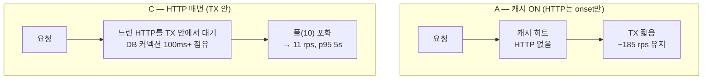

> [!summary] 핵심 한 줄
> [[09.거절을 대기로 바꿨다|9편]]에서 한도 조회 HTTP를 일부러 TX 안에 남겨뒀다 — 비용을 재보려고. Redis 캐시를 끄고(HTTP가 매번 타게) VU를 400까지 밀어봐도 **아무 일도 안 났다.** 캐시는 처리량을 1%도 안 올렸다. "그럼 안 고쳐도 되네" 싶던 찰나 — merchant-limit를 100ms 느리게 하자 **처리량이 15배 무너졌다.** 캐시는 성능이 아니라 회복탄력성이었고, 실측은 "고쳐라"가 아니라 "**언제·왜 위험한지, 우선순위는 낮다**"를 말해줬다.

> [!info] 시리즈 — 부하가 드러낸 설계
> **1막 · 실측으로 잡고 증명하다** [[00.실측 서문|00]] · [[01.사설 IP 9대에 실측 판을 깔다|01]] · [[02.DB를 키웠더니 병목이 숨었다|02]] · [[03.서버는 필요할 때만, 이미지는 바뀔 때만|03]] · [[04.배포가 세 번 터졌다|04]] · [[05.190은 용량이 아니었다|05]] · [[06.10명인데 7.63%가 실패했다|06]] · [[07.한 가맹점에 몰았더니 99.9%가 튕겼다|07]] · [[08.데드락인 줄 알았다|08]] · [[09.거절을 대기로 바꿨다|09]] · [[10.SSM 고고학을 그만두다|10]] · [[11.캐시를 껐는데 아무 일도 안 났다|11]]
> **2막 · 관측을 코드로, 코드를 재측정으로** [[12.요청당 쿼리 수와 APM|12]] · [[13.동기 홉인 줄 알았다|13]] · [[14.이력 3커밋을 1로|14]] · [[15.147을 220으로|15]]

---

## 1. 일부러 남겨둔 빚

[[09.거절을 대기로 바꿨다|9편]]에서 락을 걷어내며, 한 가지를 **일부러 안 고쳤다.** 한도 조회의 3단계(Redis 캐시 → DB 스냅샷 → merchant-limit HTTP) 중 마지막 HTTP가 여전히 트랜잭션 안에서 일어난다. [[07.트랜잭션 안에서 HTTP를 부르지 마라|Kata의 교훈]]이 "빼라"고 말하는 바로 그 지점이다.

왜 안 고쳤나. **비용을 눈으로 보고 빼려고.** 교리("HTTP는 TX 밖으로")를 따라 성급히 고치는 대신, 그게 실제로 얼마나 비싼지 재기로 했다. 조회 층에 토글 플래그를 심었다.

- **A** — Redis 캐시 ON (현행)
- **B** — 캐시 OFF → DB 스냅샷으로
- **C** — 캐시+스냅샷 OFF → **매 요청 merchant-limit HTTP** (TX 안에서)

## 2. 캐시를 껐는데, 아무 일도 안 났다

같은 분산 부하로 A/B/C를 쟀다.

| config | 20 VU rps | 해석 경로 |
|--------|-----------|-----------|
| A | 162 | Redis GET / 요청 |
| B | **182** | DB SELECT / 요청 |
| C | 172 | HTTP / 요청 |

셋 다 **오차 범위**다. 그리고 반전 — **A(캐시)가 B(DB 스냅샷)보다 오히려 느렸다.** Redis 캐시가 처리량을 1%도 안 올린 것이다.

혹시 부하가 약해서 안 보이나 싶어 VU를 밀었다. 100, 200, 400.

| VU | A rps / p95 | C rps / p95 |
|----|-------------|-------------|
| 100 | 151 / 820ms | 165 / 677ms |
| 200 | 184 / 1.13s | 180 / 1.14s |
| 400 | 187 / 2.17s | 182 / 2.22s |

**VU 400까지 A와 C는 안 갈렸다.** rps는 둘 다 ~185에서 평평하고([[05.190은 용량이 아니었다|포화]]), 매 요청 HTTP를 때리는 C조차 멀쩡했다.

> [!info]- 잠깐 — 동시 400인데 rps가 185? (VU와 rps의 관계)
> VU 한 명은 "초당 1요청"이 아니라 **요청 → 응답 대기 → 다음 요청**을 반복하는 블로킹 루프다. 그래서 **rps = VU ÷ 요청당 지연**이다. 위 표에서 60 VU에 174 rps면 요청당 `60/174 ≈ 0.34초`(측정 avg 330ms와 일치). 어느 순간에도 60개가 "처리 중"이고, 각자 0.34초씩 걸려 완료되니 초당 174개가 천장인 것.
> 시스템이 초당 ~185개만 끝낼 수 있는 지점(**포화**)에 닿으면, VU를 더 넣어도 병목은 안 빨라진다 — 추가 요청은 **큐에서 대기**하고 **지연만 비례해 늘어난다**. Little's Law: `동시성 = 처리량 × 지연` (20 VU=180×0.11s, 60 VU=180×0.34s, 400 VU=185×2.2s). **"동시 400, rps 185, p95 2.2s"는 모순이 아니라 포화의 증거**다.

> [!note] 여기서 성급히 결론 내릴 뻔했다
> "캐시도 이득 없고, HTTP-in-TX도 공짜네. Kata 교리는 이 경우 틀렸고, 안 고쳐도 되겠다." — 실측이 없었으면 여기서 멈췄을 것이다. 그런데 이건 **merchant-limit가 빠를 때의** 그림일 뿐이었다.

## 3. 근데 — 왜 매 요청 HTTP가 공짜지?

이상했다. C는 매 취소마다 merchant-limit로 HTTP를 나가는데, 왜 안 느리지?

두 가지 때문이었다. (1) [[09.거절을 대기로 바꿨다|락을 걷어낸]] 덕에 HTTP 중엔 **행락을 안 쥐고 DB 커넥션만** 쥔다. (2) merchant-limit이 **빨라서** 그 커넥션을 잠깐만 쥔다. 그래서 커넥션 풀이 안 눌린다.

그럼 질문을 뒤집는다. **merchant-limit이 느려지면?** VU로는 못 건드리는 변수다. 그래서 `tc netem`으로 merchant-limit 응답에 인위적 지연을 주입했다.

## 4. 절벽

VU를 60으로 고정하고, merchant-limit 지연을 0 → 100 → 200ms로 올렸다.

| merchant-limit 지연 | A (cache) rps / p95 | C (HTTP 매번) rps / p95 |
|---|---|---|
| 0ms | 174 / 380ms | 170 / 388ms |
| 100ms | 176 / 333ms | **11.5 / 5.13s** |
| 200ms | 166 / 361ms | **6.0 / 9.96s** |

**A는 꿈쩍도 안 하고, C는 100ms에서 15배·200ms에서 26배 무너졌다.**

메커니즘은 명확하다. C는 매 요청이 **느린 HTTP를 트랜잭션 안에서 기다리며 DB 커넥션을 쥔다.** merchant-limit이 100ms면 커넥션을 100ms씩 쥐고, HikariCP 풀(10개)이 순식간에 포화된다. 나머지 요청은 커넥션을 기다리며 p95가 5초로 치솟는다. A는 대부분 캐시 히트라 HTTP를 안 나가니 무풍지대.

## 5. 캐시의 진짜 정체

여기서 캐시가 다시 보인다. VU 스윕에선 캐시가 **처리량을 1%도 안 올렸다.** 그래서 "쓸모없나" 싶었다. 하지만 netem이 진실을 드러냈다 —

> [!success] 캐시는 성능 최적화가 아니라 회복탄력성 방패였다
> Redis 캐시의 값어치는 "빠르게"가 아니라, **느린 의존성(merchant-limit)을 핫패스 밖(onset)으로 몰아내는 것**이다. 캐시가 HTTP를 그날 첫 취소로만 제한하니, merchant-limit이 아무리 느려져도 그게 매 요청의 TX를 물지 않는다. 캐시는 처리량이 아니라 **tail을 지킨다.**

## 6. 정직한 판정

그럼 "TX 밖으로" 최적화, 해야 하나?

먼저 회의부터 — **merchant-limit이 실제로 느려질까?** 그렇다. GC 정지, 자기 DB 슬로우쿼리, 배포 중 콜드스타트, 그리고 우리 토폴로지에선 [[01.사설 IP 9대에 실측 판을 깔다|order와 합쳐진 cold-svc]]의 noisy neighbor까지. 무엇보다 **코드에 이미 merchant-limit 클라이언트의 서킷브레이커가 있다** — 설계자가 "느려지거나 죽을 수 있다"고 이미 가정했다는 증거다.

하지만 정직하게, **config C는 인위적 최악**이다. 실서비스에서 HTTP는 매 요청이 아니라 **onset(캐시+스냅샷 둘 다 miss)** 에만 탄다. row가 한 번 생기면 DB 스냅샷이 덮어 Redis가 죽어도 HTTP 안 간다. 그래서 현실 위험은 "캐시 콜드 버스트 + merchant-limit 슬로우"가 겹치는 **짧은 tail hiccup**이지, 15배 지속 붕괴가 아니다.

| | 정상 | merchant-limit 슬로우 |
|---|---|---|
| 성능 이득 (TX 밖으로) | 0 (실측) | — |
| 위험 | 없음 | onset 버스트의 tail hiccup (드묾, 짧음) |

**결론: "TX 밖으로"는 급한 불이 아니다.** 성능 이득은 0이고(VU 스윕이 증명), 회복탄력성 이득은 "드물게, 그러나 크게". tail 위생 차원에서 여유 될 때 하면 되는, **우선순위 낮은** 개선이다.

---

이 편의 진짜 결과는 숫자가 아니라 **의사결정**이다. 실측이 없었으면 두 번 틀렸을 것이다 — 캐시를 성능이라 착각해 붙잡거나(실은 회복탄력성), HTTP-in-TX를 교리대로 성급히 고치거나(실은 우선순위 낮음). **실측은 "고쳐라/두어라"를 넘어, 그게 언제·왜 문제가 되고 얼마나 급한지까지 말해준다.** 부하가 청구서를 보여주고, netem이 그 청구서에 조건("의존성이 느려지면")을 달아준 것이다.
