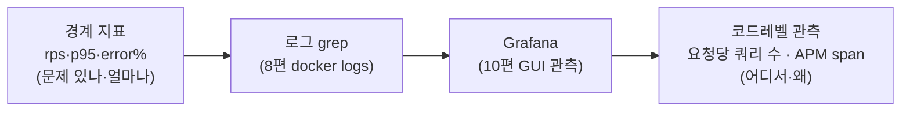

> [!summary] 핵심 한 줄
> 1막의 실측은 **경계에서만** 쟀다 — rps·p95·error%. "문제가 있나 / 얼마나 나쁜가"는 보여도 "**어디서 / 왜**"는 코드 안에 있고 경계 지표엔 안 써 있다. [[08.데드락인 줄 알았다|8편]]은 `docker logs`를 grep했고, [[11.캐시를 껐는데 아무 일도 안 났다|11편]]의 "커넥션을 트랜잭션 내내 쥔다"는 **본 게 아니라 추론**이었다. 그래서 코드레벨 관측 두 개를 깔았다 — **요청당 쿼리 수**와 **APM(분산 트레이싱)**. 전부 opt-in, 평상시·CI 영향 0.

> [!info] 시리즈 — 부하가 드러낸 설계
> **1막 · 실측으로 잡고 증명하다** [[00.실측 서문|00]] · [[01.사설 IP 9대에 실측 판을 깔다|01]] · [[02.DB를 키웠더니 병목이 숨었다|02]] · [[03.서버는 필요할 때만, 이미지는 바뀔 때만|03]] · [[04.배포가 세 번 터졌다|04]] · [[05.190은 용량이 아니었다|05]] · [[06.10명인데 7.63%가 실패했다|06]] · [[07.한 가맹점에 몰았더니 99.9%가 튕겼다|07]] · [[08.데드락인 줄 알았다|08]] · [[09.거절을 대기로 바꿨다|09]] · [[10.SSM 고고학을 그만두다|10]] · [[11.캐시를 껐는데 아무 일도 안 났다|11]]
> **2막 · 관측을 코드로, 코드를 재측정으로** [[12.요청당 쿼리 수와 APM|12]] · [[13.동기 홉인 줄 알았다|13]] · [[14.이력 3커밋을 1로|14]] · [[15.147을 220으로|15]]

---

## 1. 경계 지표의 사각지대

1막 내내 실측은 시스템 **바깥**에서 쟀다. rps, p95, error%. 이 지표들은 "문제가 있나 / 얼마나 나쁜가"를 정직하게 말해준다. 근데 "**어디서 / 왜**"는 코드 안에 있고, 경계 지표엔 원리적으로 안 나온다.

증거가 두 개 있었다.

- [[08.데드락인 줄 알았다|8편]]에서 락 결함을 진단할 때, 전부 `aws ssm send-command`로 `docker logs`를 grep했다. 원인은 찾았는데 방법이 원시적이었다.
- [[11.캐시를 껐는데 아무 일도 안 났다|11편]] netem 실험에서 "느린 merchant-limit HTTP가 DB 커넥션을 트랜잭션 내내 쥔다"를 결론냈다. 근데 그건 **메커니즘 추론**이었지, 커넥션 점유를 **본 게 아니다.**

[[10.SSM 고고학을 그만두다|10편]]이 "로그 grep → Grafana"였다면, 그 사다리의 다음 칸은 **코드레벨 관측**이다.

## 2. 두 축 — 쿼리 수는 싸고, APM은 무겁다

처음엔 "메서드별 지연까지 다 재야 하나?"였는데, 나눠보니 답이 갈렸다.

- **요청당 쿼리 수**: 싸고, 값짐. black-box가 원리적으로 못 보는 클래스(N+1)를 곡선으로 메운다. → 바로 함.
- **메서드별 지연 / 풀 트레이싱**: 무겁고 트리거가 있어야. 근데 5개 서비스 홉이 있으니 언젠간 값짐. → APM으로 같이 감.

핵심은 "느려요"를 넘어 "**어느 홉에서, 요청당 쿼리 몇 개**"까지 추론 없이 보는 것.

## 3. 요청당 쿼리 수 — datasource-proxy (p6spy 아님)

둘 다 JDBC를 감싸지만 태생이 다르다. p6spy는 **로깅** 래퍼, datasource-proxy는 **카운팅**용.

- 요청당 카운트가 datasource-proxy엔 `QueryCountHolder`로 **내장**. p6spy면 ThreadLocal을 직접 짜야 함(= datasource-proxy 재발명).
- DataSource 빈을 프로그래매틱하게 래핑 → `@ConditionalOnProperty`로 빈을 안 만들면 오버헤드 0. p6spy는 URL/설정파일 레벨이라 플래그 on/off가 껄끄러움.
- p6spy의 강점(실제 SQL 로그)은 어차피 **OTel agent의 JDBC span이 커버** → 넣으면 트레이싱과 중복.

구현은 `OncePerRequestFilter`가 요청 시작에 카운터를 clear, 끝에 읽어 Micrometer `DistributionSummary(db.queries.per_request{uri})`로 발행. `uri`는 반드시 라우트 패턴(`/payments/{id}/cancel`) — 원시 path를 쓰면 cardinality가 폭발한다.

## 4. APM — OTel agent → Tempo, 전부 opt-in

- 이미 Grafana가 있으니 **Tempo**가 데이터소스 하나로 끝. 지표(Prometheus)와 한 화면.
- 계측은 **OTel Java agent** — `-javaagent` 한 줄로 코드 변경 0. Spring MVC·JDBC·HTTP·Kafka 자동. 4개 서비스 안 건드림.
- agent를 **이미지에 굽되 `-javaagent`는 안 켠다.** 활성화는 load-test compose env로만 → 평상시·CI 영향 0.

> [!note] 이 작업 전체의 대원칙: 전부 opt-in
> 관측 도구가 평상 운영을 1%도 건드리면 안 된다. 라이브러리 모듈은 컴포넌트 스캔 밖, agent는 이미지에 굽되 비활성, 쿼리 카운트는 플래그 off면 빈 자체가 없다. "켜야만 존재"가 기본값.

## 5. 만들면서 걸린 함정들

- **라이브러리 모듈 함정**: subprojects가 Spring Boot 플러그인을 모든 모듈에 적용 → 공통 모듈이 bootJar를 못 만들어 빌드 실패. `bootJar { enabled = false }`로 해결.
- **컴포넌트 스캔 밖**: 공통 모듈 클래스가 각 서비스의 스캔 범위 밖 → `AutoConfiguration.imports`로 자동설정을 로딩해야 뜬다.
- **JAVA_TOOL_OPTIONS 병합**: compose에 이미 `-Xmx4g -XX:+UseG1GC`가 있어, 덮어쓰면 힙 설정이 날아감. `${OTEL_JAVAAGENT:-}` 붙여 병합.
- **env relaxed binding**: `loadtest.query-count.enabled` → 환경변수는 대시 제거해 `LOADTEST_QUERYCOUNT_ENABLED`. `LOADTEST_QUERY_COUNT_ENABLED`로 쓰면 조용히 안 먹는다.

## 6. 전체 브랜치 리뷰가 잡은 것 (혼자선 못 봤을)

태스크별 리뷰는 다 통과했는데, **전체 브랜치 리뷰**가 태스크 단위론 안 보이는 통합 이슈를 잡았다.

필터가 `service` 태그를 `spring.application.name`(긴 이름 `payment-service`)로 달았는데, Prometheus 스크레이프가 이미 타겟 라벨 `service`(짧은 이름 `payment`)를 붙이고 있었다. 충돌 → 앱 태그가 `exported_service`로 밀리고, 기존 대시보드는 이미 짧은 이름으로 그룹핑 중. 즉 **필터의 service 태그는 죽은 라벨**이었다.

→ 필터에서 그 태그를 뺐다. 타겟 라벨이 이미 진실의 원천이고 obs 스택 관습과도 일치. 대시보드는 그대로 동작.

> [!success] "실측으로 잡는다"의 메타버전
> 코드 리뷰조차 **혼자 보는 시야론 못 잡는 것**을, 관점을 바꾼(전체 브랜치) 리뷰가 잡았다. 라벨 하나의 충돌은 어느 단위 테스트도 못 본다 — 통합 지점에서만 보인다.

## 한 줄

[[11.캐시를 껐는데 아무 일도 안 났다|11편]]의 실측이 청구서를 보여줬다면, 이제 그 청구서의 **어느 줄이 왜 비싼지** 코드레벨로 읽는 도구를 깔았다. 다음은 추론이 아니라 관측이다 — 그리고 [[13.동기 홉인 줄 알았다|13편]]에서, 이 관측이 1막이 "동기 홉"이라 불렀던 벽의 진짜 정체를 뒤집는다.
