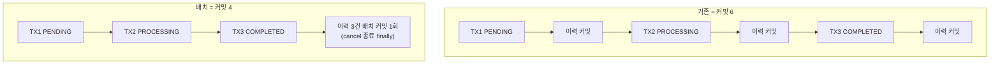

> [!summary] 핵심 한 줄
> [[13.동기 홉인 줄 알았다|13편]]이 벽을 규명했다 — 취소 1건당 커밋 6개(fsync)가 천장의 정체. 그중 3개는 **이력**(`cancel_request_history`)을 상태전이마다 별도 트랜잭션으로 쓰기 때문. 근데 이력이 코어 TX 밖에 있는 건 **감사 내구성 불변식**이라 함부로 못 합친다. 그래서 비동기도, TX 병합도 아닌 **배치** — 전이 순간 시각을 메모리에 모아뒀다가 취소 종료 시 1커밋으로 일괄 INSERT. 커밋 6→4, 이력 3건은 다 보존.

> [!info] 시리즈 — 부하가 드러낸 설계
> **1막 · 실측으로 잡고 증명하다** [[00.실측 서문|00]] · [[01.사설 IP 9대에 실측 판을 깔다|01]] · [[02.DB를 키웠더니 병목이 숨었다|02]] · [[03.서버는 필요할 때만, 이미지는 바뀔 때만|03]] · [[04.배포가 세 번 터졌다|04]] · [[05.190은 용량이 아니었다|05]] · [[06.10명인데 7.63%가 실패했다|06]] · [[07.한 가맹점에 몰았더니 99.9%가 튕겼다|07]] · [[08.데드락인 줄 알았다|08]] · [[09.거절을 대기로 바꿨다|09]] · [[10.SSM 고고학을 그만두다|10]] · [[11.캐시를 껐는데 아무 일도 안 났다|11]]
> **2막 · 관측을 코드로, 코드를 재측정으로** [[12.요청당 쿼리 수와 APM|12]] · [[13.동기 홉인 줄 알았다|13]] · [[14.이력 3커밋을 1로|14]] · [[15.147을 220으로|15]]

---

## 1. 왜 커밋 6인가

[[13.동기 홉인 줄 알았다|13편]]에서 취소 1건 = 커밋 6을 쟀다. 쪼개보면:

- **코어 3 트랜잭션** — TX1(PENDING) → risk 호출 → TX2(PROCESSING) → PG 호출 → TX3(COMPLETED). 외부 호출로 갈라져 있어 **못 합친다.** TX 하나를 HTTP 왕복 내내 쥐면 [[11.캐시를 껐는데 아무 일도 안 났다|11편]]이 경고한 "커넥션 시한폭탄"이 된다.
- **이력 3 트랜잭션** — 상태전이(PENDING/PROCESSING/COMPLETED)마다 `cancel_request_history`를 `REQUIRES_NEW`로 한 번씩.

코어 3은 구조적으로 고정. 그럼 남는 레버는 **이력 3**이다.

## 2. 이력이 TX 밖인 이유부터

배치를 논하기 전에, 왜 이력이 별도 트랜잭션인지부터. 이건 실수가 아니라 **불변식**이다.

> [!important] 감사 불변식 — 이력은 코어 TX 밖 + best-effort
> 이력 기록이 실패해도 비즈니스 취소는 성공해야 한다. 이력을 TX3 안에 넣으면, 이력 INSERT 실패가 **결제 취소를 롤백**시킨다. 감사 로그가 본업을 인질로 잡는 셈. 그래서 `REQUIRES_NEW` + 예외는 삼킨다(로그만).

즉 "커밋을 줄이자"고 이력을 코어 TX에 접어 넣는 건 **금지**다. 불변식을 지키면서 커밋만 줄여야 한다.

## 3. 세 가지 길, 그리고 함정

- **① 비동기(@Async)**: 이력을 요청 스레드 밖에서. — 함정: 요청 *지연*은 줄지만 **총 커밋 수는 그대로**다. 같은 풀·같은 2코어 DB가 여전히 6번 fsync한다. 처리량 이득 ≈ 0. 벽이 fsync 처리량이면 커밋을 **옮겨선** 안 되고 **줄여야** 한다. (커밋=fsync·group commit의 DB 내부 → [[InnoDB 내구성 — 커밋은 왜 비싼가]].)
- **② 터미널만 기록**: PENDING/PROCESSING 생략, COMPLETED/FAILED만. — 3→1이지만 **전이 로그를 잃는다.**
- **③ 배치**: 전이마다 메모리 버퍼에 쌓고, 끝에 1 트랜잭션으로 일괄 INSERT. — 3커밋→1커밋, 이력 3건 **다 보존.**

③이 답이다. 핵심 통찰: **비동기는 커밋을 옮길 뿐 안 줄인다.**

## 4. 배치의 유일한 함정 — 시각

배치하면 3건이 같은 순간에 INSERT된다. 그럼 각 이력의 `created_at`이 **flush 시각**으로 뭉개져 — "언제 PROCESSING이 됐나"라는 감사 가치가 사라진다.

해결은 간단했다. 엔티티가 `of(...)`에서 `Instant.now()`를 **생성 시점**에 박는다. 그러니 **전이 순간에 엔티티(값)를 만들어 버퍼에 넣으면**, INSERT를 나중에 배치해도 시각은 전이 순간으로 보존된다. 배치는 "쓰기"만 미루지 "시각"은 안 미룬다.

## 5. 구조

- `CancelHistoryRecorder` — `ThreadLocal` 버퍼. `add()`가 전이 시각을 캡처해 쌓고(메모리, DB 안 감), `flush()`가 `recordAll` 배치 INSERT를 위임(1 트랜잭션·1 커밋), best-effort로 예외 삼킴, `finally`에서 `ThreadLocal.remove()`.
- `CancelPaymentService.cancel()`을 `try { … } finally { recorder.flush() }`로 감쌈 → 성공·실패·재시도 **모든 종료 경로**에서 flush 1회. 코어 TX는 무변경.

> [!note] self-invocation 함정은 피했다
> `@Transactional(REQUIRES_NEW)`는 레포지토리(다른 빈)에 붙고, recorder가 그 프록시를 호출한다. 같은 빈 안에서 `this.transactional()`을 부르는 self-invocation이 아니라, 프록시가 정상 개입한다.

## 6. 복구는 왜 안 깨지나

이력을 나중에 쓰면 중간 상태 이력이 늦어진다. 복구 스케줄러가 그걸 읽으면 깨진다 — 근데 안 읽는다.

pending/processing 복구는 **`cancel_request.status`**(코어 커밋)를 조회하지 `history` 테이블을 안 본다. 이력은 순수 감사 로그다. 그래서 배치 지연은 **복구·정합성에 무영향**, 앱 크래시 시 손실되는 건 중간 이력의 감사 세분성뿐(그마저 best-effort고 드묾).

## 한 줄

커밋 6을 4로 만들었다 — 코어 TX 경계도, 감사 불변식도 안 건드리고, 이력 3건도 다 남기고. 남은 건 하나: 이게 **정말** 처리량을 올리나? [[15.147을 220으로|15편]]에서 재측정으로 증명한다.
