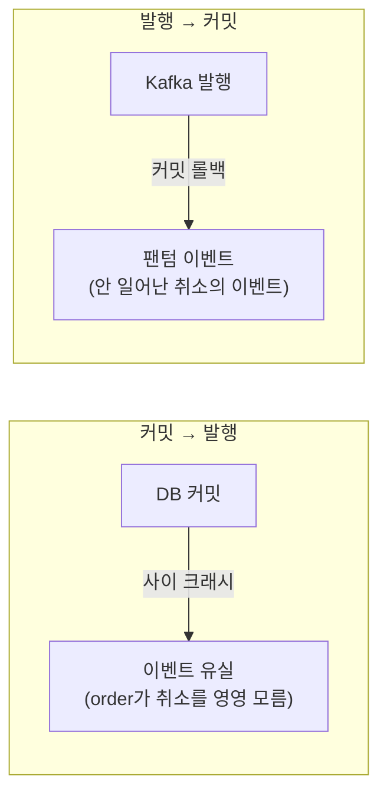
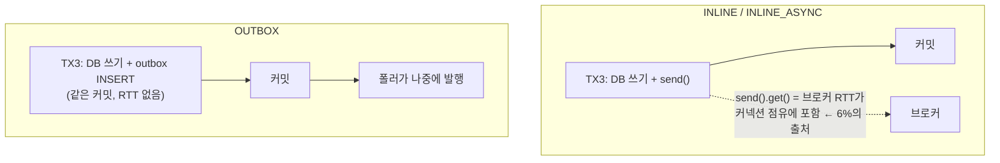

> [!summary] 핵심 한 줄
> 취소가 확정되면 두 가지를 해야 한다 — DB 커밋과 Kafka 발행. 이 둘은 공유 트랜잭션이 없어(**dual-write**) 어떻게 엮느냐로 갈린다. 현행은 TX3 안에서 `send().get()` **동기 인라인** 발행. 이 동기 확인이 커넥션 점유에 브로커 RTT를 얹는다. 발행을 3모드(INLINE / INLINE_ASYNC / OUTBOX)로 토글해 재보니 — **동기 브로커 ack를 빼면 rps +6%**(async·outbox 동률), 즉 그 6%가 **dual-write 안전의 값**이다.

> [!info] 시리즈 — 부하가 드러낸 설계
> **1막 · 실측으로 잡고 증명하다** [[00.실측 서문|00]] · [[01.사설 IP 9대에 실측 판을 깔다|01]] · [[02.DB를 키웠더니 병목이 숨었다|02]] · [[03.서버는 필요할 때만, 이미지는 바뀔 때만|03]] · [[04.배포가 세 번 터졌다|04]] · [[05.190은 용량이 아니었다|05]] · [[06.10명인데 7.63%가 실패했다|06]] · [[07.한 가맹점에 몰았더니 99.9%가 튕겼다|07]] · [[08.데드락인 줄 알았다|08]] · [[09.거절을 대기로 바꿨다|09]] · [[10.SSM 고고학을 그만두다|10]] · [[11.캐시를 껐는데 아무 일도 안 났다|11]]
> **2막 · 관측을 코드로, 코드를 재측정으로** [[12.요청당 쿼리 수와 APM|12]] · [[13.동기 홉인 줄 알았다|13]] · [[14.이력 3커밋을 1로|14]] · [[15.147을 220으로|15]]
> **3막 · 발행을 떼어내다 (Outbox·라이브락·격리)** [[16.동기 발행의 6퍼센트|16]] · [[17.최적화가 병을 키웠다|17]] · [[18.전용 풀로 라이브락을 부수다|18]] · [[19.CDC를 안 쓰기로 했다|19]]

---

## 1. dual-write — 왜 어려운가

취소 1건이 확정되면:
1. **DB 커밋** — payment_item·payment·cancel_request COMPLETED (TX3)
2. **Kafka 발행** — `payment.cancelled` (order가 소비해 주문 상태 동기화)

문제는 **DB와 Kafka가 별개 시스템**이라 하나의 트랜잭션으로 못 묶는다는 것. 순진하게 하면 어느 순서든 실패 창이 생긴다:

## 2. 현행 — TX3 인라인 동기 발행

우리 payment는 **TX3 안, 커밋 직전**에 `kafkaTemplate.send(...).get(5s)`로 발행한다. 실패하면 예외 → TX3 롤백 → PROCESSING 유지 → processing-recovery가 재처리.

- "발행 → 커밋" 순서라 **이벤트 유실은 막는다**(발행 실패면 DB도 롤백).
- 잔여 위험 = **팬텀 창**(send는 됐는데 직후 커밋 실패) → 소비자 멱등으로 방어.
- 대가: `send().get()`가 **TX3 커넥션 점유에 브로커 RTT를 더한다**. [[13.동기 홉인 줄 알았다|13편]]에서 점유시간이 풀 처리량을 지배함을 증명했으니, 이 RTT도 처리량에 값을 매긴다.

## 3. 3모드로 재보다

발행을 **런타임 토글**로 3모드 만들었다(같은 바이너리, 플래그만):

| 모드 | 발행 | 안전성 |
|---|---|---|
| **INLINE** (현행) | TX3 안 `send().get(5s)`, 실패 시 롤백 | dual-write 안전 |
| **INLINE_ASYNC** | fire-and-forget(`.get()` 없음) | **안전하지 않음** — 측정 전용 상한 |
| **OUTBOX** | TX3가 outbox 행 INSERT(같은 커밋) + 폴러가 발행 | dual-write 완전 해소 |

같은 100k 시딩, 같은 stress 스윕(50→400 VU, 6분), OTel·query-count OFF로 공정 비교.

## 4. 결과 — 동기 ack의 6%

| 모드 | rps | vs INLINE | Hikari pending | 취소 성공률 |
|---|---|---|---|---|
| **INLINE** | 218 | — | 190 | 100% |
| **INLINE_ASYNC** | 232 | **+6.4%** | 189 | 100% |
| **OUTBOX** | 231 | **+5.9%** | 189 | 100% |

세 가지 사실이 나온다:

1. **동기 브로커 ack를 빼면 ~6% rps.** INLINE_ASYNC(발송만, 확인 안 함)와 OUTBOX(발행을 TX 밖으로)가 **동률**로 +6%. TX3 점유에서 RTT가 빠진 만큼이다.
2. **OUTBOX의 INSERT는 공짜에 가깝다.** outbox 행 INSERT가 TX3의 **같은 커밋**에 얹혀 추가 fsync가 0 → async와 동률. ([[14.이력 3커밋을 1로|14편]]의 "커밋 수가 처리량을 지배"와 같은 원리 — 커밋이 안 늘면 값이 안 붙는다.)
3. **INLINE의 6%는 dual-write 안전값이다.** 동기 확인(`send().get()`)으로 "발행 실패 시 롤백"을 사는 대가. async는 그걸 포기해 6%를 벌지만 **이벤트 유실 위험**을 진다.

## 5. 풀은 여전히 벽

주목: 세 모드 모두 **Hikari pending ~189**. [[15.147을 220으로|15편]]과 똑같이 **풀(10)이 벽**이고, 6%는 "같은 벽을 통과하는 양이 6% 는" 것이다. 발행 방식은 점유시간을 조금 줄일 뿐 벽 자체를 안 옮긴다.

> [!note] 왜 이 실험을 했나
> 커밋 6→4로 rps를 1.5배 올린 뒤([[15.147을 220으로|15편]]), 다음 레버를 찾다 발행 경로에 눈이 갔다. "동기 인라인이 얼마나 비싼가"는 추측할 게 아니라 **토글해서 재는** 것이다. 답은 6% — 작지만, 다음 장을 여는 문이었다.

## 한 줄

**dual-write는 DB와 Kafka를 원자적으로 못 묶는 문제고, 동기 인라인 발행은 그 안전을 rps 6%로 산다.** OUTBOX는 그 6%를 돌려주며 dual-write를 완전히 해소한다 — 대신 "폴러"라는 새 부품을 들여온다. 그 폴러가, 다음 편에서 사고를 친다. → [[17.최적화가 병을 키웠다|17편]]
