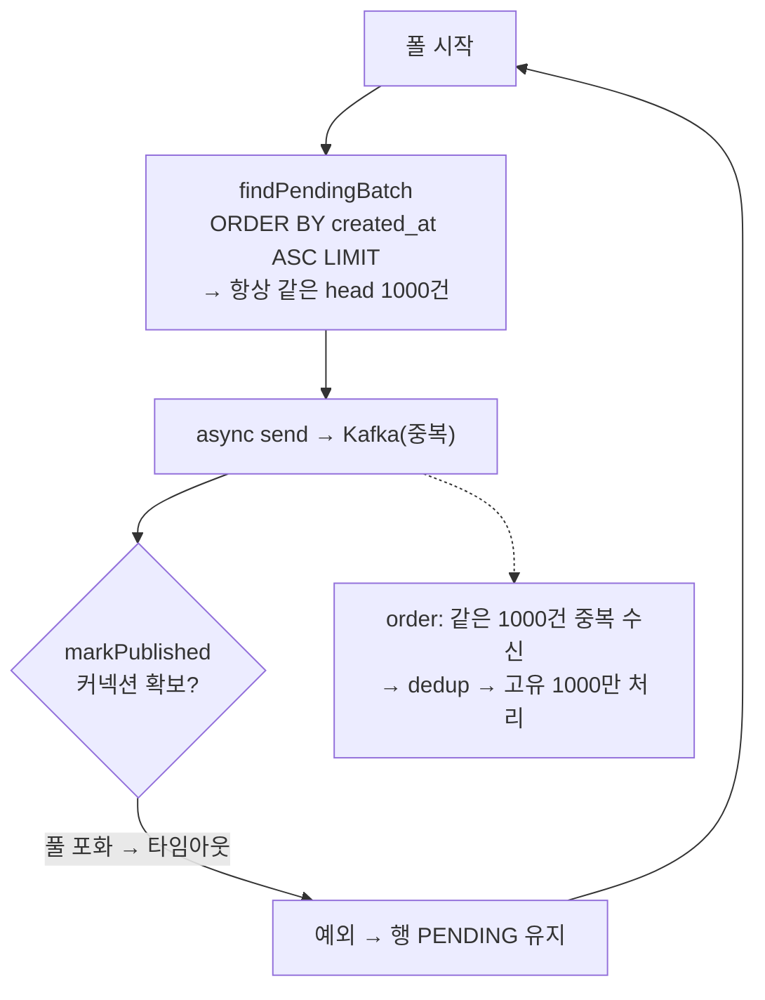

> [!summary] 핵심 한 줄
> OUTBOX 폴러가 고부하에서 백로그를 무한 축적했다. "poll 주기가 느려서"라 보고 1초로 줄였다 — 더 나빠졌다. "순차 발송이라"라 보고 배치·비동기로 최적화했다 — **오히려 병을 키웠다**(발행 42만 건, 실제 처리 1천 건). 진짜 병목은 폴러 내부 효율이 아니라 **앱과 공유하는 DB 커넥션 풀**이었다. `markPublished`가 커넥션을 못 얻어 실패 → 같은 배치를 영원히 재발송하는 **라이브락**. 가설이 두 번 반증되고서야 정체가 드러났다.

> [!info] 시리즈 — 부하가 드러낸 설계
> **1막 · 실측으로 잡고 증명하다** [[00.실측 서문|00]] · [[05.190은 용량이 아니었다|05]] · [[08.데드락인 줄 알았다|08]] · [[11.캐시를 껐는데 아무 일도 안 났다|11]] …
> **2막 · 관측을 코드로, 코드를 재측정으로** [[12.요청당 쿼리 수와 APM|12]] · [[13.동기 홉인 줄 알았다|13]] · [[14.이력 3커밋을 1로|14]] · [[15.147을 220으로|15]]
> **3막 · 발행을 떼어내다** [[16.동기 발행의 6퍼센트|16]] · [[17.최적화가 병을 키웠다|17]] · [[18.전용 풀로 라이브락을 부수다|18]] · [[19.CDC를 안 쓰기로 했다|19]]
> **4막 · 생성 너머: 소비·현실·정직성** [[20.발행만 보고 소비는 안 봤다|20]] · [[21.균등 100퍼센트는 거짓말이었다|21]]

---

## 1. OUTBOX 폴러 — 백로그가 쌓인다

[[16.동기 발행의 6퍼센트|16편]]의 OUTBOX 모드: 취소 TX3가 `cancel_event_outbox`에 행을 INSERT하고, 별도 스케줄러(폴러)가 `status='PENDING'`을 읽어 Kafka로 발행 후 `PUBLISHED`로 표시. 폴 10초, 배치 1000.

stress를 걸자 outbox가 안 빠졌다. 런 종료 시 **PENDING 82,511 / PUBLISHED 984**. 폴러가 거의 멈춘 것처럼 보였다.

## 2. 가설 1 — "poll이 느리다" → 반증

배수율 = 배치/폴주기 = 1000/10s = **100/s**. 생성이 230/s니 당연히 밀린다. poll을 **1초**로 줄이면 1000/s로 올라 감당하겠지 — 재측정.

결과: PENDING이 **101,121**까지 더 증가. 튜닝이 더 나쁘게 만들었다. poll 주기가 병목이 아니라는 강한 신호.

## 3. 가설 2 — "순차 발송이라" → 최적화가 병을 키웠다

폴러 로그를 보니 1000건 배치가 ~11초 걸렸다(건당 ~11ms). `send().get()`을 **순차**로 도니 상한이 ~90/s. 그래서 최적화:
- **markPublished 배치화**: 건당 `findById+save`(커넥션 1000회 왕복) → `UPDATE ... WHERE id IN (:ids)` 한 방
- **async 병렬 send**: 순차 `.get()` 제거, 발사 후 일괄 대기

재측정 — 그런데 **PUBLISHED가 런 내내 0**. 그리고 결정적 지표:

```
producer_send_total = 424,530
order 처리(고유)     = 1,000
outbox PENDING       = 79,811 (전량)
```

**42만 발송 vs 고유 1천.** 최적화가 백로그를 못 닫았을 뿐 아니라, async가 재발송을 *더 빠르게* 해서 **병을 키웠다.**

## 4. 정체 — 라이브락

payment 로그: `markPublished`가 **HikariPool 커넥션 타임아웃**. 취소 220rps가 앱 풀(10)을 꽉 쥐어, 폴러가 **write 커넥션을 못 얻는다**. `markPublished` 실패 → 오래된 배치가 영영 PENDING → `ORDER BY created_at ASC LIMIT 1000`이 **매 폴 같은 head를 재조회·재발송**.



이건 **데드락이 아니다.** 폴러는 얼어붙지 않았다 — 42만 번 발송하며 미친 듯이 바쁘다. 그런데 순진전이 0이다.

가설이 두 번 뒤집히고서야 정체가 드러난 흐름:


## 5. deadlock / livelock / starvation

| | 상태 | CPU | 진전 |
|---|---|---|---|
| deadlock | 얼어붙음 | 0 | 0 |
| **livelock** | **활발** | **높음** | **0** |
| starvation | 일부만 대기 | — | 일부 0 |

우리 건은 정확히 **livelock**(폴러가 head 재발송을 무한 반복) + 꼬리 78k건 **starvation**(영영 서비스 못 받음). [[08.데드락인 줄 알았다|8편]]에서 "데드락인 줄 알았던" 게 사실 락 대기였듯, 여기선 "느린 폴러인 줄 알았던" 게 사실 라이브락이었다.

> [!warning] 최적화가 진단을 확정했다
> async send는 백로그를 못 고쳤지만 **재발송을 가속해 42만 건이라는 증거를 만들었다.** naive 순차 폴러였다면 재발송이 더 적어 정체가 흐릿했을 것이다. 잘못된 방향의 최적화가, 역설적으로 진짜 병목(풀 경합)을 또렷하게 드러냈다.

## 6. 핵심 통찰 — 폴러 내부 효율이 아니다

병목은 **폴러가 얼마나 효율적으로 일하냐**가 아니라 **폴러가 앱과 DB 커넥션 풀을 공유한다**는 자원 봉투에 있었다. batch·async 어떤 내부 최적화도 이걸 못 고친다 — `markPublished`는 여전히 **커넥션 1개**가 필요한데, 부하 중엔 그 1개를 못 얻으니까.

이 실전 버그는 별도 문서로 박제했다(`docs/load-test/outbox-poller-livelock.md`). 프로덕션에서도 OUTBOX 발행 + 앱 포화가 겹치면 재현 가능한 진짜 버그다.

## 한 줄

**poll 튜닝도, 배치·비동기 최적화도 백로그를 못 닫았다 — 병목은 폴러 효율이 아니라 앱과 공유하는 커넥션 풀이었다.** 라이브락은 자원의 *양*이 아니라 *격리* 문제다. 그럼 격리하면 된다. → [[18.전용 풀로 라이브락을 부수다|18편]]
