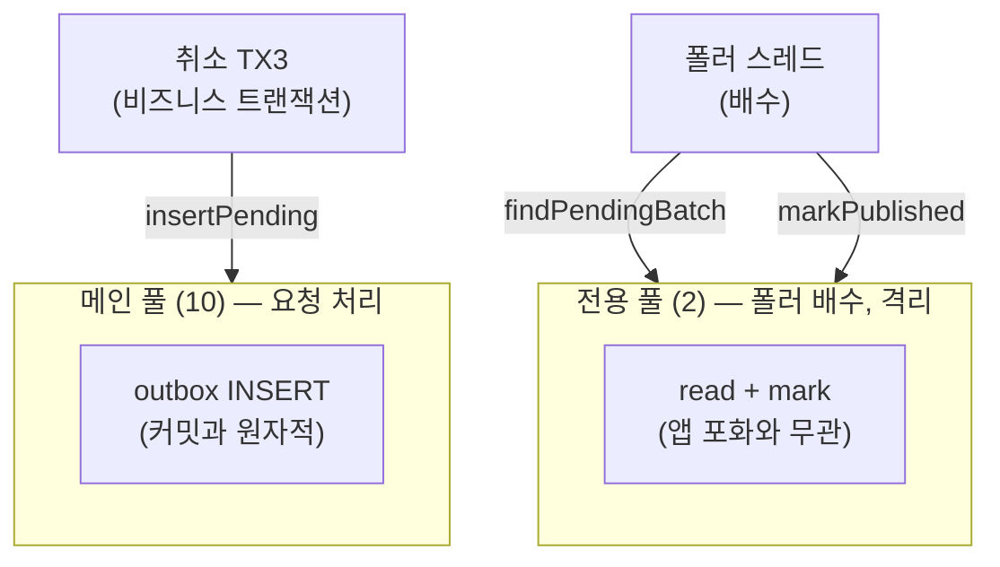

> [!summary] 핵심 한 줄
> 라이브락의 뿌리는 폴러가 앱과 **같은 커넥션 풀**을 다투는 것이었다. 고치려면 자원을 **격리**한다 — 폴러의 배수 경로에 소형 전용 DataSource(2 커넥션)를 배정해 앱 요청 풀(10)과 분리. 스케일업(풀 확대)은 포화점만 밀고, 스케일아웃은 분산락 때문에 무효. **격리가 최소 비용의 정확한 처방**이다. 재측정: PENDING 79.8k→**~330**, 재발송 42만→**취소수와 1:1**. 라이브락 해소 확정.

> [!info] 시리즈 — 부하가 드러낸 설계
> **1막 · 실측으로 잡고 증명하다** [[00.실측 서문|00]] · [[08.데드락인 줄 알았다|08]] · [[09.거절을 대기로 바꿨다|09]] …
> **2막 · 관측을 코드로, 코드를 재측정으로** [[12.요청당 쿼리 수와 APM|12]] · [[13.동기 홉인 줄 알았다|13]] · [[14.이력 3커밋을 1로|14]] · [[15.147을 220으로|15]]
> **3막 · 발행을 떼어내다** [[16.동기 발행의 6퍼센트|16]] · [[17.최적화가 병을 키웠다|17]] · [[18.전용 풀로 라이브락을 부수다|18]] · [[19.CDC를 안 쓰기로 했다|19]]

---

## 1. 스레드풀 ≠ 커넥션풀

라이브락을 정확히 이해하려면 두 자원을 갈라야 한다:

- **스레드 풀** — 일꾼(실행). Tomcat 워커 200, `@Scheduled` 폴러 스레드 1개.
- **커넥션 풀** — DB 연결. HikariCP(=커넥션 풀 구현) 10개.

스레드가 DB를 쓰려면 커넥션이 필요하다 — **별개 자원**이다. 폴러의 실패는 **스레드**가 아니라 **커넥션**이었다:


폴러 스레드는 멀쩡했다. **커넥션을 못 얻어** 굶은 것. → 고칠 대상은 스레드가 아니라 **커넥션**이다.

## 2. 격리 — 폴러 전용 DataSource

폴러의 배수 경로(`findPendingBatch`·`markPublished`)에 **소형 전용 HikariDataSource(2 커넥션)**를 배정한다. 앱 메인 풀(10)이 포화해도 폴러는 전용 커넥션으로 `markPublished` 성공.

```
insertPending    → 기존 JPA (메인 풀 10, TX3 안)  ← 원자성 유지 (outbox 불변식)
findPendingBatch → 전용 JdbcTemplate (전용 풀 2)    ← 격리
markPublished    → 전용 JdbcTemplate (전용 풀 2)    ← 격리
```



> [!important] insertPending은 메인 풀에 남겨야 한다
> outbox 행 INSERT는 취소 TX3 안에서 비즈니스 커밋과 **원자적**이어야 한다(그래야 dual-write가 안 깨진다). 전용 풀로 옮기면 별도 트랜잭션이 되어 원자성이 무너진다. 격리 대상은 **배수 경로(find+mark)뿐** — 그건 이미 커밋된 행을 읽고 표시하는, 비즈니스 TX 밖의 일이다.

이건 **Bulkhead(격벽) 패턴** — 배의 격벽처럼 워크로드별로 자원을 칸막이해 한 쪽 포화가 다른 쪽을 굶기지 않게. 배치 잡·read replica 분리에서 흔한 정석이다.

## 3. 왜 스케일링이 아니라 격리인가

라이브락은 **양(quantity)이 아니라 격리(isolation)** 문제다:

| 대안 | 라이브락 해소 | 이유 |
|---|---|---|
| **전용 풀** | ✅ | 폴러 커넥션 격리, ~무비용 |
| 수직 스케일업(풀 확대) | ⚠️ 지연만 | 풀 커져도 **공유** → 더 높은 포화점서 또 굶음 |
| 수평 스케일아웃 | ❌ | 분산락 → 폴러 1개·공유 풀 그대로, DB 병목 |
| 풀 크기만 확대 | ❌ | 2코어 DB 공식 상한 초과 → 스래싱 |

핵심: 전용 풀은 "DB 포화를 없애는" 게 아니라 "폴러가 그 포화에 **굶어 스톨하는 걸** 없애는" 것. 실패 모드가 **스톨(라이브락) → 진전**으로 바뀐다. 폴러 쿼리(인덱스 SELECT/UPDATE)는 가벼워서 DB가 바빠도 빠르게 완료된다. 커넥션 예산도 10+2=12로 MySQL 기본 151에 여유.

## 4. 재측정 — 라이브락 해소 확정

같은 OUTBOX poll=1s, stress 50→400 VU:

| 폴러 | PENDING 피크 | order 처리 | producer_send | 라이브락 |
|---|---|---|---|---|
| naive (공유 풀) | 79,811~101,000 | 1,000 (갇힘) | 424,530 (×424 재발송) | ❌ |
| **전용 풀** | **14~330** | 52,774→수렴 | **77,508 (취소수 ×1)** | ✅ 해소 |

세 증거가 라이브락 소멸을 못 박는다:
1. **PENDING 14~330 평탄** — 폴러가 생성(214/s)을 실시간 배수, 백로그 축적 0.
2. **producer_send = 77,508 = 취소수와 정확히 1:1** — 이벤트당 딱 1회 발송. 42만 재발송 폭주 소멸.
3. **order가 1,000 갇힘을 벗어나 수렴** — head가 즉시 전진(라이브락 없음).

> [!success] 두 번 반증되고 세 번째에 증명
> "poll 튜닝하면 됨"([[17.최적화가 병을 키웠다|17편]]) ✗, "batch+async면 됨" ✗ → **"자원 격리가 답"** ✓. 가설이 두 번 뒤집히고서야 진짜 처방에 도달했다. 그리고 그 처방을 **재측정으로** 증명했다 — 추론이 아니라 PENDING 14~330이라는 관측된 사실로.

## 5. 남은 한계 — 이게 다음 편의 씨앗

전용 풀은 **라이브락(스톨)을 없애**지만, 폴러는 여전히 **단일 스레드**다. 취소율이 이 단일 스레드 배수율을 넘으면 백로그가 다시 쌓일 수 있다 — 다만 이번엔 라이브락(∞ 스톨)이 아니라 "느린 배수"(진전은 함). 그 상한을 없애는 완전판이 **CDC**다.

그런데 — 우리가 그걸 도입해야 할까? → [[19.CDC를 안 쓰기로 했다|19편]]

## 한 줄

**라이브락은 커넥션 격리로 부순다 — 스레드가 아니라 커넥션을, 양이 아니라 격리로.** 폴러 스레드는 살아있었고, 필요했던 건 걔가 빌릴 전용 커넥션 2개였다. 재측정이 PENDING 14~330으로 증명했다.
