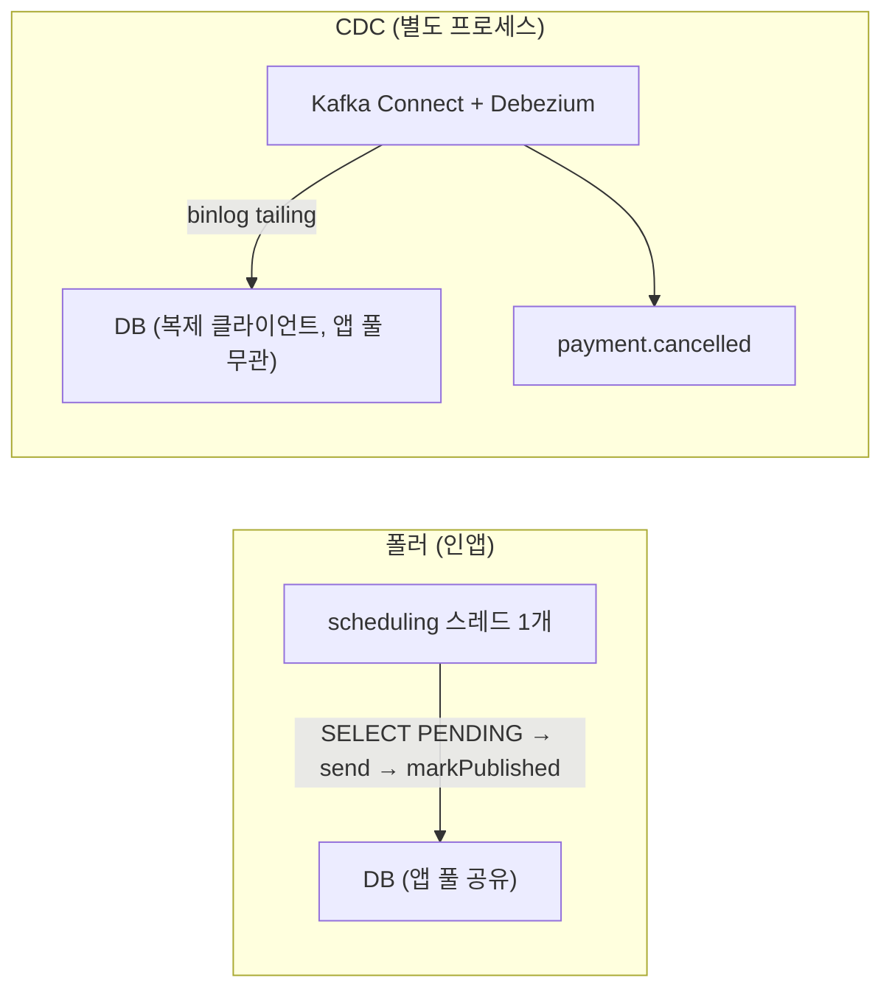
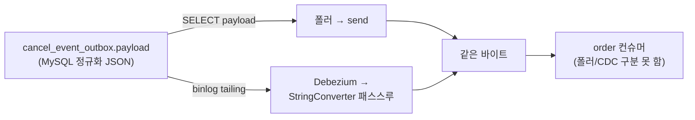

> [!summary] 핵심 한 줄
> 전용 풀([[18.전용 풀로 라이브락을 부수다|18편]])이 라이브락을 없앴지만, 폴러엔 **단일 스레드 배수율 상한**이 남는다. 그 상한을 없애는 완전판이 **CDC(Debezium)** — 별도 프로세스가 binlog를 tailing해 앱 자원을 아예 안 쓴다. 그런데 도입하지 **않기로** 했다. 이유: 폴러가 실측 부하(214rps)를 이미 감당하고, CDC의 유일한 추가 이점은 **우리가 만들 수 없는 부하에서만** 발현되기 때문. 이건 "안 함"이 아니라 **근거 있는 보류** — measure-first의 정직한 종결이다.

> [!info] 시리즈 — 부하가 드러낸 설계
> **1막 · 실측으로 잡고 증명하다** [[00.실측 서문|00]] · [[11.캐시를 껐는데 아무 일도 안 났다|11]] …
> **2막 · 관측을 코드로, 코드를 재측정으로** [[12.요청당 쿼리 수와 APM|12]] · [[13.동기 홉인 줄 알았다|13]] · [[14.이력 3커밋을 1로|14]] · [[15.147을 220으로|15]]
> **3막 · 발행을 떼어내다** [[16.동기 발행의 6퍼센트|16]] · [[17.최적화가 병을 키웠다|17]] · [[18.전용 풀로 라이브락을 부수다|18]] · [[19.CDC를 안 쓰기로 했다|19]]

---

## 1. CDC — 폴러의 완전판

폴러의 남은 한계는 **단일 스레드 배수율**이다. CDC(Change Data Capture, Debezium)는 이걸 구조적으로 없앤다:

Debezium은 **복제 클라이언트로 binlog를 읽어** outbox INSERT를 발행한다. SELECT도, 앱 DB 풀도, markPublished도 없다 — **앱과 완전 분리**. 순차 발송·풀 경합·단일 스레드 상한이 **한 번에** 사라진다. [[18.전용 풀로 라이브락을 부수다|18편]]의 격리가 "커넥션만" 뗐다면, CDC는 **드레인 자체를 프로세스째** 뗀다.

## 2. 그런데 — 우리 부하로는 이점이 안 보인다

여기가 이 편의 핵심이다. **정직하게** 재보면:

- **폴러 전용 풀이 실측 부하(214 rps)를 이미 감당** — PENDING 14~330, 백로그 0.
- **취소율은 payment 앱이 ~214 rps에서 포화** — 풀 10·2코어 DB·커밋 벽([[15.147을 220으로|15편]]). 그 이상 취소를 **만들 수가 없다.**
- CDC의 유일한 추가 이점은 **배수 headroom**(단일 스레드 상한 제거)인데, 폴러가 214에서 안 막히니 **라이브 부하로는 폴러 ≈ CDC**로 나온다.

즉 **취소 경로가 드레인 메커니즘보다 먼저 포화**해서, CDC의 이점을 자극하려면 취소 경로를 우회한 **직접-INSERT 드레인 레이스** 같은 인위적 부하가 필요하다. 실제 시스템은 그 부하에 도달하지도 않는다.

## 3. 무거운 대안엔 무거운 근거가 필요하다

CDC 인프라는 결코 가볍지 않다:
- **Kafka Connect 워커**(별도 JVM 프로세스/컨테이너)
- **Debezium MySQL 커넥터** + binlog 설정(ROW·GTID·REPLICATION 권한)
- **Outbox Event Router SMT + 컨버터** — order가 무변경 소비하도록 **메시지 바이트 호환** 튜닝(가장 fiddly한 부분)

이 운영 표면을 정당화하려면 "폴러로는 안 되는 부하"가 있어야 하는데 — 지금은 없다. **YAGNI**: 필요를 데이터로 확인하기 전엔 무거운 걸 안 들인다.

> [!important] "안 함"과 "근거 있는 보류"는 다르다
> 그냥 안 하는 건 게으름이고, **근거를 남기고 보류하는 건 설계 결정**이다. 재도입 트리거를 명시했다 — 취소 처리량이 스케일아웃/DB 확장으로 폴러의 단일 스레드 배수율 상한을 넘어서면 그때 도입한다. 설계 검토(메시지 바이트 호환 = StringConverter 패스스루로 폴러와 같은 정규화 payload 컬럼 방출, 앱 변경 = `cancel.outbox.drain=POLLER|CDC` 플래그로 폴러 off)는 **완료해 뒀다**. 필요해지면 빠르게 착수 가능.

## 4. 메시지 호환 — 왜 패스스루가 정답이었나 (설계 메모)

CDC를 실제로 붙였다면 최대 난관은 **order가 폴러 때와 똑같이 소비하게** 만드는 것이었다. 두 전략:
- **expand.json.payload** — Debezium이 payload를 파싱해 재직렬화. 중첩 배열·숫자 재포맷 리스크.
- **StringConverter 패스스루** — payload 컬럼 문자열을 raw 바이트 그대로 방출.

패스스루가 정답인 이유: **폴러도 `SELECT payload`로 MySQL이 정규화한 JSON을 읽어 보낸다.** Debezium도 binlog의 **같은 정규화된 payload 컬럼**을 읽으니, 패스스루하면 **바이트가 논리적으로 동일** — order는 CDC를 폴러와 구분조차 못 한다. 스키마 추론·숫자 리스크는 0. (드레인을 바꾸되 **관측 가능한 출력은 불변**으로 두는 게 안전한 교체의 원칙이다.)

## 5. 3막이 닫힌다

발행 패턴에서 시작해([[16.동기 발행의 6퍼센트|16편]]), 라이브락에 부딪히고([[17.최적화가 병을 키웠다|17편]]), 격리로 부수고([[18.전용 풀로 라이브락을 부수다|18편]]), 여기서 **더 무거운 대안을 근거 있게 안 하며** 닫힌다.

> [!success] measure-first의 두 얼굴
> measure-first는 "문제를 실측으로 규명하고 수정을 재측정으로 증명"하는 것만이 아니다. **"무거운 해법이 필요한지도 실측으로 판단"하는 것**이 나머지 절반이다. 라이브락은 최소 fix(전용 풀)로 해결했고, CDC는 근거를 남기고 보류했다. 둘 다 데이터가 내린 결정이다.

## 한 줄

**CDC는 검토했으나, 폴러 전용 풀이 실측 부하를 감당하고 CDC의 이점은 생성 불가능한 부하에서만 나오기에 근거 있게 보류했다.** 좋은 엔지니어링은 무거운 걸 쓰는 게 아니라, **언제 안 쓸지를 데이터로 아는 것**이다. — 3막 끝.
