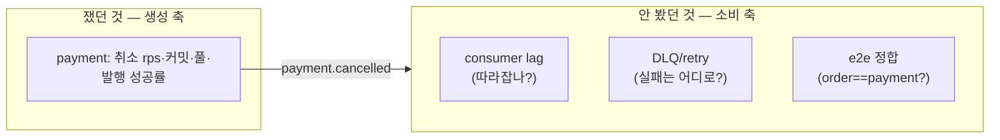
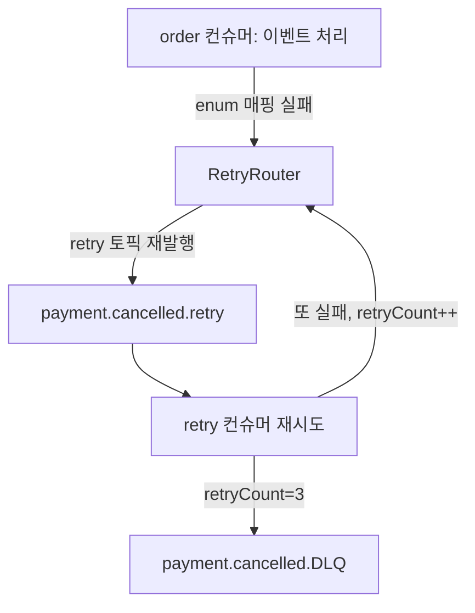

> [!summary] 핵심 한 줄
> 지금껏 취소의 **생성** 축(rps·커밋·풀)만 쟀다. `payment.cancelled`는 취소 100% 성공률로 "발행은 잘 된다"고 확인했지만([[16.동기 발행의 6퍼센트|16편]]), 그건 **프로듀서** 얘기다. order 컨슈머가 실제로 따라잡는지(lag), 최종 상태가 수렴하는지(e2e), 실패가 DLQ로 잘 빠지는지는 **한 번도 안 쟀다.** 이번에 order_db를 미러해 소비 축을 처음 쟀고 — lag→0·DLQ델타0·e2e정합을 확인했다. 그리고 미러 데이터 버그 하나가 **우발적 장애 주입**이 되어, 계획 없이 컨슈머의 실패 처리 경로(retry→DLQ)를 실증했다.

> [!info] 시리즈 — 부하가 드러낸 설계
> **1막 · 실측으로 잡고 증명하다** [[00.실측 서문|00]] · [[11.캐시를 껐는데 아무 일도 안 났다|11]] …
> **2막 · 관측을 코드로, 코드를 재측정으로** [[12.요청당 쿼리 수와 APM|12]] · [[13.동기 홉인 줄 알았다|13]] · [[14.이력 3커밋을 1로|14]] · [[15.147을 220으로|15]]
> **3막 · 발행을 떼어내다** [[16.동기 발행의 6퍼센트|16]] · [[17.최적화가 병을 키웠다|17]] · [[18.전용 풀로 라이브락을 부수다|18]] · [[19.CDC를 안 쓰기로 했다|19]]
> **4막 · 생성 너머: 소비·현실·정직성** [[20.발행만 보고 소비는 안 봤다|20]] · [[21.균등 100퍼센트는 거짓말이었다|21]]
> **5막 · 처리량에서 지연으로** [[22.같은 190인데 p95가 20배 달랐다|22]]

---

## 1. 사각지대 — 생성은 쟀고 소비는 안 쟀다

취소 부하 실측은 내내 **payment 쪽**을 봤다. rps, 커밋 수, 커넥션 풀, 홉 지연. `payment.cancelled` 발행도 "취소 100% 성공률"로 간접 확인했다 — 설계상 TX3 커밋과 send가 커플링돼 있으니(발행 실패면 롤백) 성공률이 곧 발행 성공률이다.

그런데 이벤트는 **누군가 소비**해야 의미가 있다. order-service가 `payment.cancelled`를 받아 주문 상태를 동기화한다. 여기엔 생성 축에 안 잡히는 질문들이 있다:



비동기라 **처리량엔 안 보이지만 정합성엔 보인다.** 컨슈머가 밀리면 주문 상태가 늦게 수렴하고, 실패 이벤트가 조용히 쌓이고, 최악엔 order와 payment가 영영 어긋난다. 이걸 재려면 order_db가 실제 데이터를 들고 있어야 한다 — payment_item에서 orders·order_item을 미러했다(두 DB는 별도 인스턴스라 앱 밖에서 복제).

## 2. 버그가 카오스 실험이 됐다

미러 SQL에서 `orders.status`를 `'CREATED'`로 넣었다. 그런데 `OrderStatus` enum엔 CREATED가 **없다**(PAID·CONFIRMED·CANCELLED…). 컨슈머가 주문을 읽어 enum으로 매핑하는 순간 터졌다:

```
No enum constant com.example.order.domain.entity.OrderStatus.CREATED
```

의도한 건 아니었다. 그런데 이게 **완벽한 장애 주입**이 됐다. 컨슈머가 매 이벤트에서 실패하니, 시스템의 실패 처리 경로가 부하 하에서 그대로 드러났다:



측정값이 이 경로를 못 박았다. **66,822건**이 최종 DLQ로 빠졌고, retry 토픽엔 **174,485건**이 재발행됐다(각 실패가 최대 3회 재시도되며 증폭). 계획된 카오스 실험 없이, 미러 오타 하나가 "실패는 무한 재시도가 아니라 3회 후 DLQ로 격리된다"를 실증했다.

> [!note] 좋은 장애는 '구별 가능'하게 실패한다
> DLQ·retryCount·`processed_cancel_event`가 없었다면 이 실패는 그냥 "order가 조용히 안 맞음"으로 뭉갰을 거다. 실패를 **1급 신호**(retry 토픽 깊이, DLQ 오프셋)로 만들어 뒀기에, 오타조차 진단 가능한 사건이 됐다.

## 3. 고치고 — 깨끗한 소비 축을 재다

`status`를 유효 enum(PAID)으로 고치자 두 가지가 일어났다. retry 토픽에 쌓여 있던 이벤트들이 **재시도에서 살아나** 처리됐고(retryCount<3이었던 것들), 새 이벤트는 깨끗이 흘렀다. 미러를 바로잡고 config를 하나 더 돌려 **오염 없는 소비 축**을 쟀다:

| 지표 | 결과 |
|---|---|
| consumer lag | `payment.cancelled` 전량 소비 → **0** |
| DLQ 델타 | **0** (실패 0) |
| retry 델타 | **0** (재시도 0) |
| e2e 정합 | processed 101,062 ≈ orders CANCELLED 101,072 ≈ order_item CANCELLED 101,102 |

`processed_cancel_event`의 UK가 **dedup = exactly-once 효과**를 보장한다. 발행이 at-least-once(재발행·중복 가능)여도, 소비가 멱등이면 order 상태는 정확히 한 번만 전이된다. [[17.최적화가 병을 키웠다|17편]]의 라이브락에서 42만 발송이 order 1,000으로 수렴했던 것도 같은 원리 — **컨슈머 멱등이 발행 중복을 흡수**한다.

> [!success] 두 얼굴을 다 봤다
> 한 번의 실측에서 **건강한 소비**(lag→0·정합·exactly-once)와 **장애 처리**(retry→DLQ 격리)를 둘 다 관측했다. 전자는 정상 경로를, 후자는 버그가 우연히 그려 준 실패 경로를 — 소비 축의 양면이 한 판에 드러났다.

## 한 줄

**발행이 100%여도 소비는 별도로 재야 한다 — 생성 축의 건강이 소비 축의 정합을 보장하지 않으니까.** 그리고 실패를 신호로 만들어 두면, 오타 하나도 카오스 실험이 된다. → [[21.균등 100퍼센트는 거짓말이었다|21편]]
