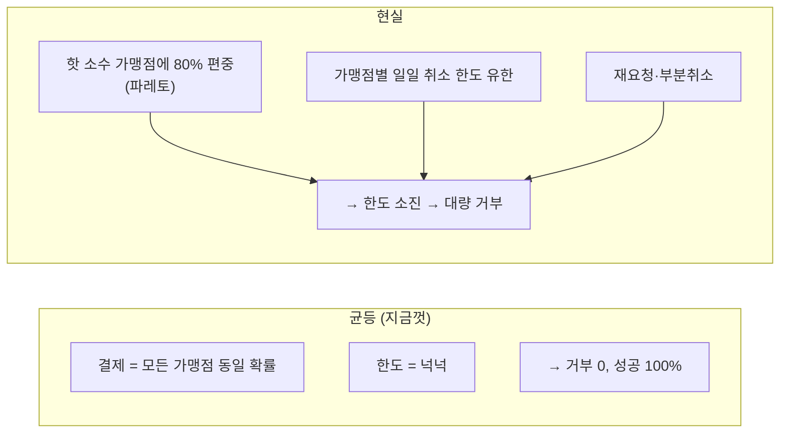
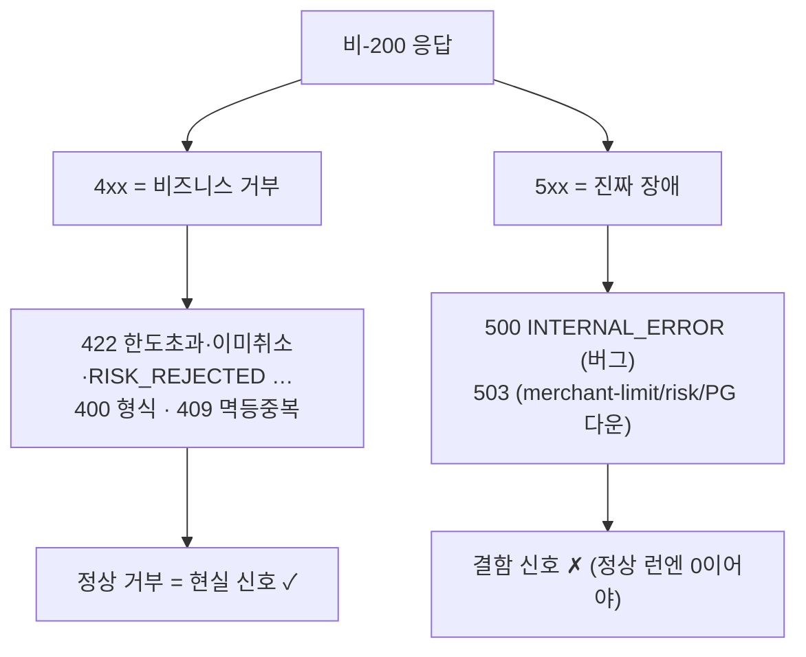

> [!summary] 핵심 한 줄
> 앞선 실측은 전부 **균등 부하**였다 — 모든 결제가 같은 확률, 넉넉한 한도. 그래서 취소는 늘 100% 성공했고, "시스템은 100% 성공한다"고 믿게 됐다. 그런데 균등은 **비즈니스 제약을 안 건드린다.** 현실은 트래픽이 소수 핫 가맹점에 몰리고(파레토), 가맹점마다 일일 취소 한도가 유한하고, 사용자가 재요청한다. 현실 믹스로 재보니 성공률이 **25%**로 떨어졌다 — 그런데 이건 나쁜 게 아니다. 75%는 시스템이 **정확히 거부한 것**이고, 그 거부는 전부 의도된 4xx다. "실패율 75%"가 오히려 건강의 증거였다.

> [!info] 시리즈 — 부하가 드러낸 설계
> **1막 · 실측으로 잡고 증명하다** [[00.실측 서문|00]] · [[11.캐시를 껐는데 아무 일도 안 났다|11]] …
> **2막 · 관측을 코드로, 코드를 재측정으로** [[12.요청당 쿼리 수와 APM|12]] · [[13.동기 홉인 줄 알았다|13]] · [[14.이력 3커밋을 1로|14]] · [[15.147을 220으로|15]]
> **3막 · 발행을 떼어내다** [[16.동기 발행의 6퍼센트|16]] · [[17.최적화가 병을 키웠다|17]] · [[18.전용 풀로 라이브락을 부수다|18]] · [[19.CDC를 안 쓰기로 했다|19]]
> **4막 · 생성 너머: 소비·현실·정직성** [[20.발행만 보고 소비는 안 봤다|20]] · [[21.균등 100퍼센트는 거짓말이었다|21]]

---

## 1. 균등이 숨긴 것

지금까지 "220rps 100% 성공"을 자랑스럽게 적었다. 하지만 그 부하는 **균등**이었다 — 10만 결제가 10개 가맹점에 라운드로빈, 한도는 전부 넉넉. 이런 부하에선 **한도 초과도, 이미-취소 충돌도 일어날 수가 없다.** 100%는 시스템이 완벽해서가 아니라, **비즈니스 제약을 자극하지 않는 부하**였기 때문이다.

현실 트래픽은 세 가지가 다르다:

그래서 현실 믹스를 만들었다. 편중·다중아이템·타이트 한도는 **시드가 데이터로** 만들고(핫 2가맹점에 80%, 한도 2억), k6는 **재히트·부분취소 주사위만** 굴린다(`path` 태그로 new/rehit/partial 분해).

## 2. 성공 25% — 그런데 이게 정상이다

결과: 집계 성공률 **25.2%**. path별로는 rehit 39% · new 23% · partial 23%. "실패" 75%가 났다. 균등의 100%에서 곤두박질쳤다.

계산해 보면 당연하다. 핫 가맹점 한도 2억, 취소 1건 3만 → 가맹점당 ~6,600건이면 한도 소진. 트래픽 80%가 핫 2곳에 몰리니, 그 뒤로는 **한도가 다 차서 거부**된다. 콜드 가맹점(20%)만 여유롭게 성공.

> [!important] 25%는 시스템 품질이 아니라 정책 대비 부하의 함수다
> 75%의 "실패"는 서버 오류가 아니라 **비즈니스 거부**다: 핫 가맹점 일일 한도 소진(422 한도초과) + 이미-취소 아이템 재요청(충돌). 시스템이 "안 됩니다"를 **정확히** 말한 것. 한도가 있는데 안 막으면 그게 버그다. rehit이 39%로 높은 건 멱등 리플레이(이미 전체취소된 건 200 반환)라서다.

즉 이 실험의 값은 "25%가 좋냐"가 아니라 — **"균등 100%"가 용량·정책 제약을 숨긴 착시였음**을 드러낸 것이다. 현실 믹스는 "실효 처리량"과 "정상 거부율"을 보여 준다. 핫 가맹점 한도를 올리거나 유저가 재시도하도록 유도하라는 **용량·정책 신호**지, 시스템 결함이 아니다.

## 3. 정직성 — "실패"가 4xx인지 5xx인지 못박기

여기서 멈추면 부정직하다. "실패 75%"를 4xx(의도된 거부)와 5xx(진짜 장애)로 **안 쪼갰으니까.** 만약 그 안에 5xx가 섞였다면 이야기가 완전히 달라진다.

코드로 못박았다. payment `ErrorCode`를 전수 분류하면:

핸들러는 `BusinessException`→코드의 httpStatus, 그 외 예외→500. **모든 비즈니스 거부 코드는 4xx**고, 5xx는 오직 내부 버그(500)나 의존성 다운(503)에서만 나온다. 즉 **거부가 5xx로 새는 경로가 코드상 존재하지 않는다.** 현실 믹스의 두 거부(한도초과·이미취소)는 둘 다 422다.

이 불변식을 실측이 아니라 **스크립트가 강제**하게 했다 — `server_error_rate: rate==0` threshold. 다음 어떤 런에서든 5xx가 1건이라도 나면 런이 실패로 표시된다. 그건 "현실 거부"가 아니라 진짜 결함이라는 뜻이니까.

> [!success] 정직한 숫자의 조건
> "성공 25%"는 맥락 없이는 오해를 부른다. **(1) 25%는 타이트 한도 하 거부 비율이지 시스템 품질이 아니고, (2) 거부는 전량 4xx(5xx=0)**임을 함께 말해야 정직한 숫자가 된다. 균등의 100%가 감춘 걸 현실 믹스가 드러냈듯, 집계 성공률이 감추는 걸 상태코드 분해가 드러낸다.

## 한 줄

**균등 부하의 100%는 비즈니스 제약을 안 건드린 착시였고, 현실 편중은 성공률을 25%로 떨어뜨렸다 — 그 75%는 결함이 아니라 정확한 4xx 거부였다.** 좋은 측정은 유리한 숫자가 아니라, 그 숫자가 무엇을 숨기는지까지 아는 것이다. — 4막 끝.
