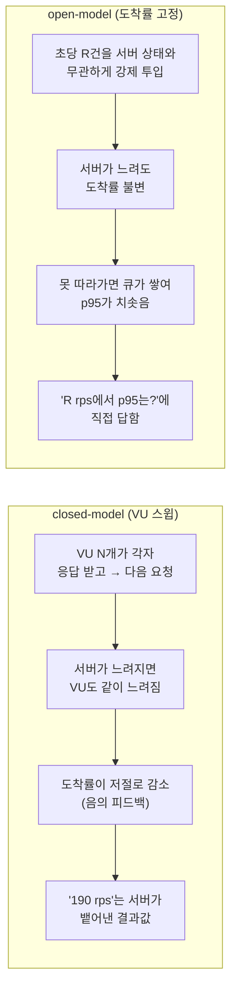
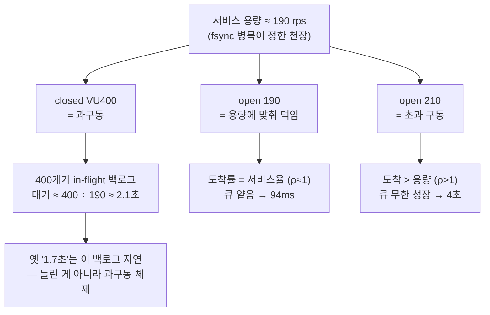

> [!summary] 핵심 한 줄
> 4막까지 나는 늘 **처리량**을 쟀다 — 147을, 220을, 190을. 그런데 SLO는 처리량이 아니라 "초당 R건이 들어올 때 p95가 500ms 안이냐"를 묻는다. VU를 늘리는 closed-model은 이 질문에 답할 수 없다 — 서버가 느려지면 VU도 같이 느려져 도착률이 저절로 줄기 때문이다. 그래서 도착률을 **강제**하는 open-model로 다시 쟀다. 그런데 숫자가 이상했다: 전에 "포화 ~190에서 p95 1.7초"라 적었는데 이번엔 **190에서 94ms**. 같은 190인데 20배. 오타가 아니었다. closed의 1.7초와 open의 94ms는 **둘 다 맞다** — 다른 체제를 잰 것뿐이고, 그 차이가 SLO의 전부였다.

> [!info] 시리즈 — 부하가 드러낸 설계
> **1막 · 실측으로 잡고 증명하다** [[00.실측 서문|00]] · [[11.캐시를 껐는데 아무 일도 안 났다|11]] …
> **2막 · 관측을 코드로, 코드를 재측정으로** [[12.요청당 쿼리 수와 APM|12]] · [[13.동기 홉인 줄 알았다|13]] · [[14.이력 3커밋을 1로|14]] · [[15.147을 220으로|15]]
> **3막 · 발행을 떼어내다** [[16.동기 발행의 6퍼센트|16]] · [[17.최적화가 병을 키웠다|17]] · [[18.전용 풀로 라이브락을 부수다|18]] · [[19.CDC를 안 쓰기로 했다|19]]
> **4막 · 생성 너머: 소비·현실·정직성** [[20.발행만 보고 소비는 안 봤다|20]] · [[21.균등 100퍼센트는 거짓말이었다|21]]
> **5막 · 처리량에서 지연으로** [[22.같은 190인데 p95가 20배 달랐다|22]]

---

## 1. 처리량은 쟀지만 지연은 안 쟀다

지금까지의 모든 실측은 **VU를 늘려 천장을 찾는** 방식이었다 — VU 10, 50, 100, 400으로 밀어 "몇 rps에서 포화하나"를 봤다. 이걸로 147→220→190 같은 처리량 숫자를 얻었다.

그런데 SLO는 처리량을 안 묻는다. SLO는 이렇게 묻는다: **"초당 190건이 들어올 때, p95가 500ms 안에 들어오나?"** 이 질문에 VU 스윕은 구조적으로 답할 수 없다.



closed는 "이 시스템이 최대 얼마나 뱉나"를, open은 "이만큼 밀어넣으면 얼마나 걸리나"를 잰다. SLO는 후자다. 그래서 k6 `constant-arrival-rate`로 도착률을 60·100·140·170·190·210 rps로 고정하고, 각 90초씩 유지하며 rate별 p95를 분리해 쟀다.

## 2. 평탄하다가, 절벽

| 도착률 | p50 | **p95** | 판정 |
|---|---|---|---|
| 60 | 38.9 | **43.0ms** | ✅ |
| 100 | 38.1 | **40.1ms** | ✅ |
| 140 | 40.8 | **45.6ms** | ✅ |
| 170 | 46.1 | **56.3ms** | ✅ 엘보 시작 |
| 190 | 49.1 | **94.5ms** | ✅ 꼬리 팬아웃 |
| 210 | 1505 | **4068ms** | ❌ **절벽** |

170까지 p95는 40~56ms로 거의 평탄하다. 시스템이 부하를 못 느낀다. 190에서 p50은 여전히 49ms인데 **p95만 94ms로 두 배** 벌어진다 — 큐잉 분산이 커지는 엘보다. 그리고 210에서 **p95 4068ms로 절벽**. 완만한 곡선이 아니라 **평탄하다가 수직으로 꺾인다.**

이 모양 자체가 병목의 지문이다. CPU 포화라면 곡선이 완만하게 휜다. 하지만 우리 병목은 payment 커밋의 **fsync(디스크 I/O)** — 여유가 있을 땐 그룹커밋으로 흡수하다가, 도착률이 fsync 처리율을 넘는 **순간** 큐가 터진다(2막·[[15.147을 220으로|15]]에서 잡은 그 병목이다). ρ(이용률)이 1을 넘으면 큐가 무한 성장하고, 지연 = 큐깊이 ÷ 서비스율이라 발산한다.

## 3. 반전 — "1.7초였는데 94ms?"

여기서 멈칫했다. 나는 이미 [[15.147을 220으로|15]]에서 포화 지점 p95를 **1.67초**라 적었다. 그 근처 처리량이 ~190~220이었다. 그런데 이번 open-model은 **190에서 94ms**. 같은 rps인데 20배 차이. 둘 중 하나는 틀린 거 아닌가?

둘 다 맞았다. **같은 처리량이라도 지연은 "어떻게 먹이느냐"에 따라 자릿수가 다르다.**



closed VU400은 400개를 동시에 쑤셔넣는다. 서버는 초당 ~190개만 뱉으니 나머지는 밀려 **백로그**가 되고, 각 요청은 앞의 것들이 빠질 때까지 기다린다(≈2초). 옛 1.7초는 **틀린 값이 아니라 과구동 상태의 백로그 지연**이었다. open 190은 정확히 용량만큼만 먹이니 큐가 얕아 94ms. open 210은 용량을 넘겨 다시 백로그 — closed VU400의 open 버전이다.

> [!important] 게다가 기계적으로 예측된다 (Little's law)
> 풀 10 · 커넥션 점유 ~50ms → 지탱 동시성 10 · 처리율 ≈ 10 ÷ 0.05s = **~200/s**. 190 rps는 필요 동시성 190×0.05 ≈ **9.5 ≈ 풀 10**(딱 풀 포화 → p95 팬아웃 시작), 210은 10.5 > 10(슬롯 대기 + fsync는 못 빨라짐 → 절벽). "풀 10 = ~190 rps 천장 @ 저지연"이 이론에서 그대로 떨어진다 — 전에 "풀을 20으로 키웠더니 오히려 −12%(iowait 2배)"였던 반증과도 정합한다. 풀 10이 동시 커밋을 10으로 묶어 **저지연을 주는 벽**이었던 것이다.

## 4. 게이트웨이 없는 숫자 — 내부 예산의 한 조각

한 가지 못 박을 게 있다. 이 측정엔 **게이트웨이가 없다.** k6가 payment를 직접 때렸고, 클라이언트는 VPC 내부(RTT sub-ms)다. 그러니 이 p95는 사용자 체감 지연이 아니라 **내부 서비스 타임** — SLO 예산의 한 조각이다.

```
사용자 p95(500ms) = WAN RTT + 게이트웨이(TLS·인증·홉) + [내부 취소 경로 ← 여기서 잰 것]
```

그럼 게이트웨이가 없어서 이 측정이 무의미할까? 아니다 — **병목이 공유 DB fsync로 확정된 이상 게이트웨이는 무릎의 위치를 옮기지 않는다.** 게이트웨이는 상수 오프셋(수 ms)을 더할 뿐이고, payment 레플리카를 아무리 늘려도 결국 **같은 DB에 write 경합**하니 천장은 그대로다. 게이트웨이는 우리를 제약하는 것과 직교한다.

| 운영점 | 내부 p95 | 엣지에 남는 예산 | 판정 |
|---|---|---|---|
| 170 rps (안전 엘보) | 56ms | 444ms | 매우 안전 |
| 190 rps (하드 상한) | 94ms | 406ms | 안전하나 꼬리 불안정 |
| 210 rps | 붕괴 | — | 게이트웨이 유무 무관 사용 불가 |

그래서 운영점은 **정상 도착률 ≤170 rps, 하드 상한 190, 210은 never-exceed.** 수직 병목이라 순간 초과가 곧 절벽이라, 190을 넘는 버스트는 큐·셰딩으로 흡수해야 한다.

## 5. 곁가지 — 측정은 왜 어려운가

깨끗한 곡선 하나 얻는 데 세 번 미끄러졌다. 스파이스로 남긴다:

- **Spot이 노드를 죽였다.** 런 도중 DB 노드와 부하생성기가 Spot 회수로 사라졌다. 살아있는 척하는 죽은 인스턴스에 명령을 쐈고, 그 사이 데이터가 조용히 오염됐다. → 정합성 필수 노드는 온디맨드로.
- **멱등 리플레이가 또 물었다.** 시딩 스크립트가 `| tail`에 실패를 삼켜, 이미 취소된 옛 키를 재사용했다. 이미 취소된 건 risk를 안 타고 ~1.5ms에 반환된다 → p95가 **가짜로 낮아진다**. 한 번 데인 함정([[20.발행만 보고 소비는 안 봤다|20]] 계열)에 또 데였다. 이제 재시딩 후 "pool[0]이 아직 미취소인지" 게이트로 막는다.
- **태그 하나가 표를 비웠다.** 도착률별 p95는 k6 시나리오 태그의 자동 전파에 의존하는데, 요청 레벨에서 태그를 덮어써 sub-metric이 통째로 비었다(count 0). 첫 요약표가 전부 0이라 다시 돌렸다.

## 한 줄

**처리량은 시스템이 견디는 최대를 말하지만, 지연은 그 최대를 어떻게 먹이느냐가 정한다.** 같은 190 rps라도 과구동하면 2초, 용량에 맞춰 먹이면 94ms다. closed로 잰 옛 숫자는 틀리지 않았다 — SLO가 묻는 질문이 달랐을 뿐이다. 좋은 측정은 숫자를 얻는 게 아니라, 그 숫자가 **어느 체제의 답인지**를 아는 것이다. — 5막 시작.
