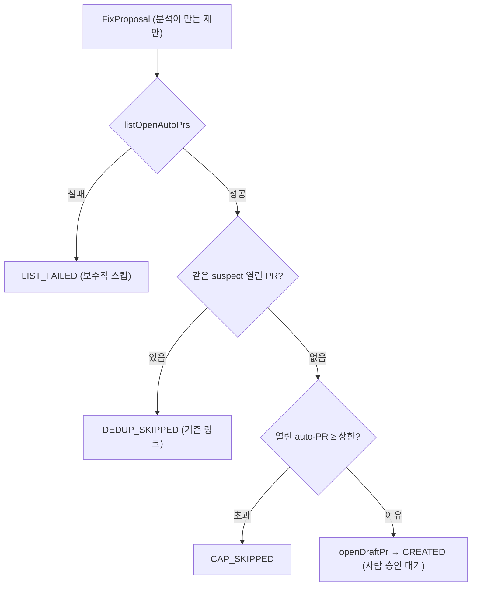

> [!summary] 핵심 한 줄
> 자율 코드 생성에서 **속도와 안전을 바꾸지 않았다.** 에이전트는 수정안을 *제안*만 하고, `FixProposer`가 **draft PR로만** 전환한다. 머지·main 직커밋은 **코드 어디에도 없다** — 머지 API를 아예 구현하지 않은 것이 사람 승인 게이트다. 거기에 dedup·PR 상한·상태 고지로 "도배"와 "폭주"까지 막았다.

> [!info] 시리즈 — LLM을 장애대응 파이프에 안전하게 엮기
> [[1.e2e 데모가 잡아낸 두 버그]] · [[2.장애 도구가 장애에 죽지 않게]] · [[3.LLM에게 도구를 주되 가두기]] · [[4.LLM이 코드를 고치되 머지는 사람만]] · [[5.LLM을 못 믿어 결정론 레일을 깔았다]] · [[6.알림 폭풍에 스팸 PR을 안 만들기]] · [[7.orchestrator 언제 무엇을 수집할지]] · [[8.패키지 구조가 서사를 증명하게]]

---

## 1. 배경 — 자율 코드 생성의 양극단

LLM이 분석을 넘어 **수정 패치**까지 만들 수 있게 되면, 곧장 위험한 선택지가 생긴다.

- **자동 적용/머지**: 빠르지만, 잘못된 LLM 패치가 프로덕션에 들어가는 재앙. 검증 없는 자율성.
- **제안조차 안 함**: 안전하지만, 도구의 가치가 절반으로 줄어든다.

이 사이에서 "코드는 생성하되 사람이 반드시 개입"하는 경계를 코드 구조로 강제해야 했다.

---

## 2. 결정

**분석(무엇이 문제인가)과 행동(고치는 PR)을 타입·패키지 수준에서 분리**하고, 행동은 오직 **draft PR 생성**까지만 간다.

- 타입 분리: `Analysis` vs `FixProposal`
- 패키지 분리: `analyzer/` vs `fixproposal/` (GitHub 인프라는 별도 `github/`)
- `FixProposer`는 `openDraftPr`만 호출 — **머지 API는 코드에 존재하지 않는다**

---

## 3. 대안 비교

| 방식 | 속도 | 안전 | 도구 가치 | 채택 |
|---|---|---|---|---|
| 자동 적용 + 자동 머지 | 최고 | **최악 (검증 없이 프로덕션)** | 높음 | X |
| 패치를 코멘트로만 게시 | 중 | 높음 | 중 (적용은 수작업) | △ |
| 제안 자체를 안 함 | — | 최고 | 절반 | X |
| **draft PR 생성 (머지는 사람)** | 중 | **높음 (승인 게이트)** | 높음 | **O** |

---

## 4. 선택 이유

**자율 코드 생성에서 속도보다 안전 경계가 우선**이라는 게 이 설계의 명시적 입장이다. draft PR은 그 자체로 **사람 승인 게이트**다 — 사람이 리뷰하고 머지 버튼을 눌러야 반영된다. 그리고 그 경계를 "관습"이 아니라 **코드의 부재**로 못 박았다: 머지/직커밋 호출이 코드베이스 어디에도 없으니, 실수로라도 자동 머지가 일어날 수 없다. 헌장(규율 #4)으로도 같은 선을 그었다.

---

## 5. 설계 상세

`FixProposer.propose`는 draft PR을 만들기 전 **세 개의 안전장치**를 차례로 통과시키고, 모든 결과를 `Status` enum으로 남긴다.

```java
// fixproposal/FixProposer.java
public FixProposal propose(Alert alert, Analysis analysis, FixProposal proposal) {
  Optional<List<OpenPr>> openOpt = github.listOpenAutoPrs();
  if (openOpt.isEmpty()) {                      // ① 조회 실패 → 보수적으로 스킵
    return withOutcome(proposal, null, Status.LIST_FAILED);
  }
  // ② dedup: 같은 service + 같은 suspect 파일의 열린 auto-PR이 있으면 재사용
  //    "🤖 Proposed fix: <file>:" 구분자 매칭 → Work.java vs PayWork.java 거짓충돌 방지
  if (dup.isPresent()) {
    return withOutcome(proposal, dup.get().htmlUrl(), Status.DEDUP_SKIPPED);
  }
  // ③ cap: 열린 auto-PR이 maxOpenPrs(기본 5) 이상이면 스킵
  if (autoCount >= maxOpenPrs) {
    return withOutcome(proposal, null, Status.CAP_SKIPPED);
  }
  // 통과 → draft PR 생성 (머지 API는 호출하지 않음)
  Optional<String> prUrl = github.openDraftPr(branch, "main", ...);
  return prUrl.isPresent()
      ? withOutcome(proposal, prUrl.get(), Status.CREATED)
      : withOutcome(proposal, null, Status.FAILED);
}
```

### 다섯 가지 결과를 사유로 남긴다

PR이 안 만들어졌을 때 "왜 없는지"를 사람에게 전달하는 게 중요하다. 모든 경로가 `Status`로 끝난다.

| Status | 의미 | 사용자 통지 |
|---|---|---|
| `CREATED` | draft PR 생성됨 | PR 링크 |
| `DEDUP_SKIPPED` | 같은 suspect의 기존 PR 존재 | 기존 PR 링크 |
| `CAP_SKIPPED` | 열린 auto-PR 상한 초과 | "상한으로 보류" |
| `LIST_FAILED` | dedup 조회 실패 → 보수적 스킵 | "중복 확인 실패" |
| `FAILED` | GitHub 호출 실패 | "PR 생성 실패, 분석만" |

### graceful

GitHub가 죽으면 PR 없이 **분석만** Slack에 보낸다(`FAILED`). PR 생성 실패가 파이프 전체를 멈추지 않는다 — [[2.장애 도구가 장애에 죽지 않게|SourceResult]]와 같은 원칙.



근거: `fixproposal/FixProposer.java`, `receiver/GrafanaWebhookController`(analysis 있을 때만 행동), ADR(fix-proposal), CLAUDE.md 규율 #4.

---

## 6. 결과 / 트레이드오프

**보장된 것**

- 자동 머지가 **구조적으로 불가능**하다 (머지 API 부재).
- 알림 폭주에도 dedup·cap이 "같은 제안 도배"와 "PR 폭주"를 막는다.
- PR이 없을 때 그 사유가 Slack에 남는다.

**감수한 한계**

- 사람이 반드시 개입해야 하니 **완전 자동화의 속도는 없다.**
- 단일 repo·single-file·single-hunk로 범위를 좁혔다 (데모 스케일, 의식적 YAGNI).

---

## 7. 교훈

> [!important] 자율성의 상한을 코드 구조로 강제하기
> "자동 머지 안 함"을 규칙·리뷰 관습으로 두면 언젠가 깨진다. **머지 API를 아예 구현하지 않으면** 실수로도 일어날 수 없다. 안전 경계는 문서가 아니라 *코드의 부재*로 박을 때 가장 견고하다.

면접 한 마디: *"LLM이 코드를 생성하지만 머지는 절대 사람만 합니다 — 머지 API를 아예 구현 안 했어요. draft PR이 곧 사람 승인 게이트입니다. dedup·상한·상태 고지로 '같은 제안 도배'와 'PR 폭주'까지 막았습니다."*

---

## 관련 글

- [[3.LLM에게 도구를 주되 가두기]] — 이 PR을 제안하는 에이전트
- [[5.LLM을 못 믿어 결정론 레일을 깔았다]] — LLM이 패치를 못 낼 때의 백스톱
- [[2.장애 도구가 장애에 죽지 않게]]
