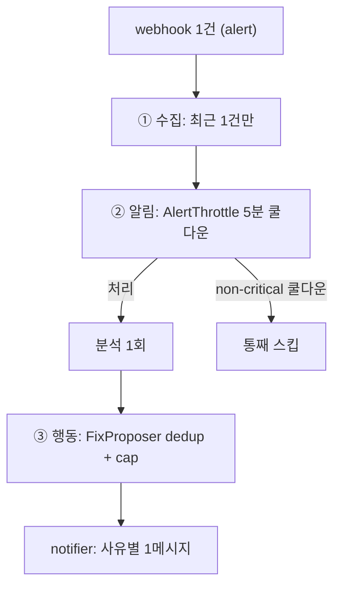

> [!summary] 핵심 한 줄
> 신뢰성 도구의 역설 — **가장 바쁠 때(알림 폭주) 스스로 노이즈가 된다.** 같은 에러가 수십 번 울리면 분석·멘션·PR이 도배된다. 그래서 dedup을 한 곳이 아니라 **수집·알림·행동 세 레이어에 분산** 배치했다. 파이프의 단위는 *에러*가 아니라 *알림(alert)*: webhook 1건 = Context 1개 = 분석 1회 = PR 최대 1개 + Slack 1메시지.

> [!info] 시리즈 — LLM을 장애대응 파이프에 안전하게 엮기
> [[1.e2e 데모가 잡아낸 두 버그]] · [[2.장애 도구가 장애에 죽지 않게]] · [[3.LLM에게 도구를 주되 가두기]] · [[4.LLM이 코드를 고치되 머지는 사람만]] · [[5.LLM을 못 믿어 결정론 레일을 깔았다]] · [[6.알림 폭풍에 스팸 PR을 안 만들기]] · [[7.orchestrator 언제 무엇을 수집할지]] · [[8.패키지 구조가 서사를 증명하게]]

---

## 1. 배경 — 신뢰성 도구의 역설

장애 대응 도구는 보통 **장애가 폭주할 때** 가장 많이 호출된다. 그런데 그때 도구가:

- 같은 에러 수십 건마다 분석을 돌리고
- 담당자를 수십 번 멘션하고
- 같은 수정 PR을 수십 개 만든다면?

도구가 인시던트를 **돕는 게 아니라 노이즈를 더한다.** 폭주 상황에서 스스로 조용해지는 설계가 필요했다.

---

## 2. 결정

두 가지를 정했다.

1. **처리 단위를 "알림(alert)"으로 고정** — webhook 1건 = Context 1개 = 분석 1회 = PR 최대 1개 + Slack 1메시지. 에러 *개수*가 아니라 알림 *건수*가 단위다.
2. **dedup을 세 레이어에 분산** — 수집(가장 최근 1건만) · 알림(쿨다운) · 행동(PR dedup/cap). 한 곳에서 다 막지 않는다.

---

## 3. 대안 비교

| 방식 | 장점 | 단점 | 채택 |
|---|---|---|---|
| dedup 안 함 | 단순 | **폭주 때 도배** | X |
| 한 곳(입구)에서만 dedup | 한눈에 보임 | 한 계층이 못 막는 폭주 유형 존재 (수집량·멘션·PR은 성격이 다름) | X |
| **수집·알림·행동 3계층 분산** | 각 계층이 자기 성격의 폭주를 막음 (defense in depth) | dedup 로직이 분산 | **O** |

---

## 4. 선택 이유

세 종류의 "도배"는 성격이 다르다 — **수집량 폭주**(트레이스 수십 개), **멘션 폭주**(같은 알림 반복), **PR 폭주**(같은 suspect 반복). 하나의 게이트로 셋을 다 막으려 하면 어딘가 샌다. 그래서 각 계층이 **자기 성격의 폭주만** 책임지게 분산했다 — defense in depth. 이건 [[2.장애 도구가 장애에 죽지 않게|graceful을 여러 경계에 분산]]한 것과 같은 결의 결정이다.

---

## 5. 설계 상세 — 3계층



### ① 수집 계층 — 가장 최근 1건만

윈도에 트레이스가 수십 개여도 **가장 최근 1건만** 가져온다. Loki 쿼리에 `limit=1` + `direction=backward`.

```java
// collector/LokiCollector.java
.queryParam("direction", "backward")
.queryParam("limit", "1")
// ...
return new SourceResult(source(), SourceStatus.COLLECTED, truncate(line),
    "stack from Loki near onset; correlation, not proof of cause");
```

게다가 그 1건도 `truncate`로 **80줄 / 8KB 상한**, 앞부분(throw site)을 보존하고 잘리면 마커를 단다. 폭주 시 입력량 자체를 결정론으로 묶는다.

### ② 알림 계층 — AlertThrottle 쿨다운

key는 `service|errorType`, 윈도는 5분. 같은 알림이 윈도 안에 반복되면 분석·멘션을 억제한다.

```java
// throttle/AlertThrottle.java — state.compute(key, ...)
if (entry == null || !now.isBefore(entry.cooldownUntil())) {
  out[0] = new ThrottleDecision(true, true);          // 새 키/만료 → 처리 + 멘션
  return new Entry(now.plus(COOLDOWN), true);
}
if (alert.severity() == Severity.CRITICAL) {
  boolean mention = !entry.mentioned();
  out[0] = new ThrottleDecision(true, mention);        // CRITICAL 쿨다운 중 → 처리하되 멘션 1회만
  return mention ? new Entry(entry.cooldownUntil(), true) : entry;
}
out[0] = new ThrottleDecision(false, false);           // non-critical 쿨다운 중 → 통째 스킵
return entry;
```

세 갈래의 차등이 핵심이다.

| 상황 | 처리 | 멘션 |
|---|---|---|
| 새 키 / 윈도 만료 | O | O |
| CRITICAL · 쿨다운 중 | O | **1회만** |
| non-critical · 쿨다운 중 | **스킵** | — |

CRITICAL은 놓치면 안 되니 처리는 하되 멘션 도배만 막고, non-critical 반복은 통째로 조용히 한다.

### ③ 행동 계층 — FixProposer dedup + cap

같은 service + 같은 suspect 파일의 열린 auto-PR이 있으면 새로 안 만들고 기존 PR을 가리킨다(`DEDUP_SKIPPED`). 열린 auto-PR이 상한(기본 5) 이상이면 `CAP_SKIPPED`. (자세히는 [[4.LLM이 코드를 고치되 머지는 사람만|#4]].) dedup은 `"🤖 Proposed fix: <file>:"` 구분자 매칭이라 `Work.java` vs `PayWork.java` 거짓충돌을 피한다.

### 사용자 통지 — "왜 PR이 없는지"를 사람에게

세 계층이 무언가를 막았을 때, notifier가 `Status` enum으로 **사유**를 남긴다: CREATED+링크 / DEDUP+기존링크 / CAP / FAILED / LIST_FAILED. 조용히 막되, 사람에겐 왜 막혔는지 보인다.

근거: `orchestrator/Orchestrator.java`, `collector/LokiCollector.java`, `throttle/AlertThrottle.java`, `fixproposal/FixProposer.java`, ADR(throttle/fixproposal).

---

## 6. 결과 / 트레이드오프

**보장된 것**

- 알림 폭주에도 입력량(1건)·멘션(쿨다운)·PR(dedup/cap)이 각각 묶인다.
- CRITICAL은 누락 없이 처리하되 멘션 도배만 막는다.
- 막힌 이유가 Slack에 사유로 남는다.

**감수한 한계**

- dedup 로직이 세 곳에 분산돼 "전역 억제 정책"을 한눈에 보기 어렵다.
- AlertThrottle 상태는 in-memory라 재시작 시 소실된다(데모 스케일에서 수용).

---

## 7. 교훈

> [!important] 신뢰성 도구는 가장 바쁠 때 조용해져야 한다
> 폭주를 한 게이트로 막으려 하지 말 것. 도배의 종류(수집량·멘션·PR)가 다르면 **각 계층이 자기 성격의 폭주를 책임지게** 분산하는 게 견고하다. 그리고 조용히 막되, "왜 막혔는지"는 사람에게 남겨야 한다.

면접 한 마디: *"장애 도구가 정작 폭주 때 노이즈가 되지 않게, dedup을 수집·알림·행동 세 레이어에 나눠 깔았습니다. 단위를 에러가 아니라 알림으로 잡아서, webhook 1건당 PR 최대 1개·Slack 1메시지로 묶었습니다."*

---

## 관련 글

- [[2.장애 도구가 장애에 죽지 않게]] — 같은 "여러 경계에 분산" 원칙
- [[4.LLM이 코드를 고치되 머지는 사람만]] — 행동 계층의 dedup/cap 상세
