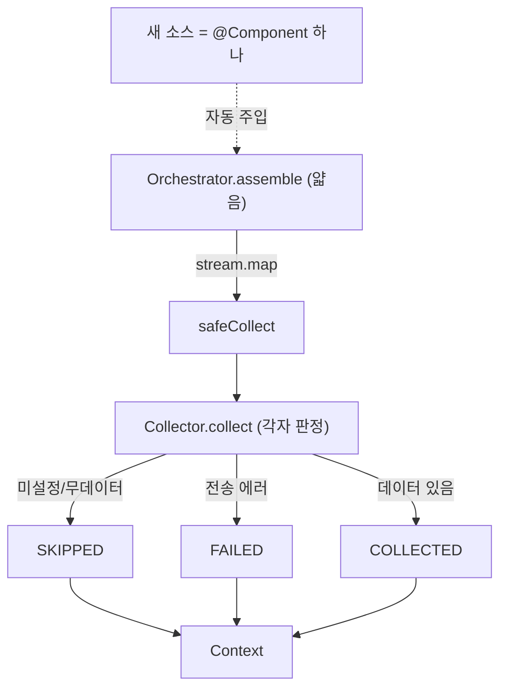

> [!summary] 핵심 한 줄
> "API 3개 이어붙이기"와 "오케스트레이션"의 차이는 **언제 무엇을 부를지**다. orchestrator는 `collectors.stream().map(safeCollect)` 한 줄로 얇게 두고, "내 데이터가 있나 없나"의 판단은 **각 콜렉터가 스스로** 한다. 새 소스 추가 = `@Component` 빈 하나, orchestrator는 안 건드린다(OCP).

> [!info] 시리즈 — LLM을 장애대응 파이프에 안전하게 엮기
> [[1.e2e 데모가 잡아낸 두 버그]] · [[2.장애 도구가 장애에 죽지 않게]] · [[3.LLM에게 도구를 주되 가두기]] · [[4.LLM이 코드를 고치되 머지는 사람만]] · [[5.LLM을 못 믿어 결정론 레일을 깔았다]] · [[6.알림 폭풍에 스팸 PR을 안 만들기]] · [[7.orchestrator 언제 무엇을 수집할지]] · [[8.패키지 구조가 서사를 증명하게]]

---

## 1. 배경 — 이 프로젝트가 증명하려는 것

이 프로젝트가 보여주려는 건 Claude 답변의 정확도가 아니라 **여러 실시스템을 끊김 없이 엮는 통합/오케스트레이션 역량**이다. 그래서 "API를 호출했다"가 아니라 **"언제 무엇을 부를지 결정하는 로직"**이 알맹이다.

순진하게 가면 orchestrator에 분기를 다 박게 된다 — "GitHub는 언제, Slack은 언제, Prometheus는 언제". 그러면 god-object가 되고, 콜렉터를 하나 추가할 때마다 orchestrator를 수정해야 한다.

---

## 2. 결정

판정 책임을 **orchestrator가 아니라 각 콜렉터 안으로** 밀어넣는다.

- `Collector` 인터페이스 하나로 통일: `source()`, `collect()`
- orchestrator는 "무엇을 부를지"만, 각 콜렉터는 "내 데이터가 있나"를 스스로 판정해 `COLLECTED/SKIPPED/FAILED` 반환

---

## 3. 대안 비교

| 방식 | orchestrator | 새 소스 추가 | 응집도 | 채택 |
|---|---|---|---|---|
| orchestrator에 소스별 분기 박기 | 두꺼움(god-object) | orchestrator 수정 필요 | 낮음 | X |
| 콜렉터별 if문을 호출부에 | 중간 | 호출부 수정 | 낮음 | X |
| **Collector 인터페이스 + 자기 판정** | **얇음(한 줄)** | **빈 하나 추가** | 높음 | **O** |

---

## 4. 선택 이유

orchestrator를 **얇게** 유지하고 "내 데이터가 있나 없나"는 콜렉터가 스스로 판단하게 했다. 그러면 소스를 추가해도 orchestrator를 안 건드린다 — `Collector`를 구현한 빈 하나만 추가하면 된다(개방-폐쇄 원칙, OCP). "언제 무엇을 수집할지"의 지능이 각 콜렉터에 응집되어, 관심사가 깔끔히 분리된다.

---

## 5. 설계 상세

### orchestrator는 한 줄

```java
// orchestrator/Orchestrator.java
public Context assemble(Alert alert) {
  List<SourceResult> sources = collectors.stream().map(c -> safeCollect(c, alert)).toList();
  sources.forEach(s -> metrics.source(s.source(), s.status()));
  return new Context(alert, sources);
}
```

`List<Collector>`를 스프링이 자동 주입한다. orchestrator는 어떤 콜렉터가 있는지조차 몰라도 된다.

### 인터페이스는 두 메서드

```java
// collector/Collector.java
public interface Collector {
  String source();
  SourceResult collect(Alert alert);
}
```

### 판정은 콜렉터 안에서

콜렉터가 자기 상태를 스스로 SKIP/FAIL/COLLECT로 판정한다. 예 — `LokiCollector`:

```java
// collector/LokiCollector.java
if (baseUrl == null || baseUrl.isBlank())
  return new SourceResult(source(), SourceStatus.SKIPPED, null, "not configured");   // 미설정 → SKIP
// ...
try {
  response = client.get()...body(LokiResponse.class);
} catch (RestClientException e) {
  return new SourceResult(source(), SourceStatus.FAILED, null, e.getMessage());      // 전송 에러 → FAIL
}
String line = firstLine(response);
if (line == null)
  return new SourceResult(source(), SourceStatus.SKIPPED, null, "no error logs in window"); // 무데이터 → SKIP
return new SourceResult(source(), SourceStatus.COLLECTED, truncate(line), "...");   // 있음 → COLLECT
```

미설정이면 SKIPPED, 쿼리 에러면 FAILED, 윈도에 데이터 없으면 SKIPPED, 있으면 COLLECTED — 이 분기가 **orchestrator가 아니라 콜렉터 안**에 있다.



### 2층 graceful

콜렉터가 자기 try/catch로 예상 실패를 SKIP/FAIL로 처리하고, orchestrator의 `safeCollect`가 예상 밖 예외·null을 FAILED로 흡수한다. 한 콜렉터의 오작동이 전체를 죽이지 않는다(→ [[2.장애 도구가 장애에 죽지 않게]]).

근거: `collector/Collector.java`, `collector/LokiCollector.java`, `orchestrator/Orchestrator.java`, ADR-0003.

---

## 6. 결과 / 트레이드오프

**보장된 것**

- 새 소스 추가 시 orchestrator 무수정 (OCP).
- 수집 정책이 각 콜렉터에 응집되어 테스트·변경이 국소적.

**감수한 한계**

- "언제 수집할지"의 지능이 분산돼, **전역 수집 정책을 한눈에** 보기 어렵다.
- 지금 규모(소스 4종)엔 분산이 이득이지만, 수십 개로 늘면 정책 레지스트리가 필요할 수 있다(YAGNI라 지금은 안 함).

---

## 7. 교훈

> [!important] "언제 무엇을"이 통합 역량의 본체
> 통합은 API를 호출하는 게 아니라 **무엇을 언제 부를지 결정하는 것**이다. 그 결정을 한곳(orchestrator)에 몰면 god-object, 각 소스로 분산하면 확장에 열린 구조가 된다. orchestrator를 얇게 두는 게 곧 오케스트레이션 설계다.

면접 한 마디: *"오케스트레이터는 얇게 유지하고, '내 데이터가 있나 없나'는 콜렉터가 스스로 판단하게 했습니다. 소스를 추가해도 오케스트레이터를 안 건드립니다 — Collector 인터페이스를 구현한 빈 하나만 추가하면 됩니다."*

---

## 관련 글

- [[2.장애 도구가 장애에 죽지 않게]] — 콜렉터가 반환하는 SourceResult
- [[8.패키지 구조가 서사를 증명하게]] — collector를 순수화한 리팩토링
