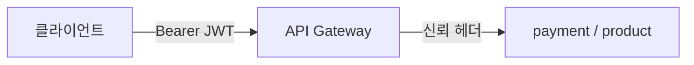

> [!summary] 핵심 한 줄
> Gateway가 JWT를 한 번만 검증하려면 클라이언트가 신뢰 헤더를 만들 수 없고, Gateway를 우회해 서비스에 닿을 수도 없어야 한다. 인증은 코드에서 끝나지만 **신뢰 경계는 네트워크에서 닫힌다.**

> [!info] 시리즈 — 분산 이커머스 신뢰성 설계
> [[01.JWT를 한 번만 검증해도 되는가]] · [[02.재고는 결제 전에 잡고 취소 뒤에 돌려준다]] · [[03.순서를 포기하고 수렴을 택했다]] · [[04.10초 폴링을 기다리지 않는 Outbox]] · [[05.Redis가 없어도 취소는 계속된다]]

---

## 1. 검증 횟수보다 신뢰 경계가 먼저다

`api-gateway`는 JWT를 검증한 뒤 `X-User-Id`, `X-User-Role`, `X-Merchant-Id`를 전달한다. payment와 product는 JWT를 다시 검증하지 않는다.

질문은 "몇 번 검증하나"가 아니다. **누가 만든 신원을 어느 구간까지 믿을 수 있나**다.

## 2. 인증과 인가를 나눴다

Gateway는 요청자가 누구인지 확인한다. 자원 인가는 자원을 가진 downstream이 판단한다.

- `ADMIN`: 관리 범위 허용
- `MERCHANT`: 헤더의 가맹점과 결제의 가맹점이 같아야 허용
- `USER`: 현재 확장 경로에서는 헤더의 사용자와 결제 소유자가 같아야 자가취소 허용

Gateway가 소유권까지 판단하면 도메인 DB 의존성이 Gateway로 역류한다. 단일 JWT 검증은 인증 중앙화이지 인가 전체의 중앙화가 아니다.

## 3. 헤더를 믿으려면 우회 경로를 닫아야 한다

Gateway는 외부 `X-User-*` 헤더를 제거하고 JWT 결과로 다시 만든다. 하지만 클라이언트가 payment 8080에 직접 닿으면 `X-User-Role: ADMIN`을 붙일 수 있다. downstream은 그 헤더를 진짜로 받아들인다.

| 경계 | 책임 |
|---|---|
| Gateway | 외부 신뢰 헤더 제거, JWT 검증, 헤더 재생성 |
| NetworkPolicy | payment·product ingress를 Gateway 파드로 제한 |

NetworkPolicy가 빠진 배포는 성능 저하가 아니라 보안 모델 붕괴다.

## 4. 대안과 선택

| 방식 | 장점 | 대가 |
|---|---|---|
| Gateway 단일 검증 | 인증 정책 단일화 | 네트워크 경계 필수 |
| 서비스별 재검증 | 직접 호출도 검증 | 키·필터·예외 정책 복제 |
| 중앙 인가 서비스 | 정책 집중 | 매 요청 홉과 장애 의존성 |

이 프로젝트는 첫 번째를 택했다. 애플리케이션 인증·인가 코드는 구현됐지만 문서상 NetworkPolicy의 실제 배포는 남아 있다. 구현 완료와 운영 경계 완료를 같은 말로 쓰지 않는다.

검증도 두 층이다. Gateway가 잘못된 토큰과 외부 헤더를 차단하는지, 그리고 Gateway 외 파드가 downstream에 직접 닿지 못하는지를 따로 확인해야 한다.

## 한 줄

**신원 생성은 Gateway에, 자원 인가는 downstream에, 우회 차단은 NetworkPolicy에 뒀다. JWT를 한 번만 검증해도 되는 이유는 세 경계가 함께 닫힐 때만 성립한다.** → [[02.재고는 결제 전에 잡고 취소 뒤에 돌려준다]]
