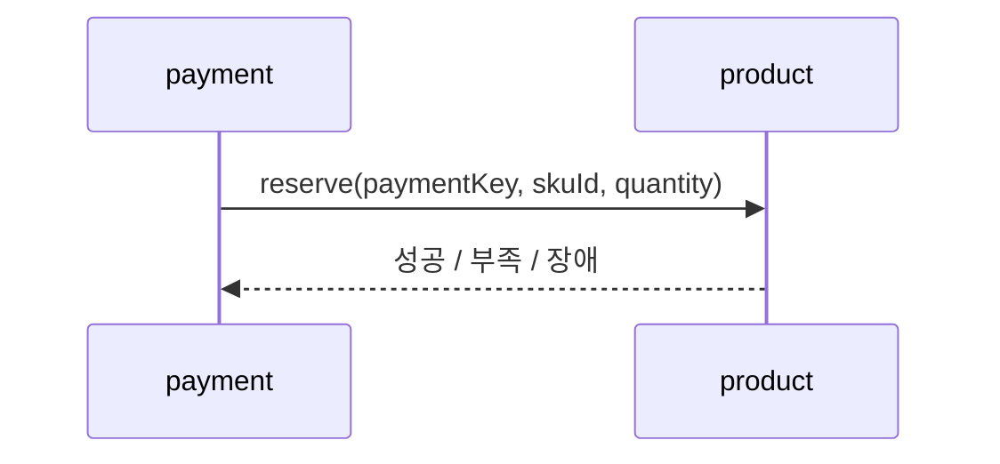
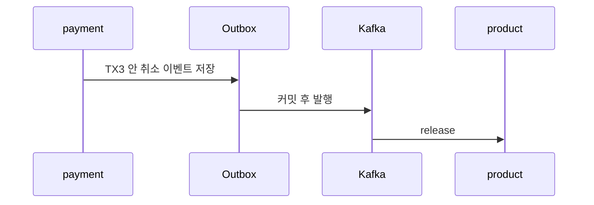

> [!summary] 핵심 한 줄
> 결제 생성은 재고가 있어야 시작할 수 있어 **동기 예약으로 fail-closed**했고, 이미 확정된 취소는 **이벤트로 비동기 복원**했다. 같은 재고 변경이어도 실패 의미가 다르다.

> [!info] 시리즈 — 분산 이커머스 신뢰성 설계
> [[01.JWT를 한 번만 검증해도 되는가]] · [[02.재고는 결제 전에 잡고 취소 뒤에 돌려준다]] · [[03.순서를 포기하고 수렴을 택했다]] · [[04.10초 폴링을 기다리지 않는 Outbox]] · [[05.Redis가 없어도 취소는 계속된다]]

---

## 1. 결제 전에 재고를 잡는다

[[03.동시에 사면 초과판매된다|Kata 03]]은 한 테이블의 경쟁을 원자적 UPDATE로 막았다. 이번에는 서비스 경계까지 넓어진다.

product의 reserve는 재고 조건과 차감을 한 SQL에 묶는다. 부족하거나 product 상태를 알 수 없으면 결제를 거부한다.

| 상황 | 결제 생성 |
|---|---|
| reserve 성공 | 계속 |
| 재고 부족 | 거부 |
| product 장애·응답 불명 | 거부(fail-closed) |

재고를 모른 채 결제를 받으면 품절 결제라는 새 상태와 환불·CS를 떠안는다. 생성 시점의 가용성보다 확실성을 택했다.

## 2. 취소 뒤 복원은 비동기다

취소 TX3는 payment, payment item, cancel request, Outbox를 한 커밋에 반영한다. 이후 `payment.cancelled`를 product가 소비해 재고를 복원한다.

복원을 TX3 안 HTTP로 묶으면 두 DB를 하나의 로컬 트랜잭션으로 만들 수 없다. product가 느리면 취소 TX가 커넥션을 쥐고, 복원 뒤 TX3가 롤백되면 재고만 돌아올 수도 있다.

## 3. 예약과 복원은 비대칭이다

| 경로 | 선택 | 실패 의미 |
|---|---|---|
| 결제 생성 → reserve | 동기 | 모르면 결제를 시작하지 않음 |
| 취소 완료 → release | 비동기 | 취소는 유지하고 복원을 재시도 |

예약 실패는 결제를 시작하지 않으면 된다. 복원 실패는 이미 확정된 취소를 없던 일로 만들 수 없다.

## 4. 재시도는 paymentKey 멱등성으로 받는다

HTTP 응답을 잃으면 reserve가 재호출되고, Outbox 이벤트도 다시 전달될 수 있다.

- 같은 paymentKey reserve는 재고를 다시 차감하지 않는다.
- 같은 paymentKey release는 재고를 다시 더하지 않는다.

전달을 정확히 한 번으로 가정하지 않고, 같은 작업을 다시 해도 한 번만 반영되게 했다. [[04.두 번 취소해도 한 번만]]과 같은 원리다.

## 5. 취소 코어는 그대로 뒀다

이벤트 payload에 `skuId`, `quantity`만 추가했다. 취소 TX, 멱등성, 복구 scheduler, Outbox 원칙은 유지했다. 새 기능이 기존 취소 코어의 회귀 범위를 키우지 않게 했다.

코드와 로컬 검증은 반영됐지만 문서상 product의 k3s 매니페스트, 외부 DB와 Kafka consumer 배선은 별도 배포 과제로 남아 있다.

비동기 복원은 즉시 일관성을 포기한다. reserve 뒤 결제 저장 실패에는 release 보상·재시도·고아 예약 정리도 필요하다. 실패가 사라진 것이 아니라 실패 위치가 상태 전이로 드러났다.

## 한 줄

**예약은 결제의 입장 조건이라 동기로 닫고, 복원은 확정된 취소의 후속 작업이라 비동기로 수렴시켰다. 둘을 다시 시도할 수 있게 만든 공통점은 paymentKey 멱등성이다.** → [[03.순서를 포기하고 수렴을 택했다]]
