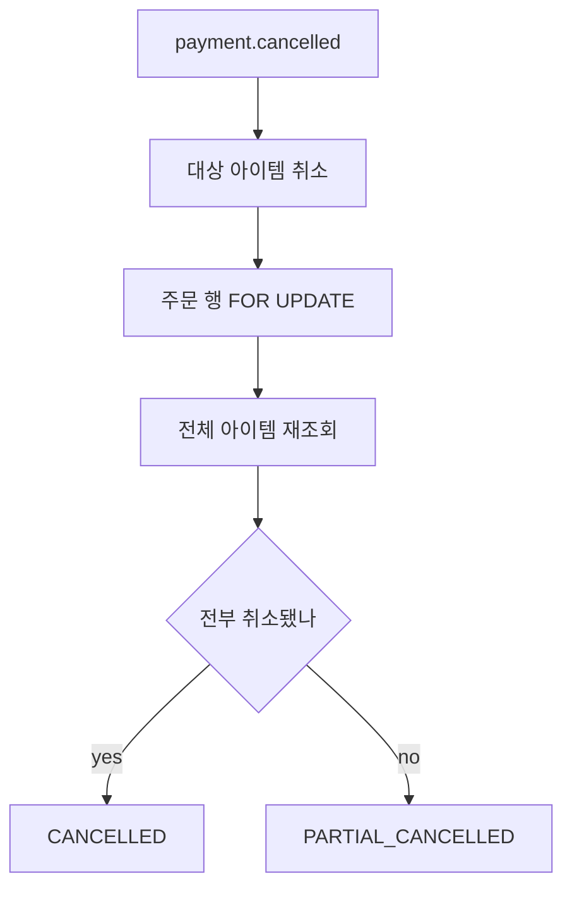

> [!summary] 핵심 한 줄
> 같은 결제의 이벤트 순서를 강제하지 않았다. Order consumer가 **전체 아이템을 다시 읽고 주문 행을 잠근 뒤 상태를 재계산**하게 만들어 현재 상태에 수렴하도록 했다.

> [!info] 시리즈 — 분산 이커머스 신뢰성 설계
> [[01.JWT를 한 번만 검증해도 되는가]] · [[02.재고는 결제 전에 잡고 취소 뒤에 돌려준다]] · [[03.순서를 포기하고 수렴을 택했다]] · [[04.10초 폴링을 기다리지 않는 Outbox]] · [[05.Redis가 없어도 취소는 계속된다]]

---

## 1. 부분 취소에는 순서가 필요해 보였다

아이템 A만 취소되면 부분 취소, A와 B가 모두 취소되면 전체 취소다. 이벤트를 단계 명령으로 보면 순서가 중요하다.

```text
A 취소 → PARTIAL_CANCELLED
B 취소 → CANCELLED
```

`paymentId`를 파티션 키로 쓰면 결제 단위 순서를 얻기 쉽다. 대신 정확성이 Kafka 전달 순서와 재처리 조건에 묶인다.

## 2. 현재 상태에서 다시 계산한다

Order consumer는 이전 주문 상태를 한 단계 옮기지 않는다.

1. 대상 아이템의 취소를 반영한다.
2. 주문 행을 `FOR UPDATE`로 잠근다.
3. 주문의 전체 아이템을 다시 읽는다.
4. 현재 아이템 상태로 주문 상태를 계산한다.



판단 근거는 이벤트 순번이 아니라 DB의 현재 전체 상태다.

## 3. 행 락과 재계산의 역할은 다르다

전체 재계산만 하면 두 consumer가 다른 중간 상태를 보고 저장할 수 있다. 주문 행 락은 같은 주문의 계산을 직렬화한다.

- 전체 재계산: 어떤 순서로 왔든 답을 도출
- 주문 행 락: 동시에 계산한 두 답이 덮어쓰지 않게 함
- Kafka 파티션: 전달 병렬성을 정함

행 락은 이벤트 순서를 복원하지 않는다. 저장 계층의 경쟁만 닫는다.

## 4. 중복은 별도로 끊는다

Outbox는 at-least-once라 같은 `cancelRequestId`가 다시 올 수 있다. `processed_cancel_event`와 UNIQUE 제약이 동시 중복을 no-op으로 만든다.

순서 무관과 멱등성은 다르다. 서로 다른 이벤트의 역순 도착은 재계산으로, 같은 이벤트의 재도착은 dedup으로 처리한다.

## 5. cancelRequestId를 파티션 키로 택했다

| 키 | 장점 | 대가 |
|---|---|---|
| paymentId | 결제 단위 순서 | 핫키와 순서 의존 |
| cancelRequestId | 취소 요청 분산 | 결제 단위 순서 없음 |

consumer가 순서를 요구하지 않으므로 `cancelRequestId`를 쓰면서도 정합성을 지킬 수 있다. consumer 설계가 파티션 키 선택의 자유를 만들었다.

잔액 증감처럼 연산 순서가 결과를 바꾸는 도메인에는 이 방식을 적용할 수 없다. 주문 상태가 아이템들의 현재 상태로 재계산 가능했기 때문에 성립했다.

[[20.발행만 보고 소비는 안 봤다|Load 20]]은 lag·retry·DLQ·e2e 정합을 실측했다. 이 글은 그 숫자를 반복하지 않고 순서 없이 수렴하는 구조에 집중한다.

## 한 줄

**Kafka 순서를 강화하기 전에 consumer가 순서를 필요로 하는지부터 바꿨다. 전체 재계산과 주문 행 락으로 수렴을 만들자 `cancelRequestId` 파티션 키를 선택할 수 있었다.** → [[04.10초 폴링을 기다리지 않는 Outbox]]
