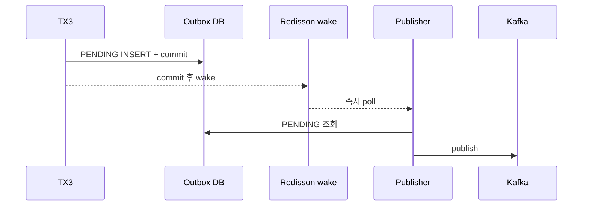
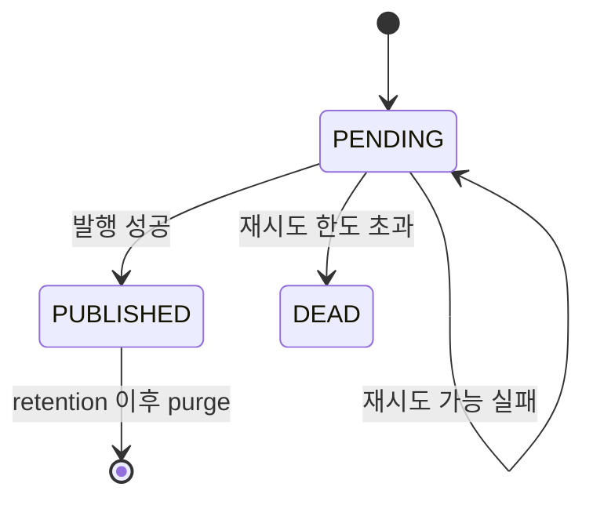

> [!summary] 핵심 한 줄
> Outbox의 신뢰 근거는 Redisson wake가 아니라 **TX3와 같은 커밋에 저장된 PENDING 행과 반복 poll**이다. wake는 정상 경로의 대기만 줄이고, 실패해도 10초 poll이 다시 찾는다.

> [!info] 시리즈 — 분산 이커머스 신뢰성 설계
> [[01.JWT를 한 번만 검증해도 되는가]] · [[02.재고는 결제 전에 잡고 취소 뒤에 돌려준다]] · [[03.순서를 포기하고 수렴을 택했다]] · [[04.10초 폴링을 기다리지 않는 Outbox]] · [[05.Redis가 없어도 취소는 계속된다]]

---

## 1. DB와 Kafka 사이를 같은 커밋으로 잇는다

취소 TX3가 성공하면 payment, payment item, cancel request가 바뀌고 다른 서비스도 이 사실을 알아야 한다. [[16.동기 발행의 6퍼센트|Load 16]]은 이 dual-write와 세 발행 모드의 비용을 비교했다.

현재 기본은 OUTBOX다.

```text
TX3
├─ payment / payment_item 변경
├─ cancel_request COMPLETED
└─ cancel_event_outbox PENDING INSERT
         ↓ 같은 DB 커밋
커밋 뒤 Kafka 발행
```

취소 사실과 "발행해야 할 일"이 같은 커밋에 남는다. 프로세스가 직후 죽어도 PENDING 행은 사라지지 않는다.

## 2. poll만 두면 안전하지만 늦다

publisher가 PENDING을 주기적으로 찾는다. 기본 주기는 10초다. 재시작하거나 알림을 놓쳐도 DB를 다시 보면 된다.

대가는 대기다. poll 직후 생긴 이벤트는 다음 주기까지 기다린다. 주기를 짧게 하면 빈 조회가 늘고 앱과 커넥션을 경쟁한다. [[17.최적화가 병을 키웠다]]와 [[18.전용 풀로 라이브락을 부수다]]가 그 실패를 다뤘다.

## 3. 커밋 뒤 wake로 정상 경로만 당겼다



순서는 `commit → wake`다. 커밋 전에 깨우면 publisher가 아직 보이지 않는 행을 조회할 수 있다.

## 4. wake는 비권위 최적화다

Redisson 메시지는 놓칠 수 있다. wake를 또 하나의 신뢰 큐로 만들지 않았다.

- wake 성공: 커밋 직후 발행
- wake 실패·유실: 10초 poll이 발견
- 프로세스 재시작: DB PENDING이 다음 poll에서 복구

정확성을 보장하는 상태는 Redis가 아니라 DB Outbox 행에 있다. Redis가 없어도 느려질 뿐 이벤트가 사라지지 않는다.

## 5. 성공과 실패의 끝을 정했다



재시도 한도를 넘으면 `DEAD`와 `OperationAlertPort`로 사람에게 넘긴다. `PUBLISHED`는 retention 뒤 purge한다. Outbox는 테이블 하나가 아니라 발행 책임의 수명주기다.

## 6. 세 발행 모드의 위치

| 모드 | 성격 | 위치 |
|---|---|---|
| INLINE | TX3 안 발행 확인, 실패 시 롤백 | 비교·학습 |
| INLINE_ASYNC | fire-and-forget, dual-write 안전하지 않음 | 측정 상한 |
| OUTBOX | 같은 커밋에 PENDING, 별도 발행 | 기본 경로 |

Load 시리즈는 처리량과 poller 라이브락을 실측했다. 이 글은 숫자를 반복하지 않고 OUTBOX를 기본으로 만든 뒤의 wake·poll·DEAD·purge 계약에 집중한다.

Outbox는 producer dual-write를 해결할 뿐 consumer 중복 안전까지 보장하지 않는다. at-least-once에는 [[03.순서를 포기하고 수렴을 택했다|3편]]의 멱등 consumer가 필요하다. poller의 전용 DataSource도 실측에서 나온 별도 안전장치다.

## 한 줄

**wake는 Outbox를 빠르게 만들지만 믿을 대상은 아니다. 같은 커밋의 PENDING, 반복 poll, DEAD 알림, PUBLISHED purge까지 이어져야 발행 책임이 끝난다.** → [[05.Redis가 없어도 취소는 계속된다]]
