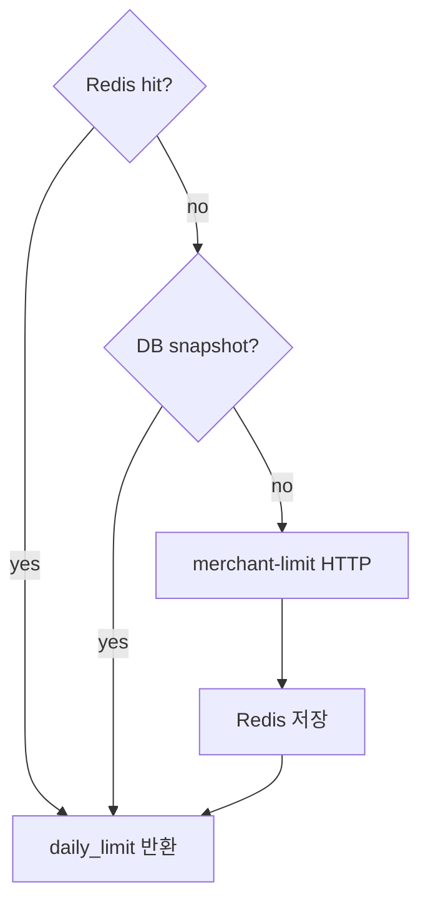

> [!summary] 핵심 한 줄
> `Redis → DB snapshot → merchant-limit HTTP` 순서로 일일 한도를 해석한다. Redis miss 뒤 원본을 바로 부르지 않고 **snapshot을 보호막으로 두어**, 캐시 장애가 원본 서비스와 DB 커넥션 풀로 번지는 것을 막았다.

> [!info] 시리즈 — 분산 이커머스 신뢰성 설계
> [[01.JWT를 한 번만 검증해도 되는가]] · [[02.재고는 결제 전에 잡고 취소 뒤에 돌려준다]] · [[03.순서를 포기하고 수렴을 택했다]] · [[04.10초 폴링을 기다리지 않는 Outbox]] · [[05.Redis가 없어도 취소는 계속된다]]

---

## 1. 캐시를 못 읽으면 원본을 부르면 되나

취소 한도 `daily_limit`의 원본은 merchant-limit-service이고 Redis는 `daily_limit:{merchantId}:{kstDate}`로 캐시한다.

흔한 fallback은 `Redis miss → 원본 HTTP`다. Redis 전체가 흔들리면 평소 캐시가 받던 요청이 원본으로 몰린다. 캐시 장애가 원본 장애로 증폭된다.

## 2. 조회 순서를 불변식으로 뒀다

```text
1. Redis daily_limit:{merchantId}:{kstDate}
2. merchant_cancel_usage.daily_limit DB snapshot
3. merchant-limit HTTP
```

두 번째를 건너뛰면 안 된다. `merchant_cancel_usage`는 그날 처음 해석한 한도를 snapshot으로 저장한다. 이후 Redis가 비어도 이미 처리 중인 가맹점은 DB에서 답을 얻는다.



HTTP는 snapshot조차 없는 onset 경로에만 남는다.

## 3. miss와 장애는 다르지만 fallback은 같다

| 상황 | 의미 | 다음 조회 |
|---|---|---|
| 키 miss | 아직 캐시되지 않음·만료 가능 | DB snapshot |
| Redis 장애 | 캐시 의존성 실패 | DB snapshot |
| snapshot 없음 | 당일 최초 해석 가능성 | merchant-limit HTTP |

사건 분류를 같게 만든 것이 아니다. 원본을 보호하기 위해 fallback의 두 번째 단계만 공유했다.

## 4. snapshot의 값과 대가

snapshot은 Redis 장애 때 원본으로 요청이 몰리지 않게 하고, 한 취소 처리에서 사용할 한도 기준을 고정한다.

대가는 stale data다. 원본 한도가 당일 변경돼도 즉시 바뀌지 않을 수 있다. `merchant.limit.updated` 이벤트가 변경을 전파하지만 지연과 실패 가능성은 남는다. 최신성보다 처리 연속성과 기준 안정성을 우선한 선택이다.

## 5. Load 11 이후 코드가 바뀌었다

[[11.캐시를 껐는데 아무 일도 안 났다|Load 11]]은 Redis, snapshot, HTTP를 토글해 쟀다. 정상 상태에서는 차이가 작았지만 merchant-limit에 지연을 주입하자 당시 HTTP-in-TX가 커넥션을 쥐고 기다려 풀 고갈로 번졌다.

현재 `ValidateAndReserveService`는 경계를 다음처럼 나눈다.

```text
TX 밖
  멱등 pre-check
  Redis → DB snapshot → merchant-limit HTTP

TX 안
  usage row 보장
  원자 조건부 차감
  멱등 history 저장
```

`resolveDailyLimit()`은 TX 밖에서 실행된다. 원본이 느리면 onset 요청은 늦지만 그 대기가 DB 커넥션을 쥐지 않는다.

- `Load/11`: HTTP-in-TX 위험을 실측으로 발견
- `Reliability/05`: 3단계 조회와 TX 경계를 현재 코드에 반영

실험이 설명으로 끝나지 않고 코드 경계로 이동했다.

## 6. 보장 범위를 좁혀 말한다

Redis와 snapshot이 모두 없는 요청은 원본 HTTP가 필요하다. 원본이 실패하면 한도를 확정할 수 없어 중단된다. DB가 장애면 두 번째 보호막도 사라진다. stale snapshot도 감수해야 한다.

따라서 "Redis가 없어도 모든 취소가 성공한다"가 아니다. **snapshot이 있는 가맹점의 취소가 Redis 장애만으로 원본 서비스에 몰리지 않는다**는 보장이다.

## 한 줄

**Redis를 빠른 첫 답으로 쓰되 DB snapshot을 반드시 두 번째에 두고 HTTP를 TX 밖으로 옮겼다. 캐시 장애를 없앤 것이 아니라 원본 서비스와 커넥션 풀까지 번지는 경로를 잘랐다.** 다섯 설계의 공통점은 실패를 부정하지 않고 실패가 넘어갈 경계를 줄인 것이다.
