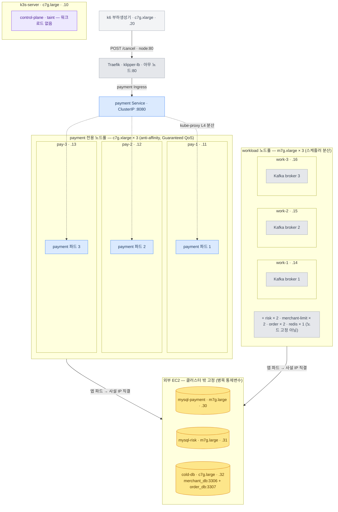

> [!summary] 핵심 한 줄
> AWS EC2 위에 k3s를 직접 올리고, Strimzi로 Kafka 3-broker를 CRD 선언 하나로 띄웠다. control-plane 1대 + agent 6대 + 클러스터 밖 DB 3대 — 판의 설계 근거는 모두 "Load에서 규명한 병목을 통제변수로 묶어두는 것"이었다.

> [!info] Scale 시리즈 — k3s 수평 스케일아웃
> **1막 · 여러 대로 안전하게** [[00.수직 다음, 수평으로|00]] · [[01.자립 리그를 k3s로 깔다|01]] · [[02.파드가 늘면 뭐가 깨지나|02]] · [[03.노드가 죽어도|03]] · [[04.배포가 조용히 터진다|04]]
> **2막 · 늘리면 정말 빨라지나** [[05.replica가 천장을 올린 줄 알았다|05]] · [[06.4단 진단 끝에 payment_db|06]] · [[07.운영 함정|07]] · [[08.매니페스트 행단위 해부|08]]

---

## 1. 왜 k3s를 직접 올리나

Load 시리즈는 EC2 단일 인스턴스에서 끝났다. 결론은 분명했다 — 한 대의 천장은 DB fsync가 정한다. 그 천장을 수평으로 옮기면 질문이 달라진다. 파드를 N개로 늘렸을 때 **무엇이 변하고 무엇이 그대로인가**.

EKS 같은 관리형을 쓰면 스케줄링·롤링 업데이트·노드 교체가 API 뒤에서 일어난다. 파드가 어떤 순서로 교체되는지, 노드가 죽으면 컨트롤 플레인이 어떻게 반응하는지 — 안 보인다. 보고 싶었다.

k3s는 단일 바이너리다. [[쿠버네티스 정리|쿠버네티스 정리 노트]]에 정리해둔 control plane 컴포넌트들(kube-apiserver, kube-scheduler, kube-controller-manager)이 전부 그 바이너리 안에 들어 있다. etcd 대신 **SQLite**를 쓴다(단일 서버 구성 기준). 설치는 curl 한 줄이고, 내부가 열려 있다.

"자립 리그"란 그 뜻이다 — 관리형 서비스 없이, 내가 만든 인프라 위에서 오케스트레이션을 직접 실측한다.

## 2. 노드 구성 — 무엇을 어디에 올렸나

Terraform 한 장(`infra/k3s-scaleout/instances.tf`)이 전체 구성을 정의한다.

| 노드 | 타입 | 사설 IP | 역할 |
|---|---|---|---|
| k3s-server | c7g.large | 10.0.1.10 | control-plane (taint, 워크로드 없음) |
| k3s-pay-1/2/3 | c7g.xlarge | .11 / .12 / .13 | payment 전용 풀 (격리 벤치) |
| k3s-work-1/2/3 | m7g.xlarge | .14 / .15 / .16 | workload 풀 (Kafka·risk·redis·merchant-limit·order) |
| mysql-payment | m7g.large | 10.0.1.30 | payment_db (클러스터 밖) |
| mysql-risk | m7g.large | 10.0.1.31 | risk_db (클러스터 밖) |
| cold-db | c7g.large | 10.0.1.32 | merchant_db:3306 + order_db:3307 (클러스터 밖, 한 대에 컨테이너 2개) |
| k6 | c7g.xlarge | 10.0.1.20 | 부하생성기 (클러스터 밖) |
| obs | t4g.medium | 10.0.1.50 | Prometheus + Grafana (클러스터 밖) |

**그림: 노드·파드 토폴로지 — k3s 클러스터 전체 배치 (격리 벤치 기준)**



핵심 구분은 두 가지다.

**첫째, control-plane에 워크로드를 올리지 않는다.** k3s-server에는 `node-role.kubernetes.io/control-plane=true:NoSchedule` taint가 걸려 있다. 실측에서 스케줄러 판단을 관찰하려면 control-plane이 워크로드와 뒤섞이면 안 된다.

**둘째, DB는 클러스터 밖에 고정한다.** Load에서 규명한 병목이 DB fsync였다. 그 변수를 건드리지 않고 "파드만 늘렸을 때" 무슨 일이 일어나는지를 보려면 DB가 통제변수여야 한다. 파드가 DB에 접근하는 경로는 flannel VXLAN → 노드 ENI → VPC 라우팅 → EC2. 같은 보안그룹이라 별도 포트 규칙 없이 통과한다. ConfigMap에 `jdbc:mysql://10.0.1.30:3306/payment_db`처럼 사설 IP를 직접 주입한다.

격리 벤치를 돌릴 때는 pay 풀(c7g.xlarge ×3)에 payment만 띄우고, work 풀(m7g.xlarge ×3)에 나머지 전부를 올린다. taint·label은 클러스터 조인 후 `kubectl`로 적용한다.

## 3. 파드 배치 — 어디에 몇 개가 서나

워크로드 단위 배치는 이렇다.

| 워크로드 | replica | 배치 방식 |
|---|---|---|
| payment (Deployment) | 3 | anti-affinity → 노드당 정확히 1개 |
| Kafka broker (Strimzi) | 3 | anti-affinity → 노드당 정확히 1개 |
| risk / merchant-limit / order | 각 2 | anti-affinity 없음 — 스케줄러가 분산 |
| Redis | 1 | 단일 (SPOF이지만 fail-safe로 수용) |
| Traefik | k3s 내장 | klipper-lb, 아무 노드:80 |

payment ×3과 Kafka broker ×3은 anti-affinity로 노드당 1개가 보장된다 — 실측으로 확인한 수치다. 나머지(risk·merchant-limit·order ×2, redis ×1)는 스케줄러가 3개 agent에 알아서 분산한다. 런마다 배치 노드가 바뀔 수 있다.

파드가 서로를 찾는 방법은 [[쿠버네티스 정리|Service와 클러스터 DNS]]다. DB URL·Kafka bootstrap·Redis host는 ConfigMap `app-config`로, DB 크리덴셜은 Secret `db-cred`로 envFrom 주입한다. 파드가 어느 노드에 올라가든 배선은 같다.

파드망은 **flannel VXLAN `10.42.0.0/16`**. 파드 IP가 노드 IP와 다른 대역이고, 노드 간 트래픽은 VXLAN으로 캡슐화된다. 클러스터는 단일 AZ, VPC `10.0.1.0/24`.

## 4. 입구 — Traefik과 klipper-lb

k3s를 설치하면 Traefik이 기본으로 같이 뜬다. Ingress 컨트롤러 역할을 한다. k6는 `node:80`으로 요청을 보내고, Traefik이 path `/`를 보고 `payment` Service(ClusterIP :8080)로 넘긴다. kube-proxy가 L4에서 payment 파드 3개에 분산한다.

Service를 외부에 노출하는 건 klipper-lb가 한다. 클라우드 로드밸런서(ELB 등) 없이 노드 IP 그대로 입구가 된다. 별도 LB 비용 없이, 내부가 투명하게 보인다.

## 5. Kafka를 Strimzi로 선언만 했다

Kafka 3-broker를 올리는 데 StatefulSet을 손으로 짜지 않았다. **Strimzi** 오퍼레이터를 설치하고 CRD 하나를 선언했다.

```yaml
# KafkaNodePool + Kafka CRD 핵심 설정 (발췌)
spec:
  kafka:
    version: 3.x
    replicas: 3
    listeners:
      - name: plain
        port: 9092
        type: internal
    config:
      default.replication.factor: 3
      min.insync.replicas: 2
    storage:
      type: persistent-claim   # local-path StorageClass
```

`kubectl apply -f kafka.yaml` 하나로 operator가 StatefulSet·Service·ConfigMap을 만든다. **RF3, minISR2**로 선언했다 — broker 1개가 죽어도 쓰기가 멈추지 않는다. ZooKeeper는 없다. **KRaft 모드**(Kafka 자체 메타데이터 합의)다.

Strimzi의 핵심은 선언이 현실을 추적한다는 점이다. broker를 1개 죽이면 operator가 감지하고 재생성한다. 이걸 3편([[03.노드가 죽어도|03]])에서 실제로 확인한다.

## 6. 설치에서 막힌 한 곳

k3s 설치는 `curl -sfL https://get.k3s.io | sh`가 표준이다. 문제는 EC2 부팅 직후다. user_data 스크립트가 너무 이른 시점에 실행되면 NAT Gateway 경로가 아직 안 뚫려 있어 curl이 실패한다. `-s`(silent) 플래그 탓에 파이프가 빈 채로 sh에 들어가고, 에러도 없이 그냥 넘어간다. k3s가 설치 안 됐는데 인스턴스는 "완료" 상태다.

해결은 두 가지를 같이 적용했다. curl을 파일로 받고, 재시도 루프를 감쌌다:

```bash
for i in $(seq 1 10); do
  curl -fL https://get.k3s.io -o /tmp/k3s.sh && break
  echo "k3s dl 재시도 $i"; sleep 10
done
```

agent는 추가로 server API 응답을 확인하고 조인한다:

```bash
until curl -sk https://10.0.1.10:6443/ping >/dev/null 2>&1; do sleep 5; done
```

조용히 무설치로 넘어가는 함정은, 처음에 원인을 몰라 꽤 헤맸다. 로그가 없으면 원인이 없는 게 아니라 로그가 없는 것이다.

## 7. 판이 다 깔리면 무엇이 보이나

`terraform apply`로 전체가 뜨고, Kafka broker 3개가 올라오고, payment 파드 3개가 각 노드에 1개씩 자리를 잡으면 — 판이 완성된다.

이 상태에서 k6로 부하를 흘리면 kube-proxy가 세 파드에 트래픽을 나눈다. 외부에서는 단일 엔드포인트처럼 보이지만 안에서는 세 프로세스가 동시에 같은 DB와 Kafka를 사용한다.

그러면 한 대일 때는 숨어 있던 질문이 얼굴을 낸다. 같은 취소 요청이 두 파드에 동시에 들어오면? 스케줄러가 같은 취소 재처리를 두 파드에서 동시에 돌리면? 이중차감이 생기나, 이중 Kafka 발행이 생기나.

Load에서 다진 멱등성(request_hash UK, FAILED → PENDING UPDATE, TX3 row lock)이 오케스트레이션 레이어에서도 살아남는지 — 그게 2편([[02.파드가 늘면 뭐가 깨지나|02]])의 질문이다.

## 한 줄

판은 깔렸다, 이제 파드를 늘리면 뭐가 깨지나 — [[02.파드가 늘면 뭐가 깨지나|02편]]에서 정합성을 실제로 터뜨려본다.
