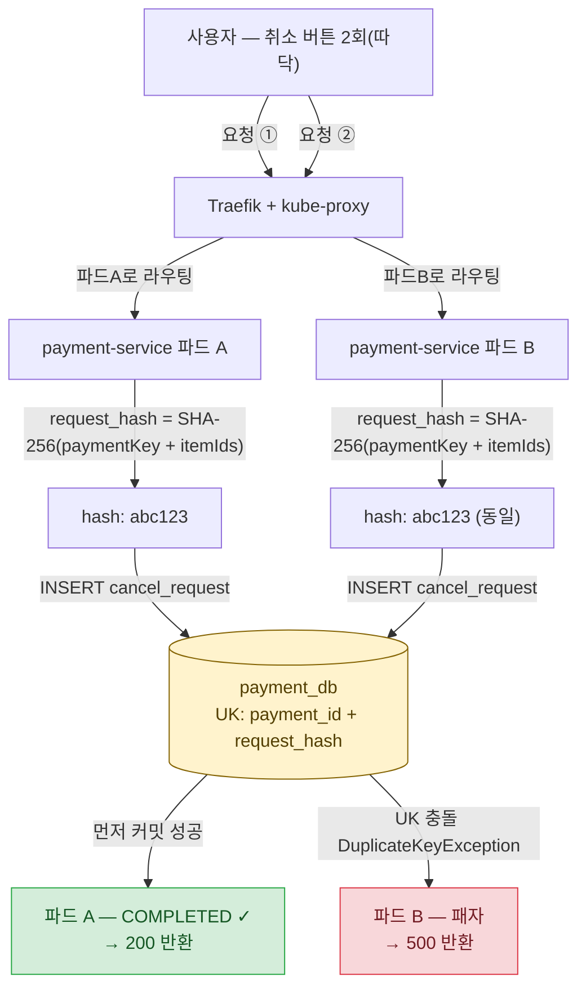

> [!summary] 핵심 한 줄
> 파드를 3개로 늘렸다. 설계에 박아둔 UK·분산락·dedup이 이중취소와 중복발행을 실제로 막았다. 단, 동시 레이스의 패자는 500을 받았다 — 정합성은 지켜졌지만 그게 곧 좋은 UX는 아니다.

> [!info] Scale 시리즈 — k3s 수평 스케일아웃
> **1막 · 여러 대로 안전하게** [[00.수직 다음, 수평으로|00]] · [[01.자립 리그를 k3s로 깔다|01]] · [[02.파드가 늘면 뭐가 깨지나|02]] · [[03.노드가 죽어도|03]] · [[04.배포가 조용히 터진다|04]]
> **2막 · 늘리면 정말 빨라지나** [[05.replica가 천장을 올린 줄 알았다|05]] · [[06.4단 진단 끝에 payment_db|06]] · [[07.운영 함정|07]] · [[08.매니페스트 행단위 해부|08]]

---

## 1. 파드가 늘면 새로 생기는 문제

Load 시리즈는 payment 파드 1개, risk 1개, merchant-limit 1개로 돌렸다. 단일 인스턴스는 동시성 결함을 숨긴다. 같은 프로세스 안에서는 취소 요청이 하나씩 처리되니 "이 요청은 저 파드로, 저 요청은 이 파드로" 같은 상황 자체가 없다.

파드를 3개로 늘리면 세 가지 깨짐이 새로 얼굴을 내민다.

- **따닥이 다른 파드에 착지한다.** 사용자가 취소 버튼을 두 번 누르면 Traefik이 두 요청을 다른 payment 파드로 각각 보낼 수 있다. 한 파드가 이미 처리를 시작한 줄 모르고 두 번째 파드가 동시에 시작하면, 같은 취소가 두 번 실행된다.
- **`@Scheduled` 폴러가 파드마다 돈다.** payment-service·merchant-limit-service는 복구 스케줄러와 outbox 발행 스케줄러를 각각 내장한다. 파드가 3개면 스케줄러도 3개가 돈다. 같은 outbox 행을 세 파드가 동시에 집어 Kafka에 발행하면 중복 메시지가 생긴다.
- **Kafka 파티션 재분배가 이벤트를 재처리시킨다.** 컨슈머 그룹 리밸런싱이나 at-least-once 재전달로 같은 이벤트가 두 번 들어오면, 이미 처리한 주문 상태를 한 번 더 갱신하게 된다.

세 깨짐 각각에 방패가 있다. 그걸 코드 수준에서 확인하고, 실측으로 실제로 막히는지 증명했다.

---

## 2. 첫 번째 깨짐 — 따닥이 다른 파드에 착지

### 설계: request_hash UK

취소 요청이 들어오면 payment-service는 서버 쪽에서 해시를 직접 만든다.

```
request_hash = SHA-256(paymentKey + paymentItemIds 오름차순 정렬)
```

그리고 `cancel_request` 테이블에 `(payment_id, request_hash)` 복합 UK가 걸려 있다. 클라이언트가 `Idempotency-Key` 헤더를 보내는 게 아니다 — 서버가 요청의 내용물로 해시를 직접 계산해 파드 간에 동일한 키를 만든다.

두 파드가 동시에 같은 취소를 처리하려 하면 둘 다 동일한 `request_hash`를 계산한다. DB에 먼저 도달한 쪽이 INSERT에 성공하고, 나중에 도달한 쪽은 UK 위반으로 `DuplicateKeyException`을 받는다. 이중취소는 물리적으로 차단된다.

### 실측: 동시 2회 → cancel_request 1건

Traefik에 동일 취소 요청을 **동시 2회** 보냈다. 라우팅을 다른 payment 파드로 유도해 두 파드가 실제로 같은 요청을 동시에 처리하도록 했다.

결과:

- `cancel_request` 테이블: **1건 COMPLETED, 취소액 10,000**
- Payment 상태: CANCELLED

UK가 이중취소를 물리적으로 막았다. 숫자가 맞다: 요청 2번, 완료 1건.

### 정직한 발견: 패자가 500을 받는다

그런데 패자 파드는 `DuplicateKeyException`을 잡지 못하고 그대로 500(INTERNAL_ERROR)을 클라이언트에 반환했다.

정합성은 지켜졌다 — 취소는 정확히 한 번만 실행됐고, 금액 차감도 한 번뿐이다. 하지만 두 번 누른 사용자는 한 번은 200을, 한 번은 500을 받는다. 단일 인스턴스에서는 이 상황이 안 만들어진다. 같은 프로세스 안에서는 두 번째 요청이 들어올 때 이미 처리 중인 첫 번째 요청의 상태를 알 수 있어서 멱등 응답(200)을 돌려줄 기회가 있다. 멀티파드에서는 두 파드가 서로 모르고 동시에 달려들다 DB에서 충돌한다.

> 향후 개선: PENDING INSERT의 `DuplicateKeyException`을 잡아 진행 중/완료 결과를 멱등 반환(200)하도록 처리해야 한다. 이 엣지케이스는 스케일아웃 검증이 아니었다면 드러나지 않았을 것이다.

**따닥 → UK 레이스: 이중취소 차단 흐름**



---

## 3. 두 번째 깨짐 — 스케줄러가 파드마다 돈다

### 문제: 세 스케줄러, 하나의 outbox

merchant-limit-service는 `limit_event_outbox` 테이블에 발행 대기 행을 쌓고, 스케줄러가 주기적으로 그 행을 읽어 Kafka에 발행한다. 파드가 2개면 스케줄러도 2개. 같은 tick에 두 스케줄러가 같은 PENDING 행을 집어 각자 Kafka에 발행하면, 동일 이벤트가 두 번 발행된다.

payment-service의 복구 스케줄러도 마찬가지다 — 3개 파드가 동시에 같은 PROCESSING 행을 복구 대상으로 집어 PG사 조회와 TX3 재실행을 이중으로 돌릴 수 있다.

### 방패: Redisson RLock

스케줄러 진입부에 Redisson 분산락을 건다.

```java
RLock lock = redisson.getLock("lock:outbox:publisher");
boolean acquired = lock.tryLock(0, TimeUnit.SECONDS);  // 대기 없이 즉시 시도
if (!acquired) return;                                  // 못 잡으면 이번 tick 포기
try {
    publishPendingOutbox();
} finally {
    if (lock.isHeldByCurrentThread()) lock.unlock();   // 소유권 확인 후 해제
}
```

`tryLock(0, TimeUnit.SECONDS)` — 대기 시간 0이다. Load [[08.데드락인 줄 알았다|08편]]에서 본 것처럼, 분산락이 "대기 없이 거부"하면 핫 경합 상황에서 99.9%가 튕긴다. 스케줄러 락은 이게 **맞는 선택**이다. 스케줄러는 이번 tick에 못 하면 다음 tick에 하면 된다. 커넥션을 쥐고 기다릴 이유가 없다.

워치독(watchdog)도 켜 두었다. tryLock에 leaseTime을 명시하지 않으면 Redisson은 워치독을 활성화해 락 보유 스레드가 살아 있는 동안 자동으로 TTL을 연장한다. 스케줄러가 처리 도중 TTL 만료로 락을 잃어 두 번째 파드가 진입하는 상황을 막는다.

소유권 확인(`isHeldByCurrentThread()`) 후 unlock은 Load 리그에서 학습한 패턴이다 — 다른 스레드가 취득한 락을 실수로 해제하는 걸 막는다.

### 실측: 5 outbox → Kafka 정확히 5 메시지

merchant 한도를 5회 업데이트했다. `limit_event_outbox`에 행이 5개 쌓였다. merchant-limit 파드는 2개.

결과:

- Kafka 파티션 오프셋 합: **5** (파티션 0:2·1:1·2:2)
- `limit_event_outbox` 상태: PUBLISHED 5행, 각 1회

중복 발행 0. 5 outbox → Kafka 5 메시지가 정확히 성립했다. Redisson RLock이 2개 파드에서 exactly-once 발행을 보장했다.

---

## 4. 세 번째 깨짐 — Kafka 파티션 재분배와 재처리

order-service는 `payment.cancelled` 이벤트를 소비해 주문 상태를 갱신한다. Kafka는 at-least-once다. 컨슈머 그룹 리밸런싱이나 브로커 장애 복구 상황에서 같은 이벤트가 두 번 들어올 수 있다.

방패는 `processed_cancel_event` 테이블의 UK dedup이다. 이벤트 소비 시 `cancel_request_id`를 이 테이블에 INSERT하고, 이미 있으면 무시한다. 처리 순서와 무관하게 수렴한다 — 동일 `cancelRequestId`가 어느 파드에, 몇 번 도달해도 실제 상태 갱신은 한 번만 일어난다.

파티션 키는 `cancelRequestId`다. `paymentId`를 키로 쓰면 같은 결제에 대한 취소가 항상 같은 파티션으로 가지만, `cancelRequestId`가 고르게 분산돼 처리량이 더 좋다. order 컨슈머는 행 락으로 아이템 전체를 재계산하므로 결제 단위 순서 보장이 없어도 수렴한다.

---

## 5. 설계가 실제로 버틴다는 게 무슨 의미인가

세 실험 결과를 놓고 보면, "설계 문서에 있는 안전장치가 멀티파드에서도 실제로 작동한다"는 걸 증명한 셈이다.

그런데 동시에, 단일 인스턴스 테스트가 감추고 있던 것도 드러났다. 패자의 500은 코드 리뷰를 통과했다. `DuplicateKeyException`은 예외 처리가 돼 있으니 "터지진 않는다"고 볼 수 있다. 실제로 이중취소가 없으니 정합성 관점에서도 맞다. 그런데 멀티파드 실측을 돌려보기 전까지, 동시 요청의 패자가 500을 받는다는 사실을 아무도 직접 확인하지 않았다.

스케일아웃 검증의 값이 여기 있다. 숫자를 만들기 위해 하는 게 아니라, 단일 인스턴스가 숨겨 왔던 엣지케이스를 꺼내기 위해 하는 것이다.

```
이중취소: UK가 막는다         ✅ (단, 패자는 500)
중복발행: Redisson이 막는다   ✅
이벤트 재처리: UK dedup이 막는다  ✅
```

정합성은 확인됐다. 패자 500은 다음 개선 사이클 항목이다.

개념 연결: [[동시성 제어 4종 — 락 결정 트리]], [[결제 취소 멱등성 설계]]

---

## 한 줄

안전은 확인됐다 — UK·분산락·dedup이 멀티파드에서도 정합성을 지킨다. 다음 질문은 "노드 하나가 죽으면 어떻게 되나"다 → [[03.노드가 죽어도|03편]]으로.
