> [!summary] 핵심 한 줄
> 100rps 중 payment 파드가 얹힌 노드를 drain했다. 실패 요청은 0건. p95는 61ms에서 1139ms로 급등했다가 가라앉았고, 떠난 파드는 스스로 돌아왔다. **장애 = 실패 0 + 짧은 지연 블립 + 자동 복구**다.

> [!info] Scale 시리즈 — k3s 수평 스케일아웃
> **1막 · 여러 대로 안전하게** [[00.수직 다음, 수평으로|00]] · [[01.자립 리그를 k3s로 깔다|01]] · [[02.파드가 늘면 뭐가 깨지나|02]] · [[03.노드가 죽어도|03]] · [[04.배포가 조용히 터진다|04]]
> **2막 · 늘리면 정말 빨라지나** [[05.replica가 천장을 올린 줄 알았다|05]] · [[06.4단 진단 끝에 payment_db|06]] · [[07.운영 함정|07]] · [[08.매니페스트 행단위 해부|08]]

---

## 1. "노드가 죽으면?"이라는 질문

[[02.파드가 늘면 뭐가 깨지나|02편]]에서 정합성을 다졌다. payment 파드가 3개로 늘어도 이중취소는 0건이고, UK가 물리적으로 막아선다. 안전하게 늘리는 첫 조건은 통과다.

두 번째 조건이 남았다. **파드가 죽는 게 아니라 파드가 얹힌 노드 자체가 죽으면 어떻게 되나.** 노드 장애는 파드 장애보다 더 넓다. 그 노드에 있던 파드가 전부 함께 사라진다.

k3s 리그는 payment 파드 3개를 세 노드에 반드시 하나씩 올린다 — [[쿠버네티스 정리|anti-affinity]] 규칙 때문이다. 그러니 노드 하나가 죽으면 payment 용량의 1/3이 한 번에 사라진다. 취소 요청은 이 순간에 어떻게 되는가.

이걸 직접 걸었다.

## 2. 실험: 부하 중 노드를 뽑는다

부하생성기는 100rps를 꾸준히 보내고 있었다. p95 기준 61ms, 정상 구간이다.

이 상태에서 노드 하나에 `kubectl drain`을 날렸다. drain은 해당 노드의 파드를 전부 쫓아낸다 — 정확히 실제 노드 장애(혹은 계획적 점검)와 비슷한 상황이다. drain 대상 노드엔 payment 파드 하나와 kafka-broker-0이 함께 얹혀 있었다. 둘 다 동시에 evict됐다.

결과를 보기 전에 예상을 먼저 적어두자: 용량 1/3이 사라지니 **실패가 날 수도 있고**, 아니면 남은 2개 파드가 흡수해 **지연만 올 수도 있다**.

## 3. 결과: fail 0%, 블립 솔직하게

숫자부터.

| 지표 | 값 |
|---|---|
| fail% | **0%** (실패 요청 0건) |
| p95 블립 | **1139ms** (정상 61ms → 약 19배) |
| dropped | **61건** (지연 측정에서 window 밖으로 밀린 것) |
| self-heal | payment **3/3** 복귀 |

**drain → 흡수 → 자가치유 흐름**

```mermaid
flowchart LR
    subgraph A["초기 상태 (p95 61ms)"]
        P1["payment-1<br/>(노드1)"]
        P2["payment-2<br/>(노드2)"]
        P3["payment-3<br/>(노드3)"]
        KB["kafka-broker-0<br/>(노드3)"]
    end

    subgraph B["drain 직후 — 순간 흡수"]
        P4["payment-1<br/>(노드1)"]
        P5["payment-2<br/>(노드2)"]
        E1["payment-3 evicted"]
        E2["kafka-broker-0 evicted"]
        BLIP["p95 1139ms<br/>fail 0%"]
    end

    subgraph C["self-heal 완료"]
        P6["payment-1<br/>(노드1)"]
        P7["payment-2<br/>(노드2)"]
        P8["payment-3<br/>재스케줄 (노드1 or 2)"]
        KS["Kafka RF3/minISR2<br/>브로커1 상실 생존"]
        DONE["payment 3/3 복귀<br/>p95 정상"]
    end

    A -->|"kubectl drain 노드3"| B
    B -->|"컨트롤러 재스케줄"| C

    style E1 fill:#f4a261,stroke:#e76f51,color:#000
    style E2 fill:#f4a261,stroke:#e76f51,color:#000
    style BLIP fill:#f4a261,stroke:#e76f51,color:#000
    style DONE fill:#52b788,stroke:#40916c,color:#000
    style KS fill:#74c69d,stroke:#52b788,color:#000
```

실패는 없었다. 남은 2개 payment 파드가 트래픽을 전부 흡수했다. **무중단**이다.

다만 블립을 정직하게 봐야 한다. p95가 1139ms로 튀었다. 정상 대비 19배다. 61건은 latency window 밖으로 밀린 요청들이다 — 이 요청들이 실패로 처리된 건 아니지만, 응답이 늦었다는 건 사실이다. "무중단"은 맞는 말이지만 "아무 일도 없었다"는 틀린 말이다. **1/3 용량이 순간 사라지면 지연이 온다. 그 대가는 있다.**

## 4. 왜 살아남았나 — 두 기제

장애를 견딘 건 두 가지 설계가 맞물린 결과다.

**첫째, anti-affinity 분산.** payment 파드 3개는 반드시 서로 다른 노드에 올라간다. 이 규칙이 없었다면 3개가 같은 노드에 몰릴 수도 있고, 노드 하나가 죽는 순간 capacity 100%가 사라진다. 분산이 되어 있으니 최악의 경우에도 1/3만 날아간다. 나머지 2/3가 완충 역할을 한다.

**둘째, Deployment self-heal.** [[쿠버네티스 정리|Deployment]]는 replica 수를 유지하는 게 목표다. 파드가 evict되면 컨트롤러가 감지하고 빈 노드에 새 파드를 재스케줄한다. 사람이 개입하지 않아도 스스로 돌아온다. drain 이후 payment는 **3/3으로 복귀**했다.

Kafka도 마찬가지다. kafka-broker-0이 evict됐지만 3브로커 클러스터에 RF3/minISR2 복제가 설정되어 있으니 브로커 1개 상실에도 파티션 리더십이 살아남은 브로커로 넘어가고, 발행·소비가 계속된다. 취소 이벤트 손실 없음.

## 5. 블립이 의미하는 것

1139ms는 받아들여야 할 숫자다. 숨기고 싶은 숫자가 아니라, 설계가 의도한 트레이드오프다.

노드 장애 직후 Kubernetes는 몇 초간 엔드포인트를 재조정한다. 이 사이에 도착한 요청은 줄어든 파드로 몰린다. 줄어든 capacity에 같은 rps가 쏟아지면 큐가 쌓이고 지연이 온다. **이건 "버그"가 아니라 물리적인 결과다.**

그리고 이 지연은 금방 가라앉는다. 컨트롤러가 새 파드를 재스케줄하고, 트래픽이 다시 세 파드로 분산되면 p95가 정상으로 돌아온다. 블립의 폭과 지속 시간이 곧 시스템의 회복력을 말해준다.

100rps · 3파드 · 노드 drain 조건에서 우리 시스템은 지연 블립 ~1100ms로 넘겼다. 실패 없이.

## 6. "계획된 장애"와 "예상 못 한 장애"

drain은 계획된 작업이다. 실제 노드 장애(하드웨어 고장, 네트워크 단절)는 예고 없이 온다. drain은 graceful evict가 보장되지만, 실제 장애는 파드가 그냥 증발한다.

그럼에도 결과는 비슷하게 흐른다. Kubernetes는 노드가 NotReady 상태가 되면 일정 시간 후 파드를 다른 노드에 재스케줄한다. `drain`보다 지연이 더 클 수 있지만 — 방향은 같다. 남은 파드가 버티고, 컨트롤러가 회복한다.

이 편에서 실측한 건 "계획된 drain"이다. 실측 범위 안에서 결론: **노드를 뽑아도 취소 요청은 실패하지 않는다.**

## 한 줄

노드가 죽어도 버틴다. 지연 블립은 정직하게 왔고, 파드는 스스로 돌아왔다. — 근데 **내가 일부러 배포하면?** 노드 장애는 예고 없이 오지만, 롤링 업데이트는 내가 직접 파드를 교체하는 것이다. 계획된 교체는 다른 얘기다. [[04.배포가 조용히 터진다|04편]]에서 그 함정을 만난다.
