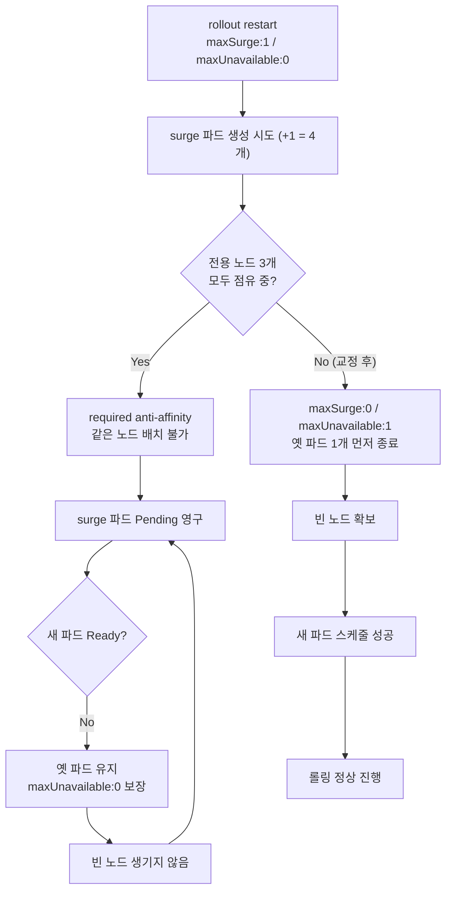
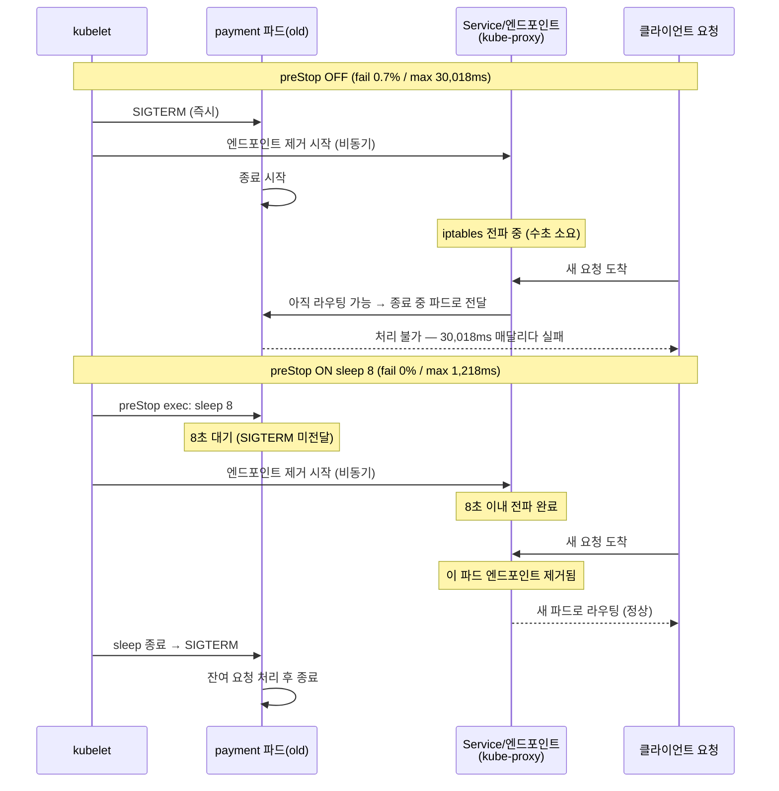

> [!summary] 핵심 한 줄
> 롤링 업데이트는 두 번 조용히 터진다. 첫 번째는 **fail 0%로 보이면서 한 발도 못 나가는 데드락**, 두 번째는 **종료 중인 파드로 라우팅된 요청이 30초 동안 매달리다 죽는 레이스**. 둘 다 단일 인스턴스에선 안 보인다.

> [!info] Scale 시리즈 — k3s 수평 스케일아웃
> **1막 · 여러 대로 안전하게** [[00.수직 다음, 수평으로|00]] · [[01.자립 리그를 k3s로 깔다|01]] · [[02.파드가 늘면 뭐가 깨지나|02]] · [[03.노드가 죽어도|03]] · [[04.배포가 조용히 터진다|04]]
> **2막 · 늘리면 정말 빨라지나** [[05.replica가 천장을 올린 줄 알았다|05]] · [[06.4단 진단 끝에 payment_db|06]] · [[07.운영 함정|07]] · [[08.매니페스트 행단위 해부|08]]

---

## 1. 배포를 걸었더니 아무것도 안 일어났다

[[03.노드가 죽어도|03편]]에서 다진 것은 **장애 복구**였다. 노드를 죽여도 요청 실패가 0%였다. anti-affinity가 파드를 분산시켰고, 남은 파드가 트래픽을 흡수했다. 자가치유가 됐다.

이제 배포를 걸었다. `kubectl rollout restart deployment/payment`.

---

아무것도 안 일어났다.

파드 목록을 새로고침해도 `3/3 Running`. 롤아웃 상태를 봐도 `Waiting for rollout to finish: 0 of 3 updated replicas are available`. fail은 0%. 에러 로그도 없다.

조용했다. 그래서 더 위험했다.

## 2. 함정 1 — surge 데드락

구성을 다시 보자. payment 전용 노드 풀, 정확히 3개. 각 노드에 payment 파드 1개씩. 매니페스트에는 required anti-affinity — **같은 노드에 payment 파드 2개를 허용하지 않는다**. 그리고 롤링 전략은 기본값대로 `maxSurge:1 / maxUnavailable:0`.

[[쿠버네티스 정리|RollingUpdate]]의 기본 동작을 따라가면 문제가 보인다.

`maxUnavailable:0`이라는 건, **새 파드가 Ready 상태가 되기 전까지는 옛 파드를 죽이지 않는다**는 뜻이다. 서비스 연속성을 위한 설정이다. 그리고 `maxSurge:1`은, 롤링 중에 파드를 하나 더 만들어도 된다는 뜻이다. 원래 3개이니 surge 파드까지 하면 최대 4개.

그런데 **갈 노드가 없다.** 전용 노드 3개는 이미 모두 옛 파드로 채워져 있고, required anti-affinity 때문에 같은 노드에 두 번째 payment 파드를 스케줄할 수 없다. surge 파드는 Pending 상태로 멈춘다. 영구적으로.

`maxUnavailable:0`이라 옛 파드는 안 죽는다 → surge 파드가 Ready가 안 되니 옛 파드를 죽일 수 없다 → 빈 노드가 생기지 않는다 → surge 파드는 영원히 Pending. **데드락이다.**

fail은 0%였다. 옛 파드 3개가 그대로 살아서 트래픽을 처리하고 있으니까. 에러 로그도 없다. 롤아웃만 멈춰 있을 뿐이다. preStop 훅이 한 번도 발동되지 않은 채로.

이게 조용한 이유다. 장애가 아니다 — **배포가 안 되고 있는 것**이다. 모니터링 대시보드는 초록이다.

**surge 데드락 — 왜 Pending이 풀리지 않는가**



**교정: `maxSurge:0 / maxUnavailable:1`**

반대로 뒤집으면 문제가 풀린다. `maxUnavailable:1`은 **옛 파드 1개를 먼저 죽인다**. 빈 노드가 생긴다. 거기에 새 파드를 스케줄한다. required anti-affinity와 충돌이 없다. 순서를 바꿨을 뿐인데, 데드락이 흐름이 된다.

```yaml
strategy:
  type: RollingUpdate
  rollingUpdate:
    maxSurge: 0
    maxUnavailable: 1
```

교정 후 롤아웃을 다시 걸었다. 이번엔 파드가 순서대로 교체됐다.

## 3. 함정 2 — 엔드포인트 레이스

데드락은 해결됐다. 이제 진짜 롤링이 돌아간다. **그런데 롤링 중에 요청이 죽는다.**

150rps 부하를 유지하면서 `rollout restart`를 걸었다. preStop 훅 없이.

```
fail: 0.7%  |  max latency: 30,018ms  |  dropped: 50
```

0.7%가 크지 않아 보일 수 있다. 하지만 max 30,018ms가 낯익다. `terminationGracePeriodSeconds: 30` — 종료 유예 기간과 정확히 일치한다. 이건 요청이 타임아웃된 게 아니라, **종료 중인 파드에 붙어서 유예 기간 내내 매달리다 죽은 것**이다.

원인은 **엔드포인트 전파 레이스**다.

파드가 SIGTERM을 받고 종료를 시작한다. 동시에 kube-proxy가 엔드포인트 목록에서 이 파드를 제거해야 한다 — 그래야 Service가 새 요청을 이 파드로 보내지 않는다. 그런데 이 두 가지가 **독립적으로, 비동기로** 일어난다.

SIGTERM 전달은 즉시다. 엔드포인트 제거는 Endpoints 오브젝트 업데이트 → kube-proxy가 각 노드에서 iptables 규칙을 갱신하는 연쇄 과정이다. 짧게는 수초가 걸린다. 그 사이에 라우팅된 새 요청들이 **이미 종료를 시작한 파드로** 향한다. 파드는 요청을 받아도 처리를 완료하지 못하고, 유예 기간이 다 차면 종료된다.

## 4. preStop A/B — 인과 확정

preStop 훅을 켰다.

```yaml
lifecycle:
  preStop:
    exec:
      command: ["sh", "-c", "sleep 8"]
```

SIGTERM 전에 8초를 기다린다. 그 8초 동안 엔드포인트 전파가 완료된다. 파드는 새 요청을 더 이상 받지 않는 상태에서 SIGTERM을 받는다.

동일 조건(150rps, `rollout restart`)에서 A/B를 비교했다.

| preStop | fail% | max latency | dropped |
|---------|-------|-------------|---------|
| **OFF** | 0.7% | **30,018ms** | 50 |
| **ON** (`sleep 8`) | **0%** | **1,218ms** | 0 |

**preStop OFF vs ON — 엔드포인트 전파 레이스**



숫자 하나가 눈에 띈다. **p50/p95는 OFF·ON 동일 — 43ms / 51ms.**

preStop은 평균 지연을 줄이지 않는다. p95도 바꾸지 않는다. **꼬리(tail)만** 잡는다. 30,018ms짜리 요청이 1,218ms 안으로 들어오는 것 — graceful shutdown 단독으로는 못 덮던 레이스를, preStop 8초가 소거했다.

## 5. 두 함정의 공통점

두 함정을 나란히 놓으면 패턴이 보인다.

**데드락은 조용하다.** 롤아웃이 멈춰도 모니터링은 초록이다. 요청이 처리되고 있으니까. preStop이 한 번도 발동되지 않는다는 사실도 — alert으로 잡히지 않는다. 배포 버튼을 눌렀는데 배포가 안 되고 있다는 걸, 직접 롤아웃 상태를 들여다봐야만 안다.

**엔드포인트 레이스도 조용하다.** 0.7% fail이다. 나머지 99.3%는 정상이다. max 30s짜리 지연이 p95에는 나타나지 않는다 — 꼬리에 숨는다. 꼬리를 보지 않으면 보이지 않는다.

Load 시리즈에서 반복된 말이 있었다.

> **실행해봐야만 드러나는 결함이 있다.**

코드 리뷰가 `maxSurge:1/maxUnavailable:0`을 틀렸다고 잡지 않는다. 매니페스트 linter도 통과한다. 단일 인스턴스 테스트는 롤링 자체가 없다. **멀티노드에서 직접 롤아웃을 걸어봐야 데드락이 보인다.** preStop 없이 부하 중 롤링을 해봐야 꼬리 fail이 보인다.

전용 풀 + anti-affinity + RollingUpdate 기본값. 셋이 만나면 교과서적인 설정이 교과서적인 데드락이 된다. 그 조합을 단일 인스턴스 환경에서 재현할 방법이 없다.

## 6. 매니페스트에 남긴 것

두 실험 결과를 매니페스트에 반영했다.

```yaml
strategy:
  type: RollingUpdate
  rollingUpdate:
    maxSurge: 0          # 전용 노드 풀 + anti-affinity = surge 갈 곳 없음
    maxUnavailable: 1    # 옛 파드 먼저 종료 → 빈 노드 확보 → 순서 역전

lifecycle:
  preStop:
    exec:
      command: ["sh", "-c", "sleep 8"]   # 엔드포인트 전파 대기 (kube-proxy 레이스 소거)
```

숫자 하나(`maxSurge: 0`)와 훅 하나(`preStop: sleep 8`). 두 줄이 없으면, 하나는 배포가 영구히 멈추고 하나는 롤링마다 요청 0.7%가 30초짜리 지연과 함께 죽는다.

## 한 줄

여기까지가 1막이다. 정합성이 견고한지 확인했고([[02.파드가 늘면 뭐가 깨지나|02편]]), 노드가 죽어도 무중단인지 확인했고([[03.노드가 죽어도|03편]]), 배포 중에도 요청이 죽지 않는지 확인했다. **안전하게 늘리는 건 됐다.** 이제 진짜 질문 — 늘리면 빨라지나? → 2막 [[05.replica가 천장을 올린 줄 알았다|05편]]에서 첫 숫자가 나온다. 그리고 그 숫자가 통째로 뒤집힌다.
