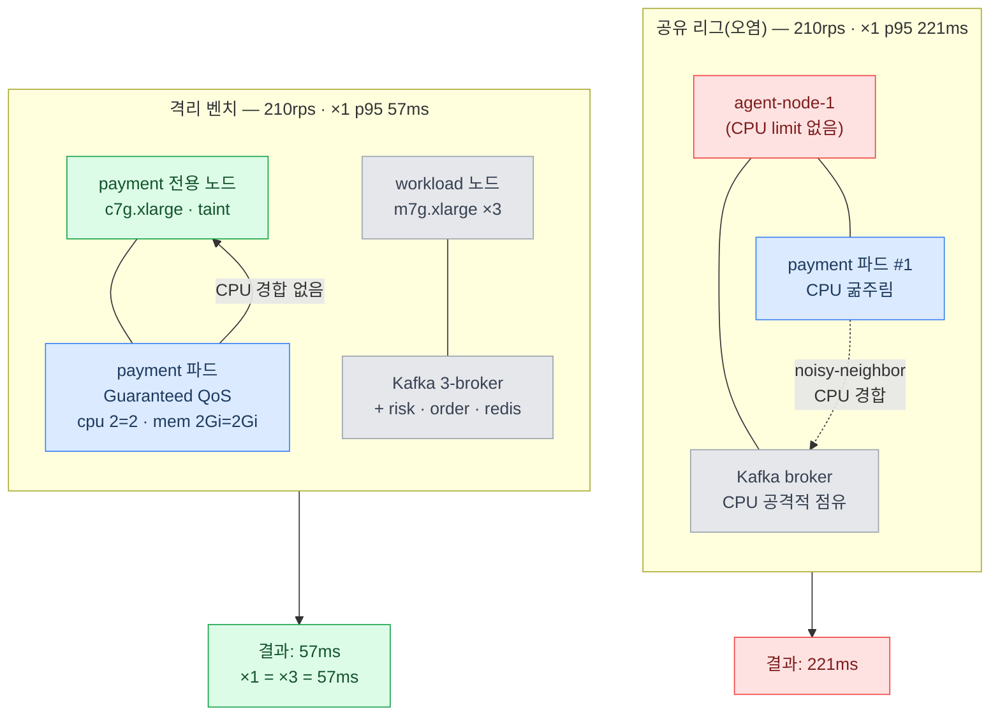

> [!summary] 핵심 한 줄
> 210rps에서 payment ×1은 221ms, ×3은 53ms — "replica가 천장을 올렸다"는 결론이 그럴듯했다. 격리하니 ×1도 57ms였다. 극적인 차이 전체가 **noisy-neighbor CPU 아티팩트**였고, 원래 가설("앱 replica는 천장을 못 올린다")이 오히려 입증됐다. 정정이 정정을 뒤집는다 — 그리고 진짜 벽은 아직 등장 전이다.

> [!info] Scale 시리즈 — k3s 수평 스케일아웃
> **1막 · 여러 대로 안전하게** [[00.수직 다음, 수평으로|00]] · [[01.자립 리그를 k3s로 깔다|01]] · [[02.파드가 늘면 뭐가 깨지나|02]] · [[03.노드가 죽어도|03]] · [[04.배포가 조용히 터진다|04]]
> **2막 · 늘리면 정말 빨라지나** [[05.replica가 천장을 올린 줄 알았다|05]] · [[06.4단 진단 끝에 payment_db|06]] · [[07.운영 함정|07]] · [[08.매니페스트 행단위 해부|08]]

---

## 1. 2막의 질문

1막은 "여러 대로 안전한가"를 다졌다. 멱등, 분산락, 노드 장애, 롤링 업데이트 — 정합성이 살아남는지 하나씩 따졌다. 답은 "산다"였다. 조건이 있었지만(preStop, `maxSurge:0`, DuplicateKey 처리), 핵심 불변식은 스케일아웃 이후에도 유지됐다.

이제 2막의 질문을 꺼낸다.

> **replica를 늘리면 처리량이 오르나?**

Load 시리즈가 규명한 천장은 "취소 1건당 커밋 수(fsync)"였다. 그 병목은 payment 파드 안이 아니라 DB에 있었다. 파드를 N개로 늘려도 DB는 그대로 — "당연히 안 오른다"는 직관이 먼저 든다.

그런데 첫 번째 실험이 그 직관을 뒤집는 것처럼 보였다.

---

## 2. 첫 결과 — "replica가 천장을 올렸다"

공유 리그(payment 포함 여러 서비스가 같은 3개 agent 노드에 혼재)에서 `slo-arrival.js` 도착률 스윕을 돌렸다. open-model 기준, 210rps에서:

| 설정 | p95 |
|---|---|
| payment ×1 | **221ms** |
| payment ×3 | **53ms** |

×1이 이미 211ms로 살짝 포화 조짐을 보이는데 ×3이 53ms — 4배 이상 차이다. 결론이 자동으로 나온다.

> **단일 파드 풀이 병목이다. replica 3개가 천장을 올렸다. "앱 티어는 병목이 아니다"는 가설이 반증됐다.**

그럴듯했다. 수치가 극적이었고, 이야기가 깔끔했다. 여기서 멈췄으면 됐다.

---

## 3. 의심 하나

멈추기 전에 숫자 하나가 걸렸다.

×1에서 **221ms**. 이 수치는 실제로 "payment 파드 포화"를 가리키는가, 아니면 다른 이유로 부풀려진 건가?

공유 리그의 구조를 다시 봤다. payment 파드는 agent 노드 위에서 Kafka broker와 **CPU를 나눠 쓰고 있었다.** 그리고 `resources.limits`가 설정되어 있지 않았다. Kafka broker는 메시지 처리 부하를 받으면 CPU를 공격적으로 쓴다 — **noisy-neighbor**다.

단일 파드일 때 CPU를 빼앗겼다면? ×3일 때는 세 파드가 세 노드에 분산되어(anti-affinity) 각자 다른 Kafka broker와 경합했다면, 우연히 경합이 덜한 노드로 요청이 분산된 것일 수 있다.

요컨대: **221ms가 payment의 실제 한계인지, 아니면 Kafka에 CPU를 빼앗긴 결과인지** — 이 두 가설을 구분하지 않은 채로 결론을 낸 것이다.

---

## 4. 격리 재측정 — 설계

의심을 해소하는 방법은 하나다. CPU 경합을 없애고 다시 잰다.

격리 설계:

- **payment 전용 노드 풀** — c7g.xlarge 3대에 taint(`role=payment:NoSchedule`)를 걸어 다른 파드 스케줄을 차단
- **Guaranteed QoS** — payment 파드의 `requests=limits`(cpu 2=2, mem 2Gi=2Gi). 커널이 다른 파드에 CPU를 빌려주지 않는다
- **workload 풀 분리** — Kafka 3-broker, risk, merchant-limit, order, redis는 m7g.xlarge 3대 별도 노드 풀로 이전
- DB는 외부 EC2 고정 — 공유 리그와 동일

이 설계로 payment 파드는 노드 위에서 Kafka와 CPU를 나눠 쓸 일이 없다. 측정하려는 것(앱 파드 한 벌의 처리량)이 측정하지 않으려는 것(인프라 경합)에 오염되지 않는다.

**221ms vs 57ms — 차이의 전부는 배치 구조였다. 격리 전후를 나란히:**

> 차이(221 vs 57ms)는 replica 효과가 아니라 noisy-neighbor 아티팩트. 격리하니 ×1=×3=57ms.

---

## 5. 반전 — 격리하니 ×1도 57ms

격리 리그에서 같은 스윕을 다시 돌렸다.

| rate | ×1 p95 | ×3 p95 |
|---|---|---|
| 190~210 | 51~57ms | 57ms (동일) |
| 230 | **2131ms** (절벽) | — |
| 250 | — | 59ms (단독) ~ 808ms |
| 290 | — | **4344ms** (절벽) |

**×1이 210rps를 57ms로 처리했다.**

221ms가 사라졌다. 격리 전 221ms는 payment 파드의 한계가 아니었다 — Kafka와 CPU를 나눠 쓰며 굶주린 결과였다. CPU를 독점하게 하자 단일 파드도 210을 여유롭게 소화한다.

그리고 ×3의 p95도 57ms — ×1과 **동일**하다.

---

## 6. 정정이 정정을 뒤집다

두 단계로 정리된다.

**공유 리그의 결론(잘못된 것):** 210에서 ×1 221ms vs ×3 53ms → "replica가 천장을 올렸다" → 원래 가설("앱 티어는 병목이 아니다") 반증.

**격리 재측정의 결론:** 210에서 ×1 57ms = ×3 57ms → replica는 같은 무릎에서 동일한 p95 → 원래 가설 **입증**.

무릎은 어디인가. ×1은 ~220rps에서 절벽(230에서 2131ms), ×3은 ~260rps에서 절벽(250에서 808ms, 290에서 4344ms). replica 3개는 무릎을 **220→260, 약 18%** 밀었다. 3배가 아니다.

> "replica를 3배로 늘렸는데 처리량이 3배 오를 줄 알았다. 15~18%였다."

그리고 그 15~18%가 전부라는 게 — "정직하게" — 맞다. **"공유 리그의 극적인 4배 차이는 통째로 noisy-neighbor CPU 아티팩트였다."**

---

## 7. 정정의 교훈 — 격리가 먼저다

공유 리그의 숫자는 틀리지 않았다. 측정 자체는 정확했다. 틀린 건 **해석**이었다 — 수치를 만든 원인을 특정하지 않은 채 결론을 냈다.

CPU 경합이 있는 환경에서 단일 파드가 느리면, 그게 파드의 한계인지 환경의 오염인지 알 수 없다. 격리가 선행돼야 측정이 "파드 한 벌의 처리량"을 말할 수 있다.

Load 시리즈의 교훈이 "측정이 추측을 이긴다"였다면, 이번 교훈은 하나 더 붙는다.

> **측정 전에 격리가 먼저다 — 무엇을 통제했는지 모르면 무엇을 잰 건지 알 수 없다.**

---

## 8. 그럼 진짜 벽은 어디인가

replica는 무릎을 18% 밀었다. 밀지 못한 82%는 어디서 왔나.

여기서 멈추면 "앱 티어가 아니다"만 알고, 진짜 병목은 모른 채 남는다. 처리량이 ~250~260에서 벽에 부딪히는 이유를 4단계로 좁혔다.

| 개입 | 검증한 가설 | 무릎 변화 | 판정 |
|---|---|---|---|
| payment ×1 → ×3 | 앱 Hikari 풀 | ~220 → ~260 (3배 아님) | 앱 아님 |
| `innodb_flush_log_at_trx_commit` 1→2 | payment_db fsync 내구성 | 그대로 (~250) | fsync 단독 아님 |
| merchant 10 → 1000 | `merchant_cancel_usage` 행 락 경합 | 그대로 (~250) | 행 락 아님 |
| 250rps 중 CPU 스냅샷 | — | payment_db 컨테이너 CPU 94.98% · iowait 25.8% · softirq 19.4% · "waiting for handler commit" 6/9 스레드 | 병목 확정 |

대조군(동시 스냅샷): risk_db CPU 35% idle · risk 파드 226m · payment 파드 각 1.1~1.4/3코어 · merchant-limit 4~5m — **전부 여유. 오직 payment_db만 포화.**

진단 결론은 다음 편에 넘긴다. 지금 할 말은 하나다: **벽은 앱 파드가 아니다.**

---

## 한 줄

앱을 아무리 늘려도 벽은 그대로였다, 벽은 앱이 아니다 — 그 벽의 이름을 4단 진단으로 특정한다: [[06.4단 진단 끝에 payment_db|06편]].
