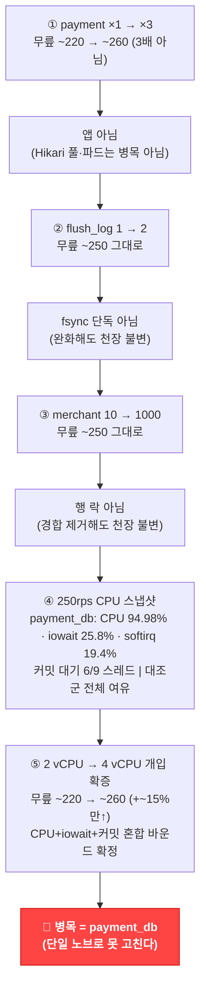

> [!summary] 핵심 한 줄
> replica를 3배로 늘렸는데 처리량이 3배가 아닌 ~18%만 올랐다. 앱 티어가 아니라는 건 첫 번째 개입에서 이미 나왔다. 네 번의 개입이 하나씩 가설을 지웠고, 마지막 CPU 스냅샷이 답을 확정했다 — 병목은 **payment_db(mysql-payment, m7g.large 2 vCPU)**, CPU 94.98%·iowait 25.8%·커밋 대기 6/9 스레드의 혼합 바운드였다. 단일 노브로는 못 고친다.

> [!info] Scale 시리즈 — k3s 수평 스케일아웃
> **1막 · 여러 대로 안전하게** [[00.수직 다음, 수평으로|00]] · [[01.자립 리그를 k3s로 깔다|01]] · [[02.파드가 늘면 뭐가 깨지나|02]] · [[03.노드가 죽어도|03]] · [[04.배포가 조용히 터진다|04]]
> **2막 · 늘리면 정말 빨라지나** [[05.replica가 천장을 올린 줄 알았다|05]] · [[06.4단 진단 끝에 payment_db|06]] · [[07.운영 함정|07]] · [[08.매니페스트 행단위 해부|08]]

---

## 1. 05편이 남긴 미결

[[05.replica가 천장을 올린 줄 알았다|05편]]의 첫 숫자는 통쾌했다. payment ×1일 때 210rps에서 p95 221ms이던 것이, ×3으로 늘리자 53ms로 뚝 떨어졌다. "replica가 천장을 올렸다 — 파드를 늘리면 빨라진다." 결론을 쓰기 직전에 멈칫했다.

221ms가 이상했다. 다른 런에서 210rps는 50ms대로 충분히 여유롭게 처리됐었다. 단일 파드가 210에서 이미 포화한다면 — 왜 다른 런에선 안 그랬나?

되짚어 보니 payment 파드가 Kafka broker와 같은 노드에 올라가 있었다. CPU limit이 없는 상태에서 두 워크로드가 한 코어를 나눠 썼다. "×1이 210에서 포화"처럼 보인 건 **noisy-neighbor 아티팩트**였다 — 파드가 굶주린 것이지 요청량이 넘친 게 아니었다.

격리가 필요했다. payment 파드 전용 노드 풀(c7g.xlarge, taint+nodeSelector, 노드당 1, Guaranteed QoS)을 만들고, 나머지 워크로드(Kafka/risk/merchant/order/Redis)는 별도 풀로 분리했다. 그리고 다시 스윕했다.

격리하자 그림이 뒤집혔다.

## 2. 격리 재측정 — 처음 보는 숫자들

open-model 도착률 스윕(`slo-arrival.js`, Traefik 경유), payment ×1 vs ×3:

| rate (rps) | ×1 p95 | ×3 p95 |
|---|---|---|
| 190~210 | 51~57ms | 57ms (동일) |
| 230 | **2131ms** (절벽) | — |
| 250 | — | 59ms (여유) |
| 290 | — | **4344ms** (절벽) |

두 가지가 확정됐다.

**첫째, ×1은 210에서 이미 포화하지 않는다.** 57ms — 여유롭다. 앞서 221ms는 노이즈였고, "×3이 53ms로 개선"처럼 보인 것도 아티팩트였다. 격리하면 ×1도 210을 57ms로 처리한다.

**둘째, replica는 무릎을 3배가 아니라 약 18%만 밀었다.** ×1 무릎 ~220rps, ×3 무릎 ~260rps. 파드 3배 → 처리량 1.18배. 직관이 틀렸다.

파드가 3배인데 처리량이 18%만 오른다면 — 파드가 문제가 아니라는 뜻이다. 모든 파드가 같은 무언가 앞에서 막히고 있다.

## 3. 진단 사다리 — 네 번의 개입, 하나씩 지워가다

"무언가"가 무엇인지 추측으로 고치면 안 된다. Load 시리즈에서 배운 교훈이다 — [[13.동기 홉인 줄 알았다|Load 13편]]에서 "동기 홉"이라 이름 붙였다가 USE 인구조사로 두 번 뒤집혔다. 이번도 하나씩 가설을 세우고 개입해서 확인했다.

| 단계 | 가설 | 개입 | 무릎 변화 | 판정 |
|---|---|---|---|---|
| ① | 앱 Hikari 풀 포화 | payment ×1 → ×3 | ~220 → ~260 (3배 아님) | 앱 아님 |
| ② | payment_db fsync 내구성 | `innodb_flush_log_at_trx_commit` 1 → 2 | ~250 그대로 | fsync **단독** 아님 |
| ③ | 행 락 경합 | merchant 10개 → 1000개 | ~250 그대로 | 행 락 아님 |
| ④ | — | **250rps 중 CPU 스냅샷** | **payment_db 94.98%·iowait 25.8%·커밋 대기 6/9** | 🔴 **payment_db 포화 확정** |

**↓ 개입 사슬 — 무효를 쌓아 payment_db로 수렴하다**

각 단계를 하나씩 들여다본다.

### 3-1. 개입 ① — 앱 티어가 아님

replica ×1→×3. 무릎이 220에서 260으로 올랐다. 3배가 아니라 ~18%. 파드를 3배 늘려서 처리량이 3배가 아니라면, 파드가 공유하는 무언가가 병목이다. 앱 Hikari 풀 자체는 파드별로 독립이라 ×3이면 커넥션도 3배다 — 그런데도 18% 증가에 그쳤다. **앱 티어는 천장이 아니다.**

### 3-2. 개입 ② — fsync 단독이 아님

Load 시리즈의 결론은 "취소 1건당 커밋 6개(fsync)가 병목"이었다. 그렇다면 `innodb_flush_log_at_trx_commit=2`로 낮추면 — fsync를 매 커밋에서 초당 1회로 완화하니 — 천장이 올라야 한다.

결과: 무릎 ~250, 그대로였다.

> [!note] Load와 같은 DB 벽, 다른 병목 구성
> Load 시리즈([[13.동기 홉인 줄 알았다|13편]]·[[14.이력 3커밋을 1로|14편]]·[[15.147을 220으로|15편]])에선 DB CPU가 62%로 여유가 있었고 **fsync와 커넥션 점유 시간**이 병목이었다. 격리 k3s에선 payment_db CPU가 95%까지 치솟는다. 같은 "DB 벽"이라도 리그(EC2 단일 vs k3s 멀티파드, 인스턴스 타입, 부하 분산 방식)가 다르면 병목의 구성이 다르다. Load의 결론을 그대로 이식하면 틀린다.

### 3-3. 개입 ③ — 행 락이 아님

payment_db에서 `merchant_cancel_usage` 테이블의 행 락 경합이 혹시 문제일 수 있다. merchant가 10개면 같은 행에 요청이 집중된다. 1000개로 늘려 행 락 경합을 제거하면?

무릎: ~250, 그대로였다. **행 락은 이 천장의 원인이 아니다.**

### 3-4. 결정타 — CPU 스냅샷

앱도 아니고, fsync 단독도 아니고, 행 락도 아니다. 가설이 셋 지워졌다. 남은 방법은 하나 — 250rps 부하가 걸린 상태에서 모든 컴포넌트의 CPU를 동시에 찍는 것.

**payment_db (mysql-payment, m7g.large 2 vCPU):**
- 컨테이너 CPU: **94.98%**
- iowait: **25.8%**
- softirq: **19.4%**
- `SHOW PROCESSLIST`: "waiting for handler commit" **6/9 스레드**

**동시 대조군:**

| 컴포넌트 | 측정값 | 상태 |
|---|---|---|
| risk_db | CPU 35% (idle 50%) | 여유 |
| risk 파드 | 226m + 178m | 여유 |
| payment 파드 × 3 | 각 1.1~1.4 / 3코어 | 여유 |
| merchant-limit 파드 | 4~5m | 완전 여유 |
| **payment_db** | **CPU 94.98% · iowait 25.8%** | **🔴 포화** |

전부 여유다. **오직 payment_db만 빨갛다.**

숫자가 이야기를 읽어준다. 2 vCPU 박스에 취소 요청이 쏟아지면 — TX1/TX2/TX3 + `SELECT … FOR UPDATE` 재조회까지 취소 1건당 여러 statement가 날아온다. statement가 올 때마다 네트워크 인터럽트 처리(softirq 19.4%). 커밋마다 스토리지 I/O(iowait 25.8%). 2코어가 연산·인터럽트·I/O 대기를 전부 껴안고 ~250rps에서 한계에 달했다.

이게 혼합 바운드다. CPU가 연산을 못 해서도, 디스크가 느려서도, 커밋이 비교적 비싸서도 — **셋이 동시에** 병목을 이룬다.

## 4. 개입 확증 — 인과를 못박다

스냅샷은 상관관계다. "payment_db가 포화 중"이라는 관측이 "payment_db가 원인"임을 확정하진 않는다. 인과를 확정하려면 개입이 필요하다 — payment_db를 바꿨을 때 무릎이 움직이면 원인이다.

mysql-payment를 m7g.large(2 vCPU) → **m7g.xlarge(4 vCPU)**로 온라인 리사이즈 후 ×1 재측정:

| rate (rps) | 2 vCPU ×1 | 4 vCPU ×1 |
|---|---|---|
| 210 | 57ms (OK) | 201ms†(OK) |
| 230 | **2131ms** (절벽) | — |
| 270 | — | **3614ms** (절벽) |

무릎이 ~220에서 ~260으로 이동했다. **payment_db를 바꾸자 천장이 움직였다 — 인과 확정.**

†4 vCPU 런은 컨테이너 재생성으로 InnoDB 버퍼풀이 콜드 상태였다. 210rps에서 57ms→201ms로 높게 찍힌 건 워밍업 지터다. 무릎은 다소 저평가될 수 있다.

그런데 — 무릎이 ~15%만 올랐다. vCPU를 2배 투입해서 천장이 15% 상승. **비례하지 않는다.**

이것도 혼합 바운드가 설명한다. CPU를 2배로 줘도 iowait 25.8%와 softirq 19.4%는 CPU를 더 준다고 해소되지 않는다. 디스크 I/O 병목은 디스크를 바꿔야 하고, 인터럽트 부하는 statement 수를 줄여야 한다. io2로 디스크만 바꿔도 부분 해소뿐이다 — 실제로 `innodb_flush_log_at_trx_commit=2`로 I/O를 완화해 봤지만 무릎이 안 올랐던 게 이미 이 방향을 확인했다.

## 5. 정직하게 구분하기

이번 실험에서 **직접 측정한 것**과 **강한 추론**을 구별해야 한다.

**직접 측정:**
- payment_db CPU 94.98% · iowait 25.8% · softirq 19.4% (스냅샷)
- 커밋 대기 스레드 6/9 (PROCESSLIST)
- 대조군 전 컴포넌트 여유 (동시 스냅샷)
- 4vCPU 리사이즈 후 무릎 ~220→~260 (개입 후 재측정)
- vCPU 2배 투입 대비 ~15% 상승 (sub-proportional)

**강한 추론 (DB 내부 직접 계측은 여기까지 미침):**
- "fsync가 커밋 대기의 정확한 기제" — PROCESSLIST에서 커밋 대기 스레드를 확인했고, iowait 수치가 이를 지지하나, fsync 호출당 지연을 직접 계측하지는 않았다.
- "softirq 19.4%가 statement당 네트워크 인터럽트" — CPU 분해 수치에서 추론이고, perf나 strace로 직접 확인하지 않았다.

추론이 틀릴 가능성은 낮다 — 수치들이 서로 정합하고 개입 후 예측이 맞았다. 하지만 추론은 추론으로 표기한다.

## 6. Load와 k3s — 같은 벽, 다른 지형

[[13.동기 홉인 줄 알았다|Load 13편]]에서 확인한 병목은 "취소 1건당 커밋 6개(fsync), 그리고 풀 10개가 커넥션을 오래 쥐는 것"이었다. 그때 DB CPU는 62%였다 — 여유가 있었다. [[14.이력 3커밋을 1로|14편]]에서 이력 커밋을 3→1로 줄여 커넥션 점유 시간을 단축했고, [[15.147을 220으로|15편]]에서 무릎이 220rps까지 올랐다.

k3s에서 만난 벽은 다르다. 같은 payment_db이지만 payment 파드가 3개라 DB에 오는 동시 statement 밀도가 높다. 결과: CPU 95%, iowait 26%, softirq 19%가 함께 포화했다. fsync가 기여하는 건 맞지만 단독 원인이 아니다.

> 같은 DB 벽이라도 리그가 다르면 병목 구성이 다르다 — Load의 결론을 그대로 k3s에 이식하면 틀린다.

이 사실이 중요한 이유는, Load에서 효과를 봤던 "커밋 감축" 처방이 k3s에서도 **여전히 유효하지만 충분하지 않다**는 것이다. 커밋을 줄이면 커밋 대기 스레드와 iowait 양쪽이 줄어든다 — 두 병목을 동시에 누른다. 하지만 softirq(statement당 인터럽트)는 커밋 수만 줄여서는 완전히 해소되지 않는다. statement 수 자체(round-trip 수)를 줄여야 한다.

Load 시리즈와 k3s 시리즈는 같은 DB 벽을 **서로 다른 각도에서** 관측하고 있다. 서로 모순이 아니라 보완이다.

## 7. 그래서 해법은

단일 노브로는 못 고친다. 확인했다.

- **vCPU 증설 단독**: 2→4 vCPU에서 15%만 올랐다. CPU 외 iowait·softirq가 여전히 남는다.
- **fsync 완화 단독**: `innodb_flush_log_at_trx_commit=2`로 무릎 변화 없었다. CPU·softirq가 함께 바운드이기 때문.
- **io2(IOPS 확장) 단독**: iowait만 개선하므로 부분 해소. CPU 95%와 softirq 19%는 그대로다.
- **행 락 해소 단독**: merchant 1000개로 변화 없었다. 애초에 행 락이 아니었다.

실질적인 레버는 두 가지를 **병행**하는 것이다.

**레버 A — DB 인스턴스 클래스 확장 (CPU + RAM + IOPS 동반):** m7g.large(2 vCPU) → 더 큰 인스턴스. vCPU만 키우는 게 아니라 RAM 확장으로 InnoDB 버퍼풀을 늘리고, 인스턴스 클래스에 딸린 네트워크 IOPS도 함께 올린다. 단일 축 확장이 아니라 세 축을 동반해야 비례에 가까워진다.

**레버 B — 취소당 커밋·round-trip 감축:** statement 수를 줄이면 softirq(인터럽트 부하)와 커밋 I/O(iowait)가 함께 내려간다. Load 14편에서 이력 3커밋→1커밋으로 줄인 것이 방향이다. k3s 리그에선 그 효과가 CPU·softirq 감축으로도 이어진다.

두 레버 중 어느 하나만으로 비례 해소는 어렵다. 인스턴스를 키우면서 동시에 커밋·round-trip을 줄이는 것 — 이것이 혼합 바운드에 대한 혼합 처방이다.

## 8. 진단 4단이 가르쳐 준 것

네 번의 개입이 걸렸다. 첫 번째(replica ×3)가 "앱이 아님"을 말했을 때 멈췄어야 할 자리에서 "fsync겠지"라고 가정하고 바로 `innodb_flush_log_at_trx_commit=2`를 건드렸다면, 그게 안 들었을 때 "그럼 행 락이겠지"로 넘어갔을 것이다. 그리고 1000개 merchant 실험 후 "왜 안 되지" 앞에서 막혔을 것이다.

개입 순서가 중요했다 — 각 단계가 다음 가설을 좁혔다. "앱 아님" → "fsync 단독 아님" → "행 락 아님" → CPU 스냅샷. 스냅샷은 무엇을 봐야 하는지 알고 나서야 결정타가 된다.

그리고 스냅샷 직후 개입 확증(2→4 vCPU 리사이즈)을 넣은 이유: **상관관계를 인과로 바꾸는 단계**다. 포화한 컴포넌트를 발견해도, 그걸 바꿨을 때 천장이 움직이지 않으면 원인이 아닐 수 있다. 움직였다 — 그래서 payment_db가 원인이다.

물론 이 확증도 카비앗이 있다. 리사이즈 후 InnoDB 버퍼풀이 콜드였고, 4 vCPU 런의 무릎은 다소 저평가됐을 수 있다. "~15% 상승"은 하한에 가깝다. 실제 격차는 더 클 수 있다 — 하지만 "2배 투입에 비례 미달"이라는 방향은 버퍼풀 워밍업 효과로도 뒤집히지 않는다.

## 한 줄

벽은 payment_db(2 vCPU)의 혼합 바운드(CPU 94.98% + iowait 25.8% + softirq 19.4% + 커밋 대기 6/9 스레드) — 단일 노브로는 못 고치고, 더 큰 인스턴스 클래스와 커밋·round-trip 감축의 병행이 실질적 레버다. 그리고 이 진단 과정에서 운영 함정 몇 개가 덤으로 따라왔다 — 다음은 그 이야기다: [[07.운영 함정|07편]].
