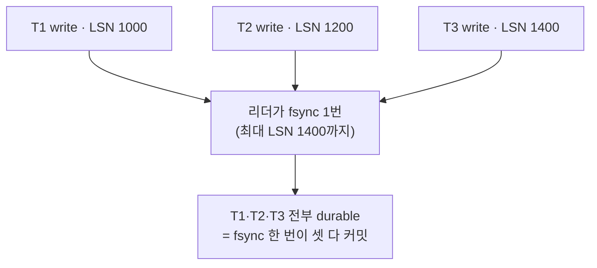
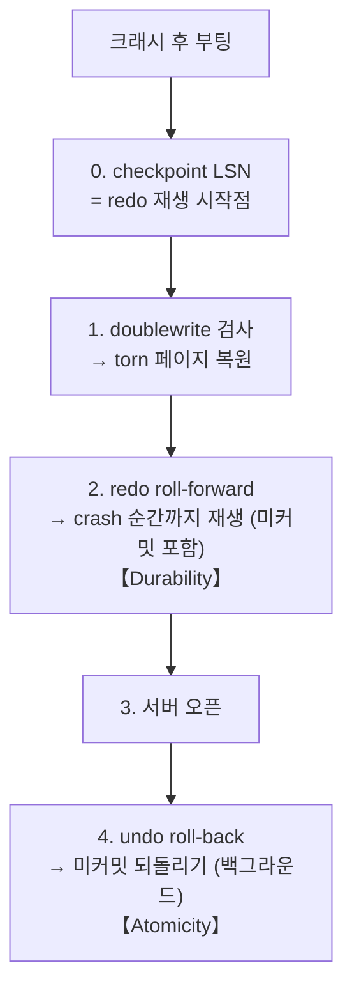
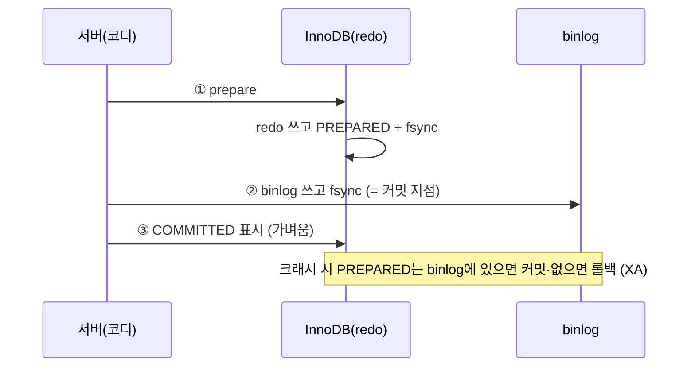

> [!summary] 핵심 한 줄
> 커밋은 취소 처리 중 **유일하게 진짜 디스크를 만지고 기다리는** 연산이다 — `fsync`로 redo log를 물리 저장장치에 durable하게 박기 때문. RAM 쓰기보다 수백~수천 배 느리고, 커넥션은 그동안 붙잡혀 있다. 그래서 **요청당 커밋 수가 처리량의 상한**을 정한다(실측: 커밋 6→4 = 처리량 ×1.5). group commit·checkpoint·doublewrite는 이 커밋 비용을 관리·상쇄하는 장치들이다.

> [!info] 관련
> [[15.147을 220으로]] · [[14.이력 3커밋을 1로]] (이 이론의 실측) · [[InnoDB 동시성 — undo log의 두 얼굴]] (읽기/동시성 편) · [[결제 취소 멱등성 설계]]

---

## 0. 왜 이 노트

[[15.147을 220으로|실측]]에서 취소당 커밋을 6→4로 줄이자 처리량이 정확히 ×1.5로 올랐다. "커밋을 줄였더니 빨라졌다"의 **왜**를 코드가 아니라 DB 내부에서 푼 게 이 노트다. 관통 개념 하나: **커밋 = fsync**.

## 1. fsync — 디스크에 "진짜" 박기

파일에 `write()`를 하면 데이터는 보통 디스크가 아니라 **OS 페이지 캐시(RAM)**로 간다. 빠르고 즉시 반환되지만, 그 순간엔 아직 디스크에 없다("dirty page"). 커널이 나중에 몰아서 내려보낸다.

`fsync(fd)`는 "**지금 이 파일을 물리 장치에 확실히 박고, 박힐 때까지 반환하지 마**"라는 시스템 콜이다.

> [!note] 비유
> `write()` = 화이트보드에 휘갈기기(빠름, 정전되면 날아감). `fsync()` = 돌에 새기고 확인받을 때까지 기다리기(느림, 영구).

RAM 쓰기는 수 µs, fsync는 SSD/NVMe라도 장치 캐시를 NAND로 내리고 왕복하느라 보통 **수백 µs ~ 수 ms**. 수백~수천 배 느리고, 순서 보장을 위한 **장벽**이라 미루거나 없앨 수도 없다.

## 2. 커밋 = redo fsync (WAL)

ACID의 **D(Durability)** — 커밋된 트랜잭션은 크래시 후에도 살아남아야 한다. InnoDB는 이걸 **redo log(WAL, write-ahead log)**로 지킨다.

- 변경이 생기면 **redo 레코드**를 만들어 in-memory **log buffer**에 append. 각 레코드엔 **LSN**(Log Sequence Number = 로그를 바이트로 센 단조 증가 오프셋)이 붙는다.
- **WAL 규칙:** 데이터 페이지를 디스크에 내리기 *전에* 그 변경의 redo가 먼저 durable해야 한다.
- COMMIT 순간: redo를 log 파일에 쓰고(`write`) **fsync** → 이제 크래시가 나도 redo로 복구 가능.

```
COMMIT:
 ① write : log buffer → OS 캐시   (RAM, 쌈)
 ② fsync : redo 파일 → 물리 장치   (느림 — 이게 그 fsync)
 ③ 커밋 성공 반환
```

`innodb_flush_log_at_trx_commit=1`(기본)이면 커밋마다 ①+②. 결론:

> **1 COMMIT ≈ 1 fsync ≈ 1번의 durable 디스크 왕복.**

WAL의 묘미는 여기 있다: "커밋마다 랜덤 데이터 쓰기"를 "커밋 땐 **순차 redo 쓰기**, 데이터 페이지는 나중에 지연"으로 바꿔 커밋을 싸게 만든다. (지연된 데이터 쓰기의 빚은 §5 checkpoint가 갚는다.)

## 3. 왜 커밋 수가 처리량을 지배하나

취소 1건의 DB 작업을 시간으로 쪼개면:

| 작업 | 어디에 | 건당 |
|---|---|---|
| SELECT·INSERT·UPDATE (~12) | 버퍼 풀(RAM) | 각 수백 µs |
| **COMMIT (6)** | **fsync(디스크)** | 각 ~수 ms → 합쳐 **점유의 대부분** |

**커넥션은 트랜잭션 내내(=커밋 fsync가 끝날 때까지) 쥐고 있다.** 그래서:

$$\text{요청당 커넥션 점유} \approx \underbrace{\text{RAM 쿼리}}_{\text{작음}} + \underbrace{\text{커밋 수} \times \text{fsync}}_{\text{지배적}}, \quad \text{처리량} = \frac{\text{풀}}{\text{점유}} \propto \frac{1}{\text{커밋 수}}$$

풀이 유한(예: 10)하고 점유의 대부분이 커밋이므로, **요청당 커밋 수가 곧 처리량의 상한**. 실측에서 커밋 6→4 = 점유 그만큼 감소 = **147→220 rps(×1.5)**로 소수점까지 맞았다.

> [!tip] 왜 CPU 늘리거나 풀 키워도 안 되나
> fsync는 CPU 연산이 아니라 **I/O 대기** — DB CPU를 놀리면서 디스크 왕복을 기다린다(그래서 CPU가 안 꽉 참). 풀을 키워도 2코어 DB가 동시 소화할 커밋엔 한계라 스래싱. **부하를 안 늘리는 유일한 공짜 이득은 요청당 커밋 수를 줄이는 것**([[14.이력 3커밋을 1로]]).

## 4. group commit — fsync를 나눠 쓴다

fsync는 특정 트랜잭션이 아니라 **파일 전체**를 durable하게 만든다. redo 파일에 fsync 한 번 = 그 시점 **최대 LSN까지 전부** durable. 그러니 A(LSN 1000)·B(LSN 1200)가 동시 커밋 대기면 **LSN 1200까지 fsync 한 번**이 둘 다 커밋시킨다.

InnoDB가 이걸 자동 이용: 동시 커밋들이 sync 지점에 모이면, 한 놈이 '리더'가 되어 현재 최대 LSN까지 fsync 1번 하고 대기자 전원을 깨운다. **fsync가 오래 걸릴수록 그동안 뒤에 더 쌓여 다음 fsync가 더 크게 묶인다**(자기조율).



> [!warning] 근데 왜 우리 병목엔 여전히 커밋 수가 지배했나
> group commit은 **동시에 커밋하는 서로 다른 요청들** 사이에서 fsync를 아낀다. 우리 한 요청의 6커밋은 외부 호출(risk·PG)로 벌어진 **순차** 커밋이라 자기끼리는 못 묶인다. 그리고 각 요청은 자기 커밋의 fsync가 (묶였든 아니든) 끝날 때까지 **커넥션을 쥔 채 블로킹**한다. 즉 group commit은 fsync *횟수*는 줄여도, **한 요청이 통과하는 커밋-대기 지점의 수 = 요청당 커밋 수**는 코드가 정한다. 그래서 6→4 감축이 group commit이 켜져 있어도 그대로 효과가 났다.

(복제용 binlog가 켜지면 순서 보장을 위해 **flush→sync→commit** 3단계 group commit이 돌지만, 단일 인스턴스면 위의 redo group commit만.)

## 5. redo log와 checkpoint — 유한한 로그의 장부

redo log 파일은 **고정 크기·원형**으로 재사용된다. 무한정 append 못 하고 옛 자리를 덮어써야 한다. 그런데 옛 redo를 덮어써도 되는 건 **그 redo가 기술하는 데이터 페이지가 이미 디스크에 durable할 때만**(아니면 크래시 시 그 변경을 복구할 redo가 사라짐).

- **checkpoint LSN** = "이 LSN까지 데이터 페이지가 전부 flush+fsync 됐다"는 지점. 이전 redo는 재활용 가능.
- checkpoint 전진 = 더티 페이지를 디스크에 flush(= **데이터 페이지 fsync**, §2의 지연된 빚 갚기).

```
redo log(원형):  ▓▓▓▓▓░░░░░░░░░░░░░░
                  ▲checkpoint LSN   ▲write LSN
                  └── checkpoint_age ──┘  (미회수 redo = 페이지 flush가 뒤처진 양)
```

`checkpoint_age`가 redo 용량 대비 커지면 InnoDB가 조인다: soft 임계에서 page cleaner가 flush 가속, hard 임계에서 **유저 트랜잭션을 스톨**시키고 미친 듯이 flush(전형적 write stall — 커밋이 자기 fsync가 아니라 "redo 자리 없음"에 막힘).

> [!note] 튜닝 트레이드오프
> `innodb_redo_log_capacity`를 키우면 checkpoint 압력까지 여유↑·스톨↓, 대신 **크래시 복구가 길어짐**(재생할 redo가 많아짐, §7). `innodb_io_capacity`는 page cleaner의 flush 공격성. — 즉 **커밋 fsync(redo)와 checkpoint fsync(데이터 페이지) 두 스트림이 디스크를 두고 경쟁**한다.

## 6. doublewrite buffer — torn page 방어

InnoDB 페이지는 **16KB**인데 디스크 블록은 보통 **4KB**. 페이지 하나 쓰기 = 여러 물리 쓰기. 도중에 크래시 나면 앞 8KB 새것·뒤 8KB 옛것인 **torn(찢어진) 페이지**가 나올 수 있다.

> [!warning] redo로 못 고친다
> redo는 "페이지 X의 이 슬롯에 삽입" 같은 **페이지에 상대적인 델타**라, 적용하려면 베이스 페이지가 성해야 한다. torn 페이지는 어떤 상태도 아니라(체크섬 깨짐) 그 위에 redo를 재생하면 쓰레기. redo는 "성한 페이지 위 변경 재생"만 한다.

해법 = **두 번 쓰기**. 최종 위치에 쓰기 전에 연속 스크래치 영역(doublewrite buffer)에 먼저 쓰고 fsync:


복구 때 최종 위치 페이지가 찢어졌으면 DWB의 성한 복사본으로 복원. ①이 완전히 끝난 뒤 ②를 시작하므로 **어느 시점 크래시에도 성한 버전이 항상 하나는 존재**. 비용은 **쓰기 2배 + fsync 2번**이지만 전부 **페이지-flush(checkpoint) 스트림**에만 붙고 커밋 스트림엔 안 붙는다. (§5의 "페이지 flush가 fsync 2번"의 정체가 이거.) 평상시엔 쓰기 전용, 오직 복구 때만 읽는다.

## 7. crash recovery 전체 흐름

크래시 후 InnoDB 부팅 순서 — 지금까지 조각이 다 꿰인다:

```
checkpoint LSN ───────── crash LSN
      │ ← 이 구간 redo 재생 → │
```

0. **checkpoint LSN 찾기** — redo 재생 시작점. 이전은 데이터 페이지 durable 보장.
1. **doublewrite 검사** — torn 페이지를 DWB 복사본으로 복원 → redo가 손댈 페이지가 성함.
2. **redo phase(roll forward)** — checkpoint→crash까지 redo를 앞으로 재생. 크래시 순간 상태로 복원 — **미커밋 트랜잭션 변경까지 포함**(redo는 커밋 여부 안 가림).
3. **서버 오픈**(현대 InnoDB는 여기서 비교적 일찍 접속 허용).
4. **undo phase(roll back)** — 크래시 때 미커밋이던 트랜잭션을 undo log의 before-image로 되돌림(**원자성 A**). 백그라운드로 진행 가능.

> [!note] 왜 미커밋까지 재생했다가 되돌리나
> ① redo는 페이지 단위 물리 로그라 커밋 여부를 구분 안 함. ② **undo log 자체가 페이지**라, redo로 undo 페이지를 먼저 되살려놔야 그걸로 롤백할 수 있다. 순서가 맞물린다: redo가 undo를 복원 → undo가 미커밋을 롤백.



**ACID 매핑:** doublewrite=베이스 페이지 성함 · redo roll-forward=**Durability** · undo roll-back=**Atomicity**.

## 8. 2PC — 내부(redo↔binlog)와, 왜 분산엔 안 쓰나

**2PC(two-phase commit):** 코디네이터가 참가자들에게 ① prepare(투표)로 "커밋 가능?"을 묻고 durable하게 '준비' 상태로 박게 한 뒤, ② 전원 YES면 commit 결정을 전파. YES 투표한 참가자는 크래시 후에도 커밋 가능해야 하고 혼자 결정 못 한다. **고질병:** 코디가 결정 직전 죽으면 참가자가 **in-doubt**로 락 쥔 채 블록.

**MySQL 내부 2PC:** binlog(복제)가 켜지면 커밋이 (InnoDB redo, binlog) **두 로그에 원자적**이어야 한다. 서버가 코디:
1. prepare: InnoDB가 redo 쓰고 PREPARED 표시 + fsync.
2. commit: 서버가 **binlog에 쓰고 fsync**(`sync_binlog=1`) ← **공식 커밋 지점**.
3. InnoDB가 COMMITTED 표시(가벼움).



크래시 후 PREPARED로 남은 트랜잭션은 **binlog를 보고** 판별 — 있으면 커밋, 없으면 롤백(**XA 복구**). 이때 **커밋당 fsync가 하나 더**(binlog) 붙어 복제는 더 무겁다.

> [!tip] 왜 분산 취소 플로우는 2PC 대신 Saga
> payment/risk/PG 사이에 고전 2PC를 쓰면 **홉 너머로 락·prepared 유지**(= "HTTP-in-TX 시한폭탄", [[11.캐시를 껐는데 아무 일도 안 났다]]), 코디 죽으면 in-doubt, **외부 PG는 참가자가 못 됨**, 하나 죽으면 블록. 그래서 우리는 **Saga(보상)** — 각 단계를 로컬로 즉시 커밋(빠른 커넥션 반납)하고, 나중 실패 시 보상으로 되돌린다. 오늘 커밋을 줄여 처리량을 올릴 수 있었던 것도 애초에 **Saga(로컬 커밋)를 골랐기 때문**이다 — 2PC였으면 커밋 수가 아니라 홉 내내 락이 문제였을 것. 내부 2PC(로그 둘·네트워크 없음)는 쓸 만하고, 분산 2PC(네트워크·외부·코디 실패)는 피한다.

## 한 줄

커밋이 비싼 건 "RAM에 쓴 걸 디스크에 진짜 박고 기다리는(fsync)" 유일한 지점이기 때문이다. group commit이 fsync를 나눠 쓰고, checkpoint가 지연된 데이터 쓰기의 빚을 갚고, doublewrite가 찢어진 페이지를 막고, 복구가 redo(내구성)+undo(원자성)로 되살린다 — 전부 이 하나의 비싼 연산을 관리하는 장치들이다. 그 undo가 평상시엔 무슨 일을 하는지는 → [[InnoDB 동시성 — undo log의 두 얼굴]].
