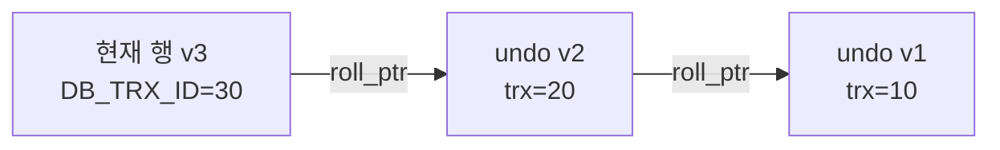
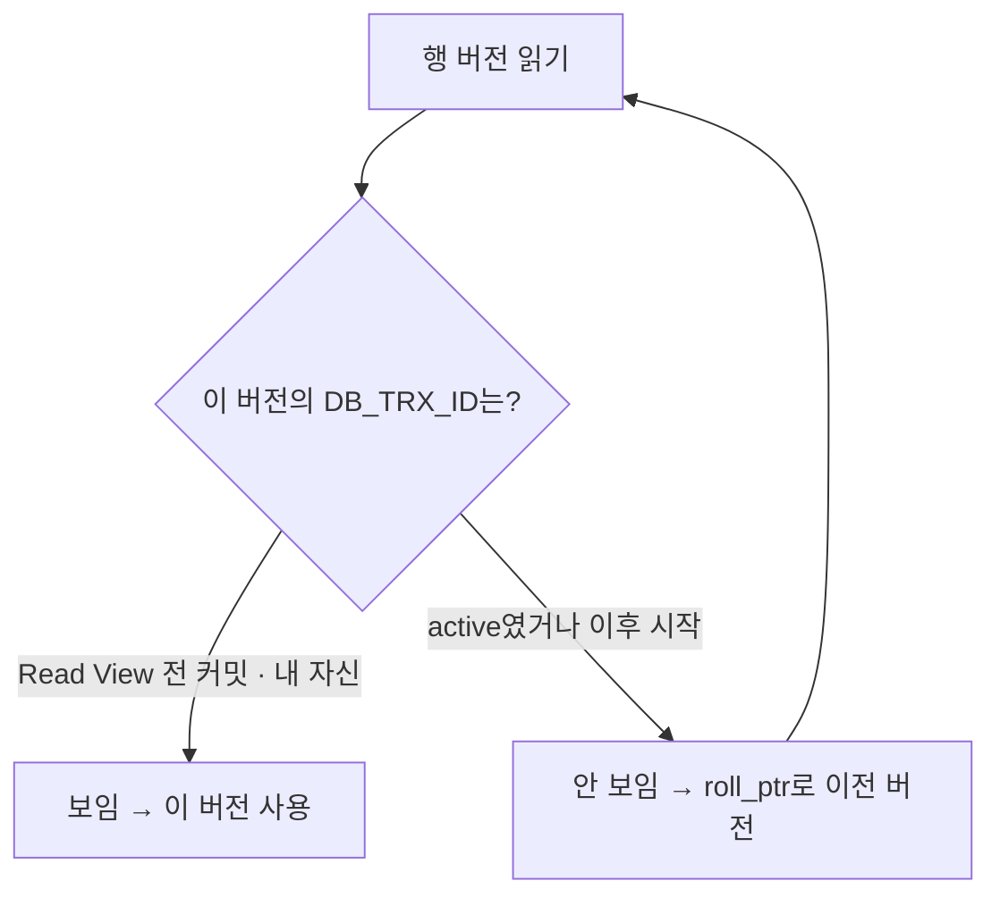
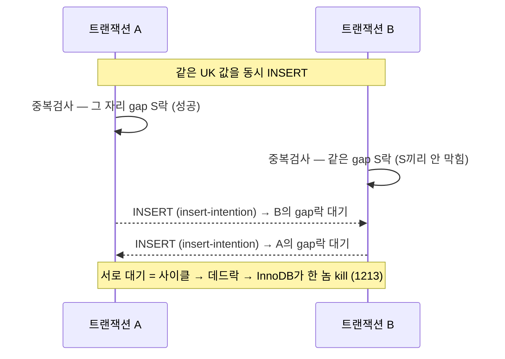
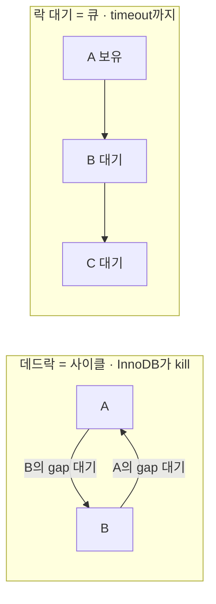

> [!summary] 핵심 한 줄
> undo log는 두 직업을 겸한다 — 크래시/롤백 때 **before-image**로 되돌리기, 그리고 평상시 **MVCC(다중 버전 동시성 제어)**의 엔진. 행마다 숨은 포인터로 옛 버전을 undo에 연결해두면, 리더는 **락 없이** 자기 스냅샷 시점의 커밋 버전을 재구성해 읽는다(읽기↔쓰기 상호 비차단). 반면 확정 쓰기(우리 TX3)는 MVCC 스냅샷을 우회하고 **FOR UPDATE로 최신+락**을 잡는다 — 그래서 "TX3 재조회" 불변식이 존재한다.

> [!info] 관련
> [[InnoDB 내구성 — 커밋은 왜 비싼가]] (쓰기/내구성 편) · [[13.동기 홉인 줄 알았다]] (TX3 FOR UPDATE 불변식) · [[JPA-persistence-context]] · [[결제 취소 멱등성 설계]]

---

## 0. undo log의 두 번째 직업

[[InnoDB 내구성 — 커밋은 왜 비싼가|내구성 편]]에서 undo log는 크래시 복구의 "미커밋 되돌리기" 재료였다. 그런데 평상시 운영에서 같은 undo가 **MVCC**를 돌린다. 목표:

> 읽기가 쓰기를 막지 않고, 쓰기가 읽기를 막지 않는다.

락 없이 **일관된 스냅샷 읽기**를 주는 것 — 옛 버전을 undo에서 재구성해서.

## 1. 행에 숨은 버전 체인

InnoDB 모든 행엔 숨은 시스템 컬럼이 있다:

- **`DB_TRX_ID`** — 이 행을 마지막으로 수정한 트랜잭션 id.
- **`DB_ROLL_PTR`**(roll pointer) — 이 행의 **직전 버전**을 담은 undo 레코드를 가리키는 포인터.

UPDATE가 일어나면: 옛 버전을 undo 레코드로 복사 → 행을 제자리에서 새 값으로 덮고 `DB_TRX_ID`=내 trx, `DB_ROLL_PTR`=그 undo 레코드. 그래서 **현재 행 + roll_ptr로 이어진 undo 체인 = 버전 체인**(시간 역순 링크드 리스트):

## 2. Read View와 가시성 판정

스냅샷 읽기를 시작할 때 InnoDB가 **Read View**를 만든다 = "이 순간 어떤 트랜잭션이 아직 **미커밋(active)** 이었나"의 스냅샷(active trx id 집합 + 워터마크).

행을 읽을 때 그 버전의 `DB_TRX_ID`를 Read View와 대조:

- Read View 생성 **전에 이미 커밋**한 trx → **보임.** 이 버전 사용.
- **나 자신** → 보임(내 쓰기는 봄).
- Read View 시점 **active였거나 그 이후 시작**한 trx → **안 보임** → `DB_ROLL_PTR` 따라 이전 버전으로 내려가 재판정. 보이는 버전 찾을 때까지 반복.

→ 각 리더가 **락 없이** 자기 스냅샷 시점의 커밋 버전을 재구성해 본다. 이게 MVCC 읽기.

## 3. insert vs update undo, purge, history list

- **insert undo**(INSERT): 롤백에만 필요(전엔 행이 없었으니 보여줄 옛 버전 없음). **커밋되면 즉시 폐기 가능.**
- **update undo**(UPDATE/DELETE): **롤백 + MVCC 둘 다** 필요. 어떤 Read View도 그 옛 버전을 안 볼 때까지 **보존.**
- **DELETE는 즉시 물리 삭제 안 함** — **delete-mark**만 찍는다(옛 스냅샷이 아직 그 행을 봐야 할 수 있으니).
- 백그라운드 **purge 스레드**가, 그 버전을 볼 Read View가 다 사라지면 update undo를 회수하고 delete-marked 행을 물리 제거.

> [!warning] 긴 트랜잭션 = history list 팽창
> 어떤 트랜잭션이 Read View를 **오래 열어두면**(긴 SELECT, 스냅샷 잡고 노는 idle 트랜잭션) purge가 못 전진 → 옛 undo 버전이 쌓임(**history list length↑**) → undo 테이블스페이스 부풀고 버전 체인이 길어져 읽기가 느려진다. `SHOW ENGINE INNODB STATUS`의 History list length가 이 신호. MySQL 운영의 고전 사고.

## 4. 격리 수준 = Read View를 언제 만드나

- **REPEATABLE READ**(InnoDB 기본): 트랜잭션당 Read View **한 번**(첫 읽기 때) → 내내 같은 스냅샷 → 반복 읽기 일관.
- **READ COMMITTED**: **문장마다** 새 Read View → 매 문장 최신 커밋 봄 → non-repeatable read 가능.

둘 다 같은 undo 기반 버전 재구성을 쓰고, **차이는 Read View 생성 시점**뿐이다.

## 5. FOR UPDATE vs 스냅샷 — 우리 TX3 불변식

MVCC 스냅샷 읽기는 **옛(스냅샷 시점) 버전**을 준다 — 락 없이 빠르지만 **최신이 아닐 수 있다.** 그런데 취소를 확정 쓰기하는 자리(TX3)는 **최신 진실 + 락**이 필요하다(동시 취소끼리 lost update 방지).

그래서 TX3의 `findAllByPaymentIdForUpdate` = **`SELECT ... FOR UPDATE`(락킹 읽기)** — 이건 MVCC 스냅샷을 **우회하고 최신 커밋 버전을 읽으면서 락**을 건다.

> [!tip] 두 읽기의 분업 ([[13.동기 홉인 줄 알았다]])
> **초기 검증/금액계산** = MVCC 스냅샷 읽기(락 없이 빠름). **TX3 재조회** = FOR UPDATE 락킹 읽기(최신+락). 불변식 "TX3에서 조회 시점(스냅샷) 데이터 쓰지 말고 재조회"의 근본 이유가 이 **MVCC 스냅샷 ≠ 락킹 최신**의 차이다. 실측 백로그에서 "payment_item 중복 SELECT 2→1 collapse"가 불가였던 것도 이 때문 — 두 읽기는 의미가 다르다.

참고로 risk의 원자 조건부 UPDATE(`WHERE used+amt<=daily_limit`)도 MVCC를 안 탄다 — UPDATE는 항상 **최신 버전에 락 걸고** 읽고-쓰기라, 한도 초과를 원자적으로 막는다(거절→대기 전환).

## 6. FOR UPDATE 락의 종류 — record·gap·next-key ([[08.데드락인 줄 알았다]]와 엮기)

`FOR UPDATE`가 거는 락은 하나가 아니다.

| 락 | 잠그는 대상 | 목적 |
|---|---|---|
| **record lock** | 인덱스 레코드 1개 | 그 행 수정/잠금 차단 |
| **gap lock** | 레코드 사이의 **틈**(레코드 X) | 그 틈에 **INSERT 막기**(팬텀 방지) |
| **next-key lock** | record + 앞 gap = `(직전, 레코드]` | 범위 스캔 기본(REPEATABLE READ) |
| *insert-intention* | INSERT하려는 gap | 삽입 직전 신호 — gap 락과 충돌 |

**언제 뭐가 걸리나:** 유니크 등호+존재 → **record만**(유니크가 팬텀 막음). 범위/비유니크 → **next-key 다발**. 없는 값 → **gap**. INSERT → 중복검사 S next-key + **insert-intention**.

> [!note] gap 락의 함정
> gap 부분은 S(공유)끼리 안 막아 — 둘이 같은 gap을 동시에 잠글 수 있다. 근데 그 위에 **INSERT(insert-intention)**를 하면 서로의 gap 락과 충돌 → 데드락의 씨앗.

### 8편은 세 락 중 둘을 동시에 보여줬다

[[08.데드락인 줄 알았다]]의 한도 차감은 `merchant_cancel_usage`를 `SELECT ... FOR UPDATE`로 잡는다. merchantId+date 등호 = 유니크 단일 행 → **record lock 하나.**

- **주 병목 = record lock 대기 큐.** 단일 가맹점에 몰리면 모두가 그 한 행에 직렬화 → 커넥션 쥔 채 줄 섬 → 풀 마름. 8편이 Redis fail-fast 게이트를 **DB 앞에** 둔 이유가 이 대기를 피하려던 것(그게 99.9% `RISK_SERVICE_UNAVAILABLE`).
- **진짜 데드락 = gap + insert-intention 사이클.** Redis 락 TTL(5s)이 만료돼 두 요청이 동시 진입 → 같은 UK로 INSERT → ① 둘 다 없는 값의 gap에 S락(안 막힘) → ② 각자 insert-intention이 상대 gap과 충돌 → 사이클 → InnoDB가 1213으로 kill. 8편의 baseline 데드락이 이 **TTL 뚫림의 2차효과**였다.

> [!warning] 데드락 ≠ 락 대기 (8편의 반전)
> **데드락**은 사이클 → InnoDB 즉시 희생자 kill, 데드락 카운트↑. **락 대기**는 큐 → `innodb_lock_wait_timeout`(기본 50s)까지, BLOCKED↑. 핫 스윕에서 데드락 0인데 99.9% 튕김 → 원인은 데드락이 아니라 fail-fast 거절(그 뒤엔 record lock 대기 회피). "스택트레이스 봤다≠원인이 데드락".

### 9편이 통한 이유

[[09.거절을 대기로 바꿨다]]의 원자 조건부 UPDATE(`SET used=used+amt WHERE used+amt<=limit`)는 read-then-update가 아니라 **단일 UPDATE 문** → record lock을 **그 순간만** 쥔다(risk 로직·HTTP 내내 X). 점유시간이 붕괴하니 §위 대기 큐가 빨리 빠져 → fail-fast 게이트 없이 거절(99.9%)→지연(0% 실패)으로 전환. read-modify-write 창이 없어 동시 UK-INSERT 데드락 시나리오도 소멸.

(우리 코드의 **범위 FOR UPDATE**는 payment TX3의 `findAllByPaymentIdForUpdate` — `WHERE payment_id=X` 범위 스캔이라 **next-key 다발**이 걸려 그 사이 아이템 삽입=팬텀을 막는다. §5의 "FOR UPDATE=최신+락"이 여기선 next-key로 구현된 셈.)

## 한 줄

undo log는 롤백(원자성)과 MVCC(동시성)를 겸하는 하나의 구조다 — 옛 버전을 붙들어 리더가 락 없이 스냅샷을 재구성하게 한다. 그래서 대부분의 읽기는 빠르고 비차단이지만, **확정 쓰기 직전의 읽기는 스냅샷을 버리고 FOR UPDATE로 최신+락을 잡아야** 한다. 그 경계가 우리 취소 플로우의 TX3 불변식이다. 이 undo가 크래시 때 어떻게 되살아나 롤백에 쓰이는지는 → [[InnoDB 내구성 — 커밋은 왜 비싼가|내구성 편]] §7.
