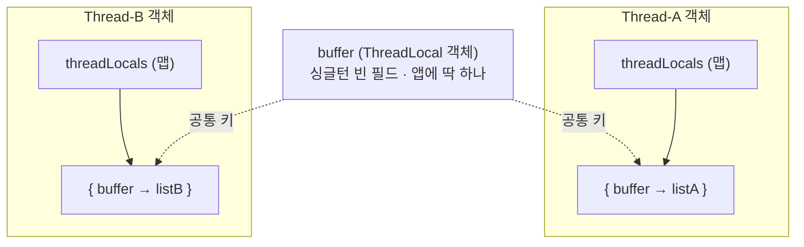
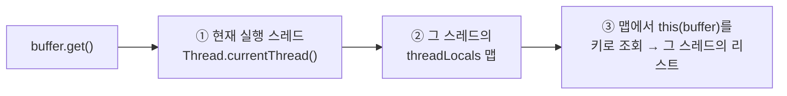
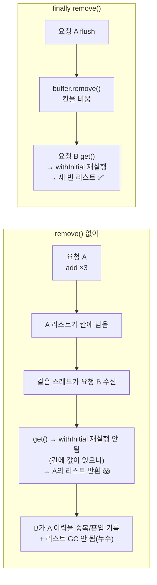
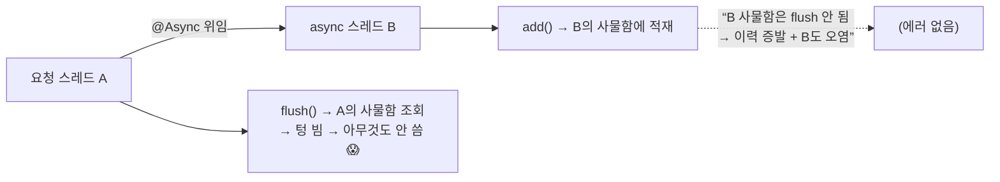
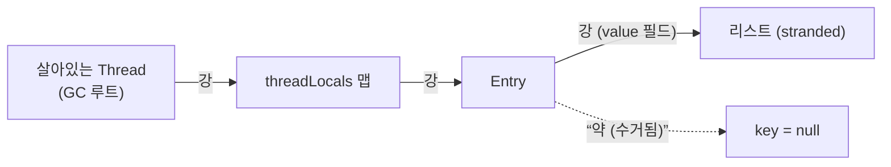

> [!summary] 핵심 한 줄
> `ThreadLocal`은 **스레드 정체를 키로 한 개인 사물함**이다. 싱글턴 빈이 여러 요청 스레드에 공유돼도, 상태를 ThreadLocal에 두면 스레드마다 값이 격리돼 **락 없이** 안전하다(동기화가 아니라 격리로 얻는 안전). 대신 값은 `ThreadLocal` 객체가 아니라 **각 `Thread`가 품은 `ThreadLocalMap`** 에 산다 — 그래서 (1) 풀 스레드 재사용 환경에선 `remove()`가 메모리 위생이 아니라 **정합성 계약**이고, (2) `@Async`로 스레드가 갈리면 add와 flush가 다른 사물함을 봐 **소리 없이 깨지며**, (3) 키는 약참조·**값은 강참조**라 스레드가 살아있는 한 값이 stranded되는 게 그 유명한 "ThreadLocal 누수"다.

> [!info] 관련
> [[14.이력 3커밋을 1로]] (이 버퍼가 쓰인 배치 설계) · [[JPA-persistence-context]] (스레드 바운드 EntityManager도 같은 원리) · [[결제 취소 멱등성 설계]]

---

## 0. 왜 이 그릇이 필요했나

취소 1건 동안 상태전이(PENDING·PROCESSING·COMPLETED) 이력 3건을 **메모리에 모았다가 끝에 1커밋으로 배치 INSERT**하려 한다([[14.이력 3커밋을 1로|14편]], 커밋 6→4). 모으는 그릇 = `CancelHistoryRecorder`. 그런데 이건 Spring **싱글턴 빈** — 앱에 인스턴스가 **하나**뿐이고 **모든 요청 스레드가 동시에** 이 하나를 때린다.

```java
@Component                                   // Spring이 하나 만들어 앱 내내 공유
public class CancelHistoryRecorder {
    private final ThreadLocal<List<CancelHistoryEntry>> buffer =
        ThreadLocal.withInitial(ArrayList::new);
    // add() → buffer.get().add(...)   /   flush() → recordAll + buffer.remove()
}
```

만약 `buffer`가 평범한 `List` 필드였다면, 취소 100건이 동시에 들어와 한 리스트에 `add`하며 깨진다(서로 다른 취소 이력이 뒤섞이고 `ArrayList` 내부 붕괴). 그래서 **상태를 스레드마다 격리**할 도구가 필요하다 — `ThreadLocal`.

## 0.5. 큰 그림 — thread-safe로 가는 세 길

**thread-safe**는 "여러 스레드가 동시에 접근해도, 외부 동기화 없이, 상태가 안 깨지는 **성질(목표)**"이다. `ArrayList`는 thread-safe가 **아니고**(동시 `add`가 내부를 깨뜨림), `ConcurrentHashMap`은 thread-safe다. 그 목표로 가는 길은 셋:

| 길 | 철학 | 예 |
|---|---|---|
| **① 격리 (confinement)** | 애초에 **공유 안 함** — 공유가 없으니 깨질 것도 없음 | **ThreadLocal**(이 노트), 지역변수(스택) |
| **② 불변 (immutability)** | 공유하되 **아무도 못 바꿈** — read-only 동시 읽기는 항상 안전 | `record` 값 객체, `final` 주입 의존성, stateless 빈 |
| **③ 동기화 (조율)** | 공유하고 바꾸되 **순서를 조율** | 락(`synchronized`·CAS·DB 락) → [[동시성 제어 4종 — 락 결정 트리]] |

**`ThreadLocal`은 ①격리의 도구다.** ③동기화(락)와 "비슷한 것"이 아니라 **정반대 철학** — 락은 공유를 인정하고 순서를 맞춰 안전을 얻고, ThreadLocal은 **공유 자체를 없애** 안전을 얻는다. 그래서 락도 순서 조율도 필요 없다(경합이 0). **가능하면 ①②가 먼저** — 락이 필요 없어져 제일 싸다. (같은 정신이 락 노트의 "가장 싼 도구부터".)

> [!example] 우리 빈들이 thread-safe한 두 가지 이유
> `CancelHistoryRecorder`는 가변 상태가 ThreadLocal 하나뿐이라 안전(①격리). `CancelPaymentService`는 **가변 인스턴스 필드가 아예 없어**(전부 `final` 주입) 안전(②불변·stateless). **싱글턴 빈이 수백 스레드에 공유돼도 멀쩡한 근본 이유가 대부분 ②** — Spring 빈 대다수가 stateless라 자동으로 thread-safe다.

## 1. 값은 ThreadLocal이 아니라 Thread가 들고 있다

가장 흔한 오해: "`ThreadLocal`(=`buffer`)이 값들을 들고 있다." **아니다.** 값을 들고 있는 건 각 `Thread`고, `buffer`는 그 사물함을 뒤질 때 쓰는 **열쇠(키)** 일 뿐이다.



- **리스트는 스레드마다 하나** — 그리고 그 리스트는 **그 스레드 자신의 `threadLocals` 맵 안**에 산다.
- **`buffer`는 앱 전체에 딱 하나** — "값"이 아니라 모든 사물함에 공통으로 꽂히는 **열쇠 번호**.
- 한 스레드가 여러 ThreadLocal을 쓰면, 그 스레드의 맵 **하나 안에** 칸이 여러 개 생긴다(`{ bufferA→…, bufferB→… }`). 맵은 **스레드당 하나**, 칸은 ThreadLocal마다 하나.

비유가 정확한 이유: **사물함 전체(맵)는 각 사람(스레드)이 소유**하고, `buffer`는 **모든 사물함에 공통으로 꽂히는 열쇠 번호**. 같은 번호로 각자 자기 칸을 연다.

## 2. `get()` 한 줄이 하는 3단계 조회



**같은 `buffer.get()` 코드인데, 누가 실행하냐(현재 스레드)에 따라 다른 리스트가 나온다.** 이것이 "격리로 얻는 안전"의 실체 — 두 스레드가 애초에 다른 리스트를 만지니 락도 순서 조율도 필요 없다. `withInitial(ArrayList::new)`는 "그 스레드가 처음 `get()`했는데 칸이 비었으면 그때 새 `ArrayList`를 만들어 넣어라"는 뜻.

## 3. `remove()` — 메모리 위생이 아니라 정합성 계약

톰캣은 스레드를 **풀에서 재사용**한다. 요청 A를 끝낸 스레드가 곧바로 요청 B를 받는다. 사물함(맵)은 스레드에 붙어있으니 **A가 쓰던 칸이 B로 넘어간다.**



즉 `remove()`를 빼면 메모리 누수뿐 아니라 **크로스-리퀘스트 데이터 오염**이 난다 — 조용하고 재현 어려운 종류. 그래서 호출부는 `try/finally`로 **모든 종료 경로(성공·실패·예외)** 에서 flush(=배치 쓰기 + remove)를 보장한다:

```java
public CancelRequest cancel(CancelPaymentCommand command) {
    try {
        // ... add()가 흐름 곳곳에서 여러 번 (상태전이마다)
        return executeCancel(...);
    } finally {
        cancelHistoryRecorder.flush();   // 배치 커밋 1개 + buffer.remove()
    }
}
```

`flush`가 최상단에 **한 번**만 있는 것도 핵심 — 각 전이마다 flush하면 커밋이 다시 3개가 돼 14편의 6→4가 도로 6이 된다. **"언제 flush하느냐 = 커밋 몇 개냐."**

## 4. `@Async` 앞에서 소리 없이 깨진다

ThreadLocal은 **"하나의 논리 작업 = 하나의 스레드"** 를 전제한다. 만약 `executeCancel`을 `@Async`로 다른 풀 스레드에서 돌리면:



add는 B의 사물함에, flush는 A의 사물함을 열어 → **다른 스레드라 flush가 못 본다** → 이력이 에러 없이 증발. 게다가 B의 버퍼는 거기서 flush가 안 도니 **remove도 안 돼** 누수·오염. 14편이 @Async를 버린 건 성능 논리(비동기는 커밋을 옮길 뿐 안 줄임)이자, **이 버퍼 모델이 성립하기 위한 조건**이기도 했다.

## 5. 누수의 진짜 구조 — 약참조 키, 강참조 값

먼저 어휘. **GC는 "GC 루트(살아있는 스레드·static·스택)에서 강한 참조 사슬로 닿는" 객체만 살려둔다.**
- **강참조** — 평범한 참조. 있으면 GC가 못 건드린다.
- **약참조(`WeakReference`)** — 대상을 **살려두지 않는** 참조. 대상을 가리키는 게 약참조뿐이면 GC가 수거해도 된다(수거 후 `.get()`은 null). **도달성 판정에서 약참조는 안 쳐준다.**

JDK `ThreadLocalMap.Entry`의 비대칭:

```java
static class Entry extends WeakReference<ThreadLocal<?>> {
    Object value;                       // ← 값(우리 리스트): 강참조
    Entry(ThreadLocal<?> k, Object v) {
        super(k);                       // ← 키(ThreadLocal 객체): 약참조
        value = v;
    }
}
```

**키는 약, 값은 강.** 그래서 어떤 ThreadLocal 키가 코드 어디서도 강참조되지 않게 되면 GC가 **키만** 수거 → `Entry`는 `key=null, value=여전히 존재`가 된다. 그런데 값은 왜 같이 안 죽나?



`get()`으로는 못 꺼내고(키가 죽어서) GC도 못 치우니(강참조 사슬) **오도가도 못하는(stranded) 값** — 이게 "ThreadLocal 누수"다. **풀 스레드**에서만 심각한 이유: 스레드가 죽으면 그 `Thread`째로 맵·값이 통째 GC되지만, 풀 스레드는 안 죽어 맵이 영원 → 값이 계속 쌓인다.

### 우리 코드에 적용하면

우리 `buffer`는 **싱글턴 빈의 필드**라 키가 앱 내내 강참조된다:

```
Spring 컨텍스트(루트) → recorder 빈 → buffer(ThreadLocal 객체)
```

→ GC가 우리 키를 **영원히 못 수거** → "약참조 키가 죽으면 맵이 null-키 칸을 정리한다"는 JDK 안전망이 **우리한텐 발동조차 안 한다**(키가 null 될 일이 없으니). ⚠️ 참고로 키가 불멸인 건 `final`이라서가 아니라 **빈이 강하게 붙잡아서**다 — `final`은 재대입 금지일 뿐 GC와 무관.

**결론:** 약참조 키는 부분 방어(키만 죽게 해줌)일 뿐이고, 값은 어차피 remove 전엔 안 지워진다. 우리처럼 키가 불멸이면 **값 누수를 막는 단 하나의 방어선 = `flush()`의 `finally { buffer.remove() }`.**

## 한 줄

`ThreadLocal`은 스레드 정체를 키로 한 개인 사물함 — **안전은 격리에서 오고**, 사물함은 `Thread`가 소유하며, **풀 스레드 위에선 `remove()`가 정합성 계약, @Async 앞에선 소리 없이 깨지고, 값 누수의 유일한 결정적 방어도 `remove()`다.**
