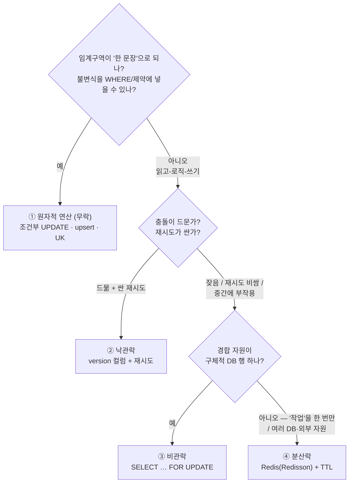
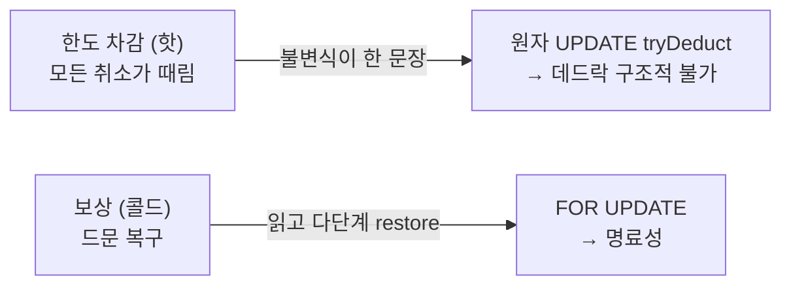
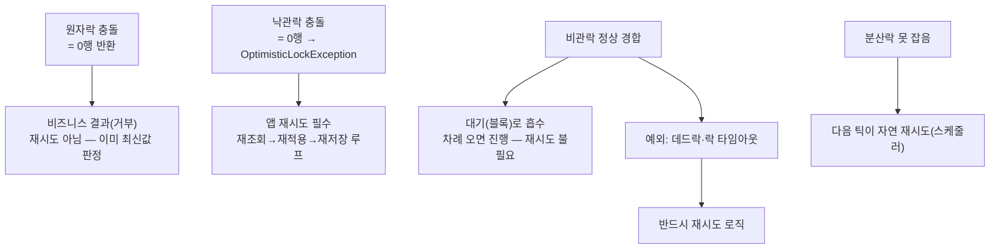

> [!summary] 핵심 한 줄
> 동시성 제어 도구는 **가장 싼 것부터** 고른다 — 원자적 연산(무락) → 낙관락 → 비관락 → 분산락 — 임계구역이 그 도구로 **표현이 안 될 때만** 위로 올라간다. 비관락(FOR UPDATE)이 "범용"인 건 항상 되고 추론이 쉬워서지 **공짜라서가 아니다**(락 경합 + 데드락). 갈림길은 두 개다: **핫/단일불변식이면 원자락, 콜드/다단계면 비관락** — 같은 자원이라도 접근 빈도가 도구를 바꾼다. 그리고 **잠글 "행"이 있으면 비관락, 잠글 대상이 "작업"이면 분산락.**

> [!info] 관련
> [[InnoDB 동시성 — undo log의 두 얼굴]] (FOR UPDATE 락 종류·MVCC) · [[07.한 가맹점에 몰았더니 99.9%가 튕겼다]] · [[08.데드락인 줄 알았다]] (핫 merchant 비관락의 대가) · [[결제 취소 멱등성 설계]] (UK 원자 방어)

---

## 0. 하나의 원칙 — 가장 싼 도구부터

동시성 버그(lost update·초과차감·따닥)는 "여러 스레드/프로세스가 같은 자원을 동시에 read-modify-write"할 때 난다. 막는 도구는 4종이고, **비용이 다르다.** 비싼 순서대로 락 경합·데드락·운영 복잡도가 커진다. 그래서 **표현 가능한 가장 싼 도구**를 고르고, 안 될 때만 에스컬레이션한다.

> [!info] 이 노트는 thread-safe로 가는 **③ 동기화** 길이다
> thread-safe(동시 접근해도 안 깨지는 성질)로 가는 길은 셋 — **①격리·②불변·③동기화**. 이 노트의 락 4종은 전부 **③동기화**(공유를 인정하고 순서를 조율)다. 반대로 공유를 아예 **없애서**(①격리) 얻는 안전이 [[ThreadLocal — 스레드별 사물함]]. 셋의 큰 그림과 "가능하면 ①②가 먼저"는 그 노트 §0.5 참고. **여기 락은 격리·불변이 불가능한 공유 가변 자원(DB 행 등)에 쓰는, 가장 비싼 마지막 길이다.**



## 1. 네 도구, 한 문장 정의

| 도구 | 정체 | 락 유지 | 실패 시 |
|---|---|---|---|
| **원자적 연산** | 불변식을 `WHERE`/제약에 넣은 **단일 문장** | 없음(문장 실행 순간의 행 락 microsecond) | 변경 0행(`=0`) 반환 → 앱이 판단 |
| **낙관락** | `WHERE version=?`로 "내가 읽은 뒤 안 바뀜" 검증 | 없음 | 0행 → 재조회 후 재시도 |
| **비관락** | 미리 잠그고 TX 내내 쥠 | TX 종료까지 | 대기(정체) / 순환 시 데드락 |
| **분산락** | 프로세스 간 상호배제, 외부(Redis)에 락 상태 | TTL 만료까지 | 못 잡으면 skip/대기 |

**핵심 비대칭:** ①②는 락을 **안 잡고** 흐르다 충돌을 **사후 감지**(0행)한다. ③④는 **미리 잠근다**. 그래서 ①②는 경합에 강하고(경합 없으면 공짜), ③④는 임계구역을 확실히 직렬화하는 대신 경합·데드락·운영 비용을 문다.

## 2. 결제 취소 시스템의 실물 5개 (+ 낙관락 자리 1개)

이 코드베이스가 원자·비관·분산 3종을 실제로 쓴다. 낙관락은 실물은 없지만 **자연스러운 자리가 하나** 있어 함께 다룬다(§2.5).

### ① 원자적 조건부 UPDATE — 한도 차감 (핫 경로)
```sql
UPDATE merchant_cancel_usage
   SET used_amount = used_amount + :amount
 WHERE merchant_id = :m AND kst_date = :d
   AND used_amount + :amount <= daily_limit   -- ← 도메인 규칙을 WHERE로
```
`tryDeduct` — 모든 취소가 때리는 초고빈도. 불변식(`used+amt <= limit`)이 **한 문장**으로 떨어져 → 원자 UPDATE, 반환 `1`=성공/`0`=한도초과. 코드 주석: *"단일 문장이라 read-modify-write 갭이 없어 lost update/초과차감/데드락 없음."*

### ① 원자적 upsert / UK — 멱등
- `ensureRow`: `INSERT … ON DUPLICATE KEY UPDATE merchant_id=merchant_id` (있으면 no-op).
- `cancel_request(payment_id, request_hash)` **UK** — 따닥 동시 INSERT를 제약이 하나만 통과시킴. 이것도 "락 대신 원자적 제약"의 일종.

### ③ 비관락 FOR UPDATE — TX3 상태 재계산 / 보상
- **TX3** `findAllByPaymentIdForUpdate` — payment_item들을 잠그고 → Payment 상태 **재계산** → 쓴다. "잠그고 다단계 로직"의 전형. 한 문장으로 못 접으니 비관락. ([[InnoDB 동시성 — undo log의 두 얼굴|TX3 재조회 불변식]])
- **보상** `findByMerchantIdAndKstDateForUpdate` — 드문 복구 경로에서 usage를 읽어 `restore`.

### ④ 분산락 Redis — 스케줄러 중복 방지
```java
@Scheduled(fixedDelay = 60_000)                 // 인스턴스마다 각자 발화
public void run() {
    RLock lock = redissonClient.getLock(lockKey);
    if (!lock.tryLock(0, 55, TimeUnit.SECONDS)) return;  // 못 잡으면 skip
    try { service.recoverAll(); } finally { if (lock.isHeldByCurrentThread()) lock.unlock(); }
}
```
pending/processing/compensation 복구 + outbox 발행. **스케줄러 자체는 분산이 아니다** — N개 인스턴스가 각자 `@Scheduled`를 돌린다. **분산된 건 락**이고, 매 틱 **한 인스턴스만** 획득해 실행한다.

### ② 낙관락이 어울리는 자리 — 한도 "설정" 변경 (자리만, 미구현)

"충돌이 드문 read-modify-write"를 상상하기 어렵다면, 이 도메인에 딱 하나 있다 — **관리자의 한도 변경**(`UpdateCancelLimitService`, `PUT /admin/merchants/{id}/cancel-limit`):

```java
@Transactional
public Result execute(long merchantId, BigDecimal newLimit, String reason) {
    MerchantCancelLimit limit = limitRepository.findByMerchantId(merchantId).orElse(null);  // 읽고
    domainService.updateLimit(merchant, limit, newLimit);   // 검증 후 값 변경 (read-modify-write)
    limitRepository.save(limit);                            // 쓰고
    historyRepository.save(...); outboxRepository.insertPending(...);
}
```

왜 여기가 낙관락 자리인가 — **"드문 충돌"의 정체:**
- 이 행(`merchant_cancel_limit`)을 쓰는 주체는 **그 가맹점 관리자 한 명**이 거의 전부. 사람이 **가끔** 대시보드에서 바꾼다.
- **같은 가맹점의 같은 한도를 두 관리자가 같은 초에** 동시 수정 = **드문 사고**(불가능은 아님 — 그래서 방어는 필요). 이게 "충돌이 드물다"의 구체적 그림 — **자원에 자연스러운 단일 소유자가 있고, 쓰기 빈도가 낮을 때.**
- 만약 순진하게 read-modify-write 하면 두 수정이 겹칠 때 **뒤엣것이 앞엣것을 덮어씀(lost update)**. `@Version` 컬럼을 두면: 두 번째 `save`가 `WHERE version=?` 불일치로 **0행 → `OptimisticLockException`** → 앱이 **재조회→재적용→재저장**으로 재시도. 충돌이 드무니 재시도는 **거의 안 일어나** — 그래서 평상시 락을 안 잡는 낙관락이 이득.

> [!note] 왜 여기엔 원자락(tryDeduct)을 안 쓰나
> 차감(`used += amt WHERE used+amt<=limit`)은 불변식이 한 문장에 떨어졌지만, 한도 **변경**은 "새 값 검증 + 이력 기록 + outbox 발행"이 한 트랜잭션에 묶인 **다단계**라 한 문장으로 못 접는다. 다단계 + 충돌 드묾 → 낙관락. 다단계 + 충돌 잦음이었으면 → 비관락.

## 3. 갈림길 하나 — 같은 자원, 핫이면 원자락 / 콜드면 비관락

risk-management 안에서 **같은 테이블(`merchant_cancel_usage`)** 을 두 방식으로 갈라 쓴다:



- **핫 + 단일 불변식 → 원자락.** `FOR UPDATE`로 읽고-검사-쓰기 하면 gap/insert-intention 락이 얽혀 **데드락**([[08.데드락인 줄 알았다|8편]]). 단일 원자 문장은 **락 순환 자체가 불가능** → 데드락 소멸. (단 핫 행 하나에 배타 락이 microsecond 걸려 **직렬화 경합은 남는다** — 데드락만 없어지고 contention은 그대로.)
- **콜드 + 다단계 → 비관락.** 경합이 거의 없어 원자화 이득이 작고, `subtract().max(0)` + 부수 판단이라 한 문장으로 접기 애매 → **명료한 FOR UPDATE**.

**통찰: 접근 빈도가 도구를 바꾼다.** 자원이 같아도 핫하면 데드락 회피가 사활이라 원자락, 콜드하면 명료성이 이득이라 비관락.

이걸 "가맹점 한도"라는 **한 개념**으로 넓히면 세 도구가 다 나온다 — **같은 개념, 접근 프로파일이 다르면 도구도 다르다:**

| 무엇 | 행 | 누가·얼마나 | 도구 |
|---|---|---|---|
| 한도 **설정/변경** | `merchant_cancel_limit` | 관리자가 **가끔** | **낙관락**(자리) |
| 한도 **소진 차감** | `merchant_cancel_usage.used` | **모든 취소**가 때림 | **원자락** tryDeduct |
| 소진 **보상 복구** | `merchant_cancel_usage` | 드문 복구 경로 | **비관락** FOR UPDATE |

## 4. 갈림길 둘 — 잠글 "행"이 있나(비관락) / "작업"인가(분산락)

FOR UPDATE도 모든 인스턴스가 **같은 MySQL 행**을 때리니 이미 프로세스 간 상호배제다. 그게 통하는 유일한 이유는 **공유 조율점이 그 DB 행**이기 때문. 그럼 분산락은 언제 필요한가 — 갈림은 단 하나, **"잠글 단일 DB 행이 존재하나?"**:

- **있다 → 비관락.** 그 행이 곧 조율점. 잠그면 인스턴스 넘어 직렬화. (TX3, 보상)
- **없다 → 분산락.** 잠글 단일 행이 없어 외부 공유 조율점(Redis)이 필요. "없다"에 두 모양이 있다:
  - **(a) 잠글 대상이 '행'이 아니라 'job 전체'** — "이번 틱에 PENDING/outbox 테이블을 한 워커만 쓸어라"는 잠글 단일 행이 없다(테이블 전체 FOR UPDATE는 불가). → **복구 스케줄러·outbox 발행이 여기.** 둘 다 `@Scheduled` 폴러를 Redis 락으로 게이팅해 매 틱 한 인스턴스만 실행(중복 Kafka 발행 방지).
  - **(b) 임계구역이 한 DB를 벗어남** — 잠글 행이 어느 DB에도 없을 때. 예: 작업이 **서로 다른 두 DB**를 건드려 어느 한쪽 행 락으로 못 덮거나(payment_db의 FOR UPDATE는 order_db에서 도는 인스턴스를 못 막음), **외부 API를 '한 번에 하나만'** 호출하게 조율해야 하는데 그 API를 나타내는 행이 DB에 없을 때. (이 레포엔 (b) 실물은 없음 — 순수 가상 예.)

→ **"이 행을 원자적으로" = 비관락, "이 job/구역을 한 번만" = 분산락.**

> [!important] 분산락엔 TTL이 필수
> 위 코드 `tryLock(0, 55s)` — 둘째 인자 `leaseTime=55s`는 **자동 만료**. 락 잡은 인스턴스가 작업 중 죽어도 55초 뒤 Redis가 해제 → 60초 틱이 **영구히 막히지 않는다**(틱보다 살짝 짧게). DB 비관락은 TX 종료/커넥션 끊김에 자동 해제라 이 문제가 없지만, 분산락은 홀더 크래시 대비 TTL이 없으면 **영구 데드락**이 난다. (첫 인자 `waitTime=0` = 안 기다리고 즉시 skip — 스케줄러는 다음 틱에 또 오니까.)

## 5. 충돌은 재시도인가 — 도구마다 다르다

"낙관락은 충돌 시 재시도가 필요한데, 비관락은 필요 없나?" — 절반만 맞다. **충돌이 어떻게 드러나느냐**가 도구마다 달라서 재시도의 성격도 다르다.



- **원자락** — `tryDeduct==0`은 "재시도 대상"이 아니라 **비즈니스 거부(한도초과)**. 이미 DB 최신값 기준으로 판정했으니 다시 해도 같은 답. 재시도 개념 자체가 없다.
- **낙관락** — 충돌 = `OptimisticLockException` → **앱이 재시도해야 완결**된다. 재시도가 **설계의 일부**. "충돌 드묾" 전제가 여기서 나옴 — 재시도가 잦아지면 순수 낭비라 비관락으로 갈아타야.
- **비관락** — 정상 경합은 **DB가 대기로 흡수**하니 앱 재시도 **불필요**. 그래서 "비관락은 재시도 없다"가 절반은 맞다. 하지만 두 예외:
  - **락 대기 타임아웃**(`innodb_lock_wait_timeout`, 기본 50s) 초과 → 예외 → 재시도 대상.
  - **데드락** → InnoDB가 한 트랜잭션을 victim으로 롤백(`Deadlock found`) → **반드시 재시도 로직**([[08.데드락인 줄 알았다|8편]]). 그래서 나머지 절반은 틀리다 — 비관락도 데드락·타임아웃은 재시도해야 한다.
- **분산락** — 못 잡으면 그냥 skip. 스케줄러는 **다음 틱이 자연 재시도**라 별도 로직이 없다.

**한 줄 대비:** 낙관락은 재시도가 **정상 흐름**, 비관락은 재시도가 **예외 처리**(데드락·타임아웃), 원자락은 재시도가 **아예 없음**(0행은 비즈니스 답).

## 한 줄

**표현 가능한 가장 싼 도구를 골라라.** 한 문장으로 되면 원자락(락 없음), 안 되면 락 — 드물면 낙관·잦으면 비관, 그리고 "행"이면 비관·"작업"이면 분산. 비관락은 default가 아니라 **에스컬레이션 종착지**고, 그 대가가 [[08.데드락인 줄 알았다|8편]]의 데드락이었다.
