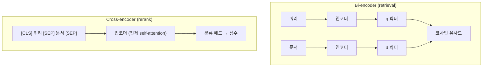
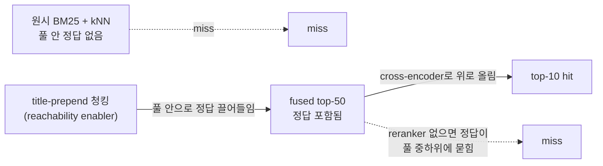

> [!summary] 핵심 한 줄
> Bi-encoder(검색)는 **쿼리와 문서를 따로** 인코딩해 벡터 거리로 후보를 빠르게 추리고, Cross-encoder(재정렬)는 **쿼리와 문서를 하나로 묶어** 직접 의미를 읽고 점수를 다시 매긴다. 정확도는 cross가 압도적으로 높고, 속도는 bi가 압도적으로 빠르다. 그래서 **bi로 50개 추리고, cross로 위로 올린다.**

> [!info] 시리즈 — AI 검색 파이프라인 깊게 파기
> 하이브리드 검색 기초 → 쿼리·문서 측 레버 → 재정렬.
> [[0.임베딩에서 하이브리드 검색까지]] ·  [[1.검색 쿼리 변형과 청킹]] ·  [[2.Reranker 크로스 인코더]]

이전 노트가 "BM25 + kNN → RRF → Top-k"에서 끝났다면(→ [[0.임베딩에서 하이브리드 검색까지]]), 본 문서는 그 뒤에 붙는 **두 번째 단계**다.

---

## 1. 왜 한 번 더 정렬하는가

하이브리드 검색 결과 Top-k 안에 **정답 청크가 들어 있으나 위쪽 순위가 아닌 경우**가 자주 생긴다.

- BM25는 표면형, kNN은 의미 좌표만 본다. 둘 다 쿼리-문서를 **따로** 본다.
- "쿼리에 대해 이 문서가 정말로 답이 되는가"는 **두 텍스트를 동시에 읽어야** 판단할 수 있다.
- 후보 50개 정도라면 그 비용을 감당할 수 있다 — 전체 코퍼스에는 못 한다.

> [!tip] 한 줄 직관
> **검색은 "후보 좁히기", 재정렬은 "정답 골라내기".**

---

## 2. Bi-encoder vs Cross-encoder



| 항목 | Bi-encoder | Cross-encoder |
|---|---|---|
| 입력 형태 | 쿼리·문서 **따로** 인코딩 | 쿼리+문서 **하나로 묶어** 인코딩 |
| 쿼리-문서 상호작용 | 마지막 벡터 거리에서만 | 모든 토큰이 모든 토큰을 self-attention |
| 문서 벡터 사전 계산 | **가능** (인덱싱 시 1회) | **불가** (쿼리마다 매번) |
| 1쌍 비용 | 매우 낮음 (벡터 두 개 거리) | 매우 높음 (Transformer forward pass) |
| 정확도 | 보통 | 높음 |
| 적합한 단계 | 1차 검색 (수백만 후보) | 재정렬 (수십 후보) |

> [!important] 왜 cross가 더 정확한가
> Bi-encoder의 벡터는 **상대 문서를 모르고** 만들어진다 — "차량"과 "자동차"가 비슷한 좌표에 놓여도 "내 쿼리에 정말 부합하는가"는 못 본다. Cross-encoder는 쿼리 토큰과 문서 토큰이 **같은 layer 안에서 직접 attend**하므로 "이 문서의 이 단어가 쿼리의 저 단어에 답한다"는 매핑을 모델 내부에서 만든다.

> [!warning] 비용 비교 (직관)
> N = 100만 문서, Q = 1 쿼리:
> - Bi-encoder: 인덱싱 때 1M 벡터 사전 계산 → 검색 때 ANN 1회 (수십 ms).
> - Cross-encoder: 검색 때 **1M 번 forward pass** (수 시간).
> → cross는 후보가 좁혀진 뒤에만 쓴다.

---

## 3. 동작 (cross-encoder)

```
입력: "쿼리: How do Pod retries work? [SEP] 문서: Job spec backoff..."
       ↓ 토큰화 후 인코더 self-attention
       ↓ [CLS] 토큰의 마지막 hidden state
       ↓ 단일 노드 분류 헤드 (linear)
출력: 실수 점수 (높을수록 관련)
```

- 학습 데이터: `(쿼리, 관련 문서, 비관련 문서)` 트리플 (MS MARCO 등).
- 손실: pairwise (관련 > 비관련) 또는 listwise.
- 출력은 0~1로 정규화되지 않은 **상대 점수**. 같은 쿼리 안에서 정렬만 의미 있다 — 다른 쿼리의 점수와 직접 비교 불가.

> [!tip] 한 줄 직관
> **Bi-encoder의 점수는 "두 좌표가 가깝다", cross-encoder의 점수는 "이 문서가 이 쿼리에 답한다" 자체.**

---

## 4. 실제 적용 — bge-reranker-v2-m3

RAG 검색 튜닝 프로젝트에서 채택한 reranker 설정:

| 항목 | 값 |
|---|---|
| 모델 | bge-reranker-v2-m3 (BAAI) |
| 베이스 아키텍처 | **XLM-RoBERTa** (multilingual) |
| 파라미터 | ~568M |
| 입력 max 토큰 | 8K (실제 코퍼스 청크는 1,000~1,400자 ≈ 작은 일부) |
| 호출 방식 | sentence-transformers `CrossEncoder.predict([[q, d1], [q, d2], ...])` |
| 풀 크기 | fused top-50 → reranker → top-10 |
| 채택 결과 | **OVERALL R@10 +0.051** (단독), title-prepend와 통합 시 **+0.102** |
| LOOCV gain/std | 통합 stage 2에서 **16.67×** |

### Reachability vs Promotion

이 프로젝트에서 얻은 가장 중요한 통찰:



- **title** = 정답을 top-50 안으로 **끌어들이는** 레버.
- **reranker** = 그 50개 중에서 정답을 **위로 올리는** 레버.
- 둘은 따로 쓰면 한계, 합치면 상보적. title만 단독 적용했을 때 R@10 변동이 0이었던 것은 **reranker의 전제 조건**으로 재해석된다.

> [!tip] 한 줄 직관
> **검색은 reachability(정답이 풀 안에 있어야 한다), 재정렬은 promotion(위로 올려야 한다). 둘은 다른 문제다.**

---

## 5. 한계 — 왜 "오프라인 전용"인가

reranker는 정확도는 최강이나 latency 때문에 **실시간 부적합**이었다.

| 측정 | 값 | 비고 |
|---|---|---|
| rerank mean (n=59) | **111s / query** | top-50 쌍 전부 forward pass |
| p95 / max | 131s / 147s | |
| 모델 로드 | 1.2s (1회) | 매 쿼리 재로드 아님 |
| 실제 device | **CPU** (nominal MPS) | `device="mps"` 인자 무시됨 |
| `.to("mps")` 강제 | **+30% 느려짐** | XLM-RoBERTa small-op MPS dispatch overhead |
| batch_size | 32 (이미 batch) | size=64 추가 이득 없음 |

→ 현재 config 안에서 모두 최적. 추가 최적화는 **fp16/int8 양자화**, **ONNX runtime**, **더 작은 모델**(품질↓), **풀 축소**(recall↓) 중 trade-off.

→ 해결책은 **두 구성 분리**: Realtime-light(reranker 없음) + Offline(reranker 포함).

> [!warning] "device 거짓말"의 교훈
> `CrossEncoder(model, device="mps")`가 실제로 weights를 MPS로 옮기지 않을 수 있다. **반드시 param device를 실측**해서 nominal config와 실제 동작을 분리할 것. measurement-first의 작은 사례.

---

## 6. 회귀 — reranker도 정답을 깨뜨릴 수 있다

통합 시 1건이 회귀했다 ("batch task retries" → 일반 Job 소개 페이지로 over-broad 해석).

> [!important] 재정렬도 zero-sum일 수 있다
> Cross-encoder가 만능은 아니다. 모델이 쿼리를 잘못 해석하면 **풀 안에서 위치를 바꿔 정답을 밀어낼** 수 있다. 채택 판정은 "전체 평균 gain"이 아니라 **per-query 분포 + LOOCV**로 해야 single-query 의존이나 회귀 비용을 본다.

---

## 7. 전체 검색 파이프라인 안 위치

| 단계 | 후보 수 변화 | 대표 기법 | 비용 / 쿼리 | 잡는 것 |
|---|---|---|---|---|
| 1차 검색 (lexical) | 수백만 → 수백 | BM25 (역색인) | ~ms | 표면형 키워드 |
| 1차 검색 (semantic) | 수백만 → 수백 | bi-encoder + ANN (HNSW) | ~10ms | 의미 근접 |
| 융합 | 수백 → 수십 | RRF | µs | 두 랭킹 결합 |
| **재정렬** | 수십 → top-k | **cross-encoder** | **100s+** | **쿼리-문서 직접 매핑** |
| (선택) LLM rerank | top-k → top-k 재정렬 | LLM 호출 | 수 초 | 더 깊은 reasoning, 비용↑ |

---

## 한계 / 확인 필요

- "후보 50, top-10"은 프로젝트 선택. recall vs latency trade-off로 도메인마다 다르다.
- Cross-encoder 점수는 쿼리 내부 정렬용. 다른 쿼리의 점수와 비교하거나 임계값(절대 컷오프)으로 쓰면 깨진다.
- XLM-RoBERTa 기반은 multilingual 강점. 영어 전용이면 ms-marco-MiniLM 류가 훨씬 작고 빠르다.

## 더 볼 것

- **ColBERT** — bi와 cross 사이의 절충 (late interaction)
- **LLM-as-reranker** — 더 비싸지만 reasoning 가능
- 관련 노트: [[0.임베딩에서 하이브리드 검색까지]]
