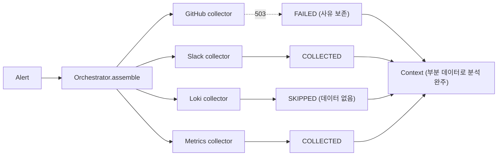

> [!summary] 핵심 한 줄
> 장애 대응 도구는 **정작 장애 때 가장 취약**하다. 콜렉터를 순차 호출하면 GitHub API 503 한 번에 파이프 전체가 죽는다. 실패를 `throw`가 아니라 **enum status(`COLLECTED/SKIPPED/FAILED`)로 모델링**해, 한 소스가 죽어도 나머지 컨텍스트로 분석이 완주하게 했다.

> [!info] 시리즈 — LLM을 장애대응 파이프에 안전하게 엮기
> 1. [[1.e2e 데모가 잡아낸 두 버그]] · 2. [[2.장애 도구가 장애에 죽지 않게]] · 3. [[3.LLM에게 도구를 주되 가두기]] · 4. [[4.LLM이 코드를 고치되 머지는 사람만]] · 5. [[5.LLM을 못 믿어 결정론 레일을 깔았다]] · 6. [[6.알림 폭풍에 스팸 PR을 안 만들기]] · 7. [[7.orchestrator 언제 무엇을 수집할지]] · 8. [[8.패키지 구조가 서사를 증명하게]]

---

## 1. 배경 — 해피패스엔 안 보이는 위험

이 프로젝트는 Grafana 알림이 오면 GitHub·Slack·Loki·Prometheus에서 관련 맥락을 모아 분석한다. 데모 화면(알림 → Slack)만 보면 "API 몇 개 이어붙인 것"처럼 보인다.

문제는 **실패 경로**다. 콜렉터를 단순 순차 호출하면:

- GitHub API가 503을 한 번 던지면 → 예외가 위로 전파 → 파이프 전체 사망
- 정작 **인시던트 한복판**에서 도구가 못 쓰이게 된다 (외부 시스템이 불안정한 바로 그 순간)

즉, 장애 대응 도구의 신뢰성은 해피패스가 아니라 **한 소스가 죽었을 때** 드러난다.

---

## 2. 결정

모든 수집 결과를 `(source, status, content, reason)` 한 형태로 표현하고, **status는 셋 중 하나**로 강제한다.

```java
public record SourceResult(String source, SourceStatus status, String content, String reason) {}
// SourceStatus = COLLECTED | SKIPPED | FAILED
```

실패를 "예외(흐름 중단)"가 아니라 **"데이터(값)"**로 모델링한 것이 핵심이다.

---

## 3. 대안 비교

| 방식 | 장점 | 단점 | 채택 |
|---|---|---|---|
| 순차 호출 + 예외 전파 | 코드 단순, 정상 경로 깔끔 | **한 소스 실패 = 전체 파이프 사망** | X |
| try/catch로 null 반환 | 파이프는 안 죽음 | "없음"과 "깨짐"을 구분 못 함, null 체크 산재 | X |
| `Optional<Content>` | null보다 안전 | 실패 *이유*를 못 싣음, 담당자 통지 빈약 | X |
| **enum status + reason** | 부분 실패가 **1급 데이터**, 사유 전달 가능 | 호출부가 status 분기 필요 | **O** |

---

## 4. 선택 이유

**실패를 예외가 아니라 enum status로 모델링한 게 핵심이다.** `Orchestrator.safeCollect`가 모든 콜렉터를 try/catch로 감싸 예외·null을 `FAILED`로 흡수한다. 그래서 GitHub가 죽어도 Slack 컨텍스트만으로 분석이 진행된다.

**SKIPPED와 FAILED를 굳이 나눈 것도 의도적**이다. 담당자에게 "수집 안 됨(데이터 없음)"과 "수집 시도했으나 깨짐"은 전혀 다른 신호다 — 전자는 정상, 후자는 점검 대상.

---

## 5. 설계 상세

orchestrator는 얇다. 콜렉터 리스트를 돌며 각각을 `safeCollect`로 감쌀 뿐이다.

```java
// orchestrator/Orchestrator.java
public Context assemble(Alert alert) {
  List<SourceResult> sources = collectors.stream().map(c -> safeCollect(c, alert)).toList();
  sources.forEach(s -> metrics.source(s.source(), s.status()));
  return new Context(alert, sources);
}

private SourceResult safeCollect(Collector collector, Alert alert) {
  try {
    SourceResult result = collector.collect(alert);
    if (result == null) {
      return new SourceResult(collector.source(), SourceStatus.FAILED, null, "collector returned null");
    }
    return result;
  } catch (Exception e) {
    log.warn("collector {} failed: {}", collector.source(), e.getMessage());
    return new SourceResult(collector.source(), SourceStatus.FAILED, null, e.getMessage());
  }
}
```

핵심은 두 가지다.

- **예외와 null을 둘 다 FAILED로 흡수** — 콜렉터가 어떻게 실수해도(throw하든 null 반환하든) 파이프는 완주한다.
- **각 콜렉터가 스스로 SKIPPED/COLLECTED를 판정** — orchestrator는 "무엇을 부를지"만, "내 데이터가 있나"는 콜렉터가 정한다. (→ 조건부 오케스트레이션은 별도 글)



### 다층 graceful — webhook의 never-500

같은 원칙이 한 곳이 아니라 **모든 외부 경계**에 깔려 있다. webhook은 분석·알림·PR 생성이 깨져도 항상 200 OK를 반환한다 (analyzer·notifier·fixProposer가 전부 try/catch 경계). 부분 실패가 1급 시민이라는 결정이 파이프 끝까지 일관된다.

근거: `model/SourceResult.java`, `orchestrator/Orchestrator.java`, `receiver/GrafanaWebhookController.receive`, ADR-0002·0005.

---

## 6. 결과 / 트레이드오프

**보장된 것**

- 한 소스가 503을 던져도 파이프가 완주한다 — 나머지 소스로 분석·통지가 나간다.
- "데이터 없음(SKIPPED)"과 "수집 깨짐(FAILED)"이 담당자에게 다른 신호로 전달된다.

**감수한 한계**

- 호출부가 status를 매번 분기해야 해 코드가 늘어난다.
- **부분 데이터로 내린 분석은 신뢰도가 낮을 수 있다** → 어떤 소스를 실제로 썼는지(`referencedSources`)를 함께 전달해 보완한다.

---

## 7. 교훈

> [!important] 신뢰성은 실패 경로 설계다
> 해피패스(알림 → Slack)에서는 이 설계가 전혀 안 보인다. 가치는 **GitHub가 죽는 순간**에만 드러난다. 실패를 "흐름 중단"이 아니라 "값"으로 끌어내리면, 코드 경로가 늘어도 파이프의 완주가 구조적으로 보장된다.


---

## 관련 글

- [[3.LLM에게 도구를 주되 가두기]]
- [[1.e2e 데모가 잡아낸 두 버그]]
- [[결제 취소 멱등성 설계]] — 같은 "실패 경로 우선" 결의 결정
