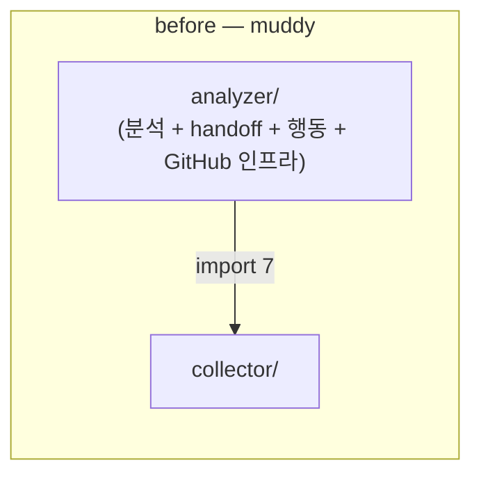
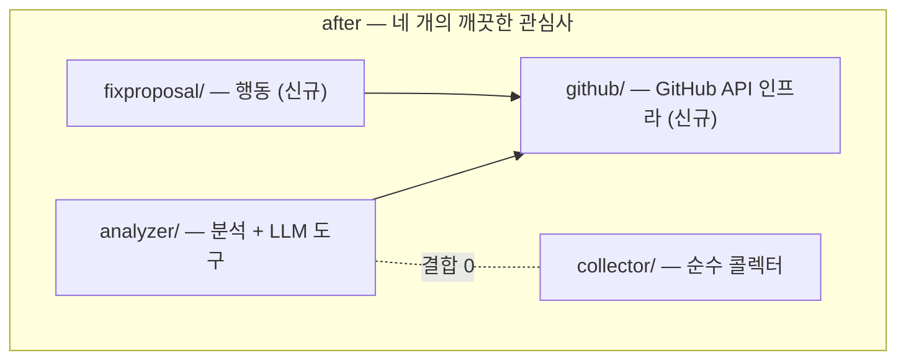

> [!summary] 핵심 한 줄
> 면접에서 "분석과 행동을 분리했다"고 말하는데 **코드에선 한 패키지에 다 섞여 있다면** 그 말은 증명되지 않는다. `analyzer/` 한 곳이 분석·handoff·행동 세 가지 일을 하던 걸, `github/`(인프라)·`fixproposal/`(행동)으로 추출해 **analyzer→collector 결합을 import 7건 → 0**으로 끊었다. 구조가 서사를 증명하게.

> [!info] 시리즈 — LLM을 장애대응 파이프에 안전하게 엮기
> 1. [[1.e2e 데모가 잡아낸 두 버그]] · 2. [[2.장애 도구가 장애에 죽지 않게]] · 3. [[3.LLM에게 도구를 주되 가두기]] · 4. [[4.LLM이 코드를 고치되 머지는 사람만]] · 5. [[5.LLM을 못 믿어 결정론 레일을 깔았다]] · 6. [[6.알림 폭풍에 스팸 PR을 안 만들기]] · 7. [[7.orchestrator 언제 무엇을 수집할지]] · 8. [[8.패키지 구조가 서사를 증명하게]]

---

## 1. 냄새 — 말과 코드의 불일치

이 프로젝트의 핵심 서사 중 하나는 **"분석(무엇이 문제인가)과 행동(고치는 PR)을 분리했다"**([[4.LLM이 코드를 고치되 머지는 사람만]])이다. 타입 수준(`Analysis` vs `FixProposal`)에선 분리돼 있었다.

그런데 **패키지에선** 그렇지 않았다. `analyzer/` 한 곳이 세 가지 일을 하고 있었다.

- 분석 (LLM tool-calling)
- handoff (증거 번들 + POST /triage)
- 행동 (draft PR 생성)

게다가 GitHub API 인프라 코드도 analyzer 안에 섞여, **analyzer가 collector를 import하는 결합**까지 생겼다. 말로는 "분리"인데 코드에선 muddy package였다.

> [!tip] 한 줄 직관
> 면접에서 말하는 원칙이 **코드 구조에 안 보이면**, 그건 주장일 뿐 증명이 아니다.

---

## 2. 추출 — 두 muddy 패키지 → 네 개의 깨끗한 관심사

`analyzer/`에서 두 관심사를 별도 패키지로 추출했다.

- **`github/`** — GitHub API 인프라 (commits/file/tree/openDraftPr). analyzer의 도구와 fixproposal이 공유.
- **`fixproposal/`** — 행동 (draft PR 생성·dedup·cap·SuspectLocator).
- 남은 **`analyzer/`** — 분석 + LLM 도구에 집중.
- **`collector/`** — 순수 콜렉터로 정리(→ model만 의존).

결과: 인프라·행동·분석·수집이 각자 한 가지 관심사만 갖는다.

---

## 3. before / after — 의존 그래프

핵심 지표는 **analyzer → collector 결합**이다. 추출 전 analyzer가 collector를 import하던 7건이, github/·fixproposal/ 추출 후 **0건**이 됐다.

import 그래프는 **사이클 0건의 깨끗한 DAG**가 됐다. (전체 3종 다이어그램: `docs/architecture/index.html`)

---

## 4. 안전하게 옮기기 — 순수 이동 리팩토링

이건 동작을 바꾸는 변경이 아니라 **순수 이동(move) 리팩토링**이라, 안전하게 하는 절차가 핵심이었다.

- 한 번에 한 관심사씩 추출 (github/ → 그다음 fixproposal/)
- 각 단계마다 **컴파일 + 테스트 게이트** 통과 확인
- 타입 계약(record)·동작은 불변 유지

> [!tip] 한 줄 직관
> 리팩토링의 안전망은 "조심함"이 아니라 **compile + test 게이트**다. 행동이 안 바뀌었음을 기계가 증명하게 한다.

---

## 5. 보너스 — gitignore가 삼킨 소스

이 작업 중 발견: 런타임 출력용 `triage/` gitignore 규칙이 앵커 없이 **소스 패키지까지 삼켜**, `TriageController`가 git에 커밋되지 않고 있었다(그런데 로컬 워킹트리엔 있어 빌드는 됨). `/triage/`로 루트 앵커링해 수정. 구조를 들여다보다 숨은 결함이 드러난 사례.

---

## 6. 결과 / 트레이드오프

**보장된 것**

- "분석↔행동 분리"가 타입뿐 아니라 **패키지 경계로도** 증명된다.
- analyzer→collector 결합 0, 사이클 0의 DAG.
- github/ 인프라를 analyzer·fixproposal이 공유해 중복 제거.

**감수한 한계**

- 패키지 수가 늘어 처음 보는 사람에겐 탐색 비용이 약간 증가.
- 순수 이동이라 기능적 이득은 없다 — 가치는 **가독성·서사 정합·결합도**에 있다.

---

## 7. 교훈

> [!important] 구조가 서사를 증명한다
> 아키텍처 원칙은 말이 아니라 **의존 그래프**로 증명된다. "분리했다"는 import 0으로, "관심사 분리"는 패키지 경계로 보여야 한다. 코드 리뷰어(와 면접관)는 말보다 구조를 본다.

---

## 관련 글

- [[4.LLM이 코드를 고치되 머지는 사람만]] — 추출된 fixproposal/의 행동
- [[7.orchestrator 언제 무엇을 수집할지]] — 순수화된 collector/
