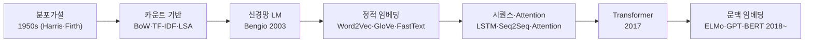
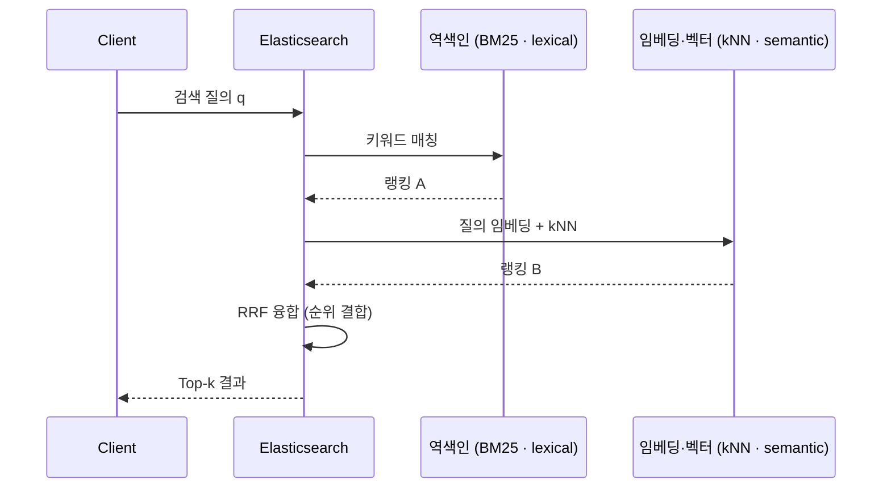

---

title: 임베딩에서 하이브리드 검색까지 
tags:

- nlp
- search
- elasticsearch
- embedding
- bm25 
created: 2026-06-08

---


> [!summary] 핵심 한 줄 단어를 벡터로 표현하려는 흐름(분포가설→정적 임베딩→Transformer→BERT)이 검색 영역에서 만나, **표면형 매칭(lexical)** → **의미 매칭(semantic)** → **둘의 융합(hybrid)** 으로 발전했다. BM25는 lexical의 표준, 임베딩 코사인 유사도는 semantic의 핵심, kNN은 그 실행, RRF는 둘을 결합하는 융합 기법이다.

---

## 1. 단어 임베딩의 역사

관통하는 철학: **"같이 등장하는 단어가 의미를 만든다"(분포가설)** 를 점점 더 효율적이고 문맥을 반영하는 방식으로 구현해 온 역사.



두 개의 큰 전환점으로 요약된다.

|전환|이전|이후|
|---|---|---|
|정적 → 문맥 (static → contextual)|Word2Vec/GloVe: 단어당 벡터 1개|ELMo/BERT: 문장 내 위치·주변에 따라 벡터가 달라짐|
|순환 제거 (recurrence → attention)|RNN/LSTM 순차 처리|Transformer self-attention → 병렬화·확장성|

### BERT 요약

- Transformer **인코더만** 쌓은 모델 (GPT는 디코더만 사용).
- 사전학습 2과제: **MLM**(토큰 15% 가리고 양옆 문맥으로 복원 → 양방향 학습), **NSP**(두 문장 연속 여부 예측, 후속 연구 RoBERTa에서 효과 약해 제거됨).
- 사전학습 → 작업별 **fine-tuning**(분류·NER·QA 등). Word2Vec 대비 결정적 차이는 **문맥 의존**("bank"가 문맥마다 다른 벡터).

### 지도학습 vs 강화학습

BERT·Word2Vec은 지도/자기지도 학습, RL은 보상 기반의 다른 패러다임.

|구분|지도학습 (BERT, Word2Vec)|강화학습|
|---|---|---|
|학습 신호|정답 레이블 (정적)|보상 (지연·희소 가능)|
|데이터|고정된 입력-출력 쌍|환경과 상호작용하며 생성|
|목표|예측 오차 최소화|누적 보상 최대화|
|대표 알고리즘|역전파 기반 분류/회귀|Q-learning, Policy Gradient, PPO|

> [!note] 연결점 LLM은 1차로 사전학습 후, **RLHF**(사람 선호를 보상모델로 만들어 PPO 등으로 미세조정)로 정렬한다. RL은 임베딩 계보의 _사전학습 다음 단계(정렬)_ 에서 결합된다.

---

## 2. TF-IDF

문서 내 단어 중요도를 두 축(빈도 × 희귀도)으로 계산하는 카운트 기반 가중치.

$$ \text{tf}(t,d)=\frac{\text{count}(t,d)}{\sum_{t'}\text{count}(t',d)} $$

$$ \text{idf}(t)=\log\frac{N}{1+\text{df}(t)} $$

$$ \text{tfidf}(t,d)=\text{tf}(t,d)\times\text{idf}(t) $$

- $N$: 전체 문서 수, $\text{df}(t)$: 단어 $t$가 등장한 문서 수.
- 직관: 특정 문서에 자주 나오고(TF↑) 전체적으로 드문(IDF↑) 단어일수록 그 문서를 잘 대표한다. "the", "is"는 IDF가 낮아 가중치가 깎인다.
- 한계: 의미·문맥 무시(표면형만), 동의어·다의어 구분 불가.

> [!tip] 한 줄 직관 **자주 나오면서 흔하지 않은 단어가 그 문서의 정체성이다.** (자주=TF↑, 흔하지 않음=IDF↑)

---

## 3. BM25

TF-IDF의 두 약점(① TF 선형 무한 증가, ② 긴 문서 과대평가)을 보정한 개선판. Elasticsearch의 기본 스코어링.

$$ \text{score}(D,Q)=\sum_{t\in Q}\text{IDF}(t)\cdot\frac{f(t,D)\cdot(k_1+1)}{f(t,D)+k_1\cdot\left(1-b+b\cdot\dfrac{|D|}{\text{avgdl}}\right)} $$

$$ \text{IDF}(t)=\ln!\left(\frac{N-\text{df}(t)+0.5}{\text{df}(t)+0.5}+1\right) $$

|기호|의미|직관|
|---|---|---|
|$f(t,D)$|문서 $D$ 안 단어 $t$ 빈도|많이 나올수록 점수↑|
|$k_1$|TF 포화 계수 (보통 1.2~2.0)|반복 단어 점수가 무한히 안 오르게 상한 곡선|
|$b$|길이 정규화 강도 (보통 0.75)|단지 길어서 유리해지는 것 방지|
|$\lvert D\rvert/\text{avgdl}$|문서 길이 / 평균 길이|평균보다 길면 점수 할인|

핵심 차이: TF-IDF의 `tf`는 빈도에 비례해 무한 증가하지만 BM25는 $k_1$으로 **포화(saturation)** 시킨다.

> [!tip] 한 줄 직관 **TF-IDF에 "단어 많이 나와도 적당히($k_1$), 문서 길어도 적당히($b$)"라는 브레이크를 단 것.**

---

## 4. 문맥 임베딩 유사도

BM25는 표면형만 본다("자동차"≠"차량"). 이를 BERT류 인코더가 보완한다.

- 문서·쿼리를 인코더에 통과 → 고정 차원 벡터(예: 768차원).
- 두 벡터의 **코사인 유사도**로 의미 근접도 측정.

$$ \text{sim}(q,d)=\frac{q\cdot d}{\lVert q\rVert,\lVert d\rVert}\quad(-1 \sim 1,\ 1\text{에 가까울수록 유사}) $$

이 벡터를 `dense_vector` 필드에 저장하고 kNN으로 검색한다.

> [!tip] 한 줄 직관 **단어가 아니라 "뜻"을 좌표로 찍어, 좌표가 가까우면 비슷한 문서다.**

---

## 5. kNN (k-Nearest Neighbors)

쿼리 벡터에서 거리가 가장 짧은 **k개** 문서를 찾는 검색. semantic 경로의 실행 부분.

```
입력: 쿼리 벡터 q, 문서 벡터 집합 {d1, d2, ...}
거리: 코사인 유사도 또는 L2(유클리드) 거리
출력: q와 가장 가까운 상위 k개 문서
```

- 정확(exact) kNN은 문서 수백만이면 느림.
- 해결: **ANN(Approximate Nearest Neighbor)** — HNSW 같은 그래프 인덱스로 근사 탐색. 약간의 정확도를 포기하고 속도를 크게 얻음. ES 벡터 검색이 내부적으로 사용.

> [!tip] 한 줄 직관 **질의 좌표 주변에서 가장 가까운 k개를 집어오는 것.** (수백만 건이면 정확 대신 근사로 빠르게)

---

## 6. RRF (Reciprocal Rank Fusion)

서로 다른 검색기의 순위 리스트를 하나로 합치는 융합 기법. hybrid의 결합 부분.

> [!warning] 왜 점수를 직접 더하지 않나 BM25 점수는 0~수십, 코사인 유사도는 $-1\sim1$ 로 **스케일이 달라 직접 합산 불가**. RRF는 점수 대신 **순위(등수)** 만 써서 우회한다.

$$ \text{RRF}(d)=\sum_{r\in\text{rankers}}\frac{1}{k+\text{rank}_r(d)}\quad(k\ \text{보통}\ 60) $$

- $\text{rank}_r(d)$: 검색기 $r$ 결과에서 문서 $d$의 등수(1등, 2등 …).
- 등수가 높을수록(rank 숫자 작을수록) 역수가 커져 점수↑. 여러 검색기에서 동시에 상위면 합산되어 더 높이 올라간다.

**계산 예시** — 문서 $D$가 BM25 1등, kNN 3등, $k=60$:

$$ \text{RRF}(D)=\frac{1}{60+1}+\frac{1}{60+3}=0.0164+0.0159=0.0323 $$

> [!important] k 혼동 주의 RRF의 $k$(≈60, 순위 완충 상수)와 kNN의 $k$(가져올 이웃 개수)는 **완전히 다른 변수**다.

> [!tip] 한 줄 직관 **점수가 아니라 "등수"로 투표해, 여러 검색기가 함께 위로 꼽은 문서를 끌어올린다.**

---

## 7. 하이브리드 검색 전체 흐름

하나의 검색 요청이 lexical 경로와 semantic 경로로 갈라졌다가 RRF에서 다시 합쳐진다.



---

## 부록: 비교표

### lexical / semantic / hybrid

|단계|방식|표현|잡는 것|못 잡는 것|
|---|---|---|---|---|
|Lexical|TF-IDF → BM25|역색인 (희소)|정확한 키워드, 빠름, 설명가능|동의어·의미|
|Semantic|BERT 임베딩 + kNN|dense_vector (밀집)|의미 유사, 동의어, 의역|정확 매칭·고유명사, 비용↑|
|Hybrid|BM25 + kNN → RRF|두 랭킹 융합|양쪽 장점|운영·튜닝 복잡도↑|

### kNN vs RRF 역할 구분

|구분|kNN|RRF|
|---|---|---|
|하는 일|의미 가까운 문서 검색|여러 순위 리스트 결합|
|단계|검색 실행 (semantic 경로)|결과 융합 (lexical + semantic)|
|입력|쿼리 벡터|검색기별 순위 리스트|
|출력|상위 k개 문서|통합 순위|
|`k`의 의미|가져올 이웃 개수|순위 완충 상수 (≈60)|

> [!tip] 한 줄 직관 **BM25는 "글자가 같은 문서", 임베딩은 "뜻이 가까운 문서"를 찾고, RRF는 둘 다 상위인 문서를 끌어올린다.**

---

## 한계 / 확인 필요

- BM25 $k_1$·$b$ 기본값(1.2/0.75), RRF $k$(60), ANN의 HNSW는 통용되는 기본값·대표 구현이며 엔진·설정마다 다르다.
- BM25가 ES 기본 스코어링이 된 시점, `dense_vector`/kNN/RRF 지원 여부는 **ES 버전별로 다르므로** 도입 시 사용 버전 공식 문서로 확인 필요.
- 융합 기법은 RRF 외에 가중합(weighted sum), 학습 기반 re-ranking 등도 있다. RRF는 스케일 차이에 강하고 튜닝이 단순해 기본값으로 많이 쓰인다.
- 임베딩 유사도는 코사인 외 내적(dot product)도 사용하며, 정규화 여부에 따라 선택이 갈린다.

## 더 볼 것

- ANN(HNSW) 동작 원리 — 정확 kNN을 어떻게 근사로 빠르게 만드는지
- ES `knn` + `match` + RRF를 한 쿼리로 묶는 실제 JSON 예시 + 인덱스 매핑
- 문서 색인 시 임베딩을 어느 시점에 생성해 넣는지(전체 파이프라인)
- Kakao Maps → MySQL → ES 파이프라인에 semantic 검색을 얹는 설계